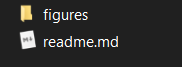

# Taskforce

* [Java](java/)

# Taskforce Markdown Kullanımı

2004 Yılında John Gruber ve Aaron Swartz tarafından geliştirilen Markdown bir yazım formatıdır. En basit tanımıyla text-to-HTML yani yazıyı HTML'e çevirmenizi sağlar.

Markdownla yazarken herhangi bir HTML etiketini kullanmaya gerek yoktur, Markdown syntaxına uygun olarak yazmak yeterlidir.

Öncelikle bir Markdown editörüne ihtiyacımız var, bizim tavsiyemiz [Typora](https://typora.io). Editörü kurduysak başlayabiliriz.

GitHub Markdown sistemine tamamen entegredir, bir klasöre tıkladığınızda o klasörün "readme.md" dosyası otomatik olarak açılır.


## Başlık Etiketleri

Cümlenin başına "#" işareti koymak başlık anlamına gelir. 

``````markdown
# h1 başlık
## h2 başlık
### h3 başlık
#### h4 başlık
##### h5 başlık
###### h6 başlık
``````

Eğer yukarıdaki metni bir Markdown editoründe önizleseydik aşağıdaki gibi gözükecekti.

# h1 başlık

## h2 başlık

### h3 başlık

#### h4 başlık

##### h5 başlık

###### h6 başlık


## Kalın, Eğik, Üstü çizili ve Tek Satırlı Kod

Kalın yapmak için `**bu yazı kalın olacak**`, 
eğik yapmak için `_bu yazı eğik olacak_`, 
üstü çizik yapmak için `~~buranın üstü çizik olacak~~` 
ve tek satır kod için ``kod buraya`` şeklinde kullanabilirsiniz. 

Kalın yapmak için **bu yazı kalın olacak**, 
eğik yapmak için _bu yazı eğik olacak_, 
üstü çizik yapmak için ~~buranın üstü çizik olacak~~ 
ve tek satır kod için ``kod buraya`` şeklinde kullanabilirsiniz. 


## Çok Satırlı Kod

~~~markdown
```
çok
satırlı
kod
buraya
gelecek
```
~~~

İstenilen dilin adını vererek o dile özgü renklenmeden faydalanabiliriz. Örneğin java için:

````
​```java
    public static void main(String[] args) {
        // create a singly linked list to store Character elements
        SinglyLinkedListGeneric<Character> myList = new SinglyLinkedListGeneric<>();

        // add some elements to (the end of) the list
        myList.addLast('A');
        myList.addLast('B');
        myList.addLast('C');
        myList.addLast('D');

    }
}
​```
````

Önizleme:

``````java
    public static void main(String[] args) {
        // create a singly linked list to store Character elements
        SinglyLinkedListGeneric<Character> myList = new SinglyLinkedListGeneric<>();

        // add some elements to (the end of) the list
        myList.addLast('A');
        myList.addLast('B');
        myList.addLast('C');
        myList.addLast('D');

    }
}
``````


## Listeler

```
- liste 1
- liste 2
- liste 3
```


- liste 1
- liste 2
- liste 3

### veya

```
1. test
2. test 2
    1. test 2.1
    2. test 2.2
    3. test 2.3
3. test 3
```

1. test
2. test 2
    1. test 2.1
    2. test 2.2
    3. test 2.3
3. test 3

## Bağlantı

```
[bu linke tıkla](https://kodluyoruz.org)
```

[bu linke tıkla](https://kodluyoruz.org)


## Resim

Her klasörün altına "figures" isminde bir klasör açıyoruz, ilgili readme dosyasındaki her fotoğrafı buradan çekiyoruz.

 

Resim yüklemek aslında az önce bahsettiğimiz "Bağlantı" kısmıyla aynı şeyler, ancak bu bağlantının başına ! işareti koyarsak markdown bunun bir fotoğraf olduğunu anlıyor.

````markdown

````


````markdown

````


## Alıntı

Metnin başına ">" işareti koymak alıntı haline getirir

```markdown
> bu alan ve
> bu alan alıntı içeriği temsil ediyor
```

> bu alan ve
> bu alan alıntı içeriği temsil ediyor

## Tablo

Tabloların gösterimi biraz karışık görünse de birkaç kez denedikten sonra hızlıca yapılabiliyor.

```markdown
Başlık | Diğer Başlık
-- | --
Değer 1 | Değer 2
Değer 1 | Değer 2
```


Başlık | Diğer Başlık
-- | --
Değer 1 | Değer 2
Değer 1 | Değer 2


## Video

Markdown'a video yüklemek tam olarak mümkün olmasa da bir fotoğrafa link göstererek video ekleyebiliyoruz. Nasıl mı yani?

Önce bir fotoğraf oluşturalım 

```markdown

```


oluşturduğumuz bu fotoğrafı kullanarak bir link oluşturalım

```markdown
[](https://youtu.be/Yq6u6Z1yuco)
```


[](https://www.youtube.com/watch?v=Yq6u6Z1yuco)
