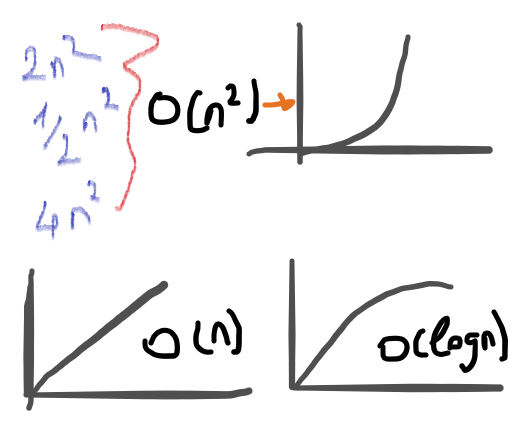
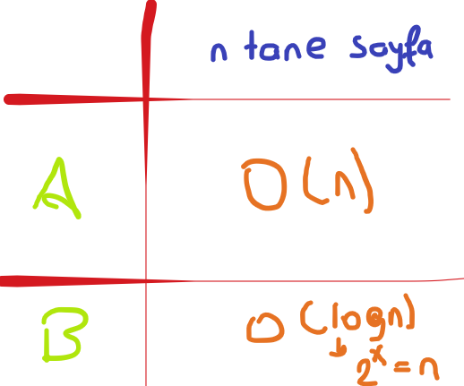

# Big-O Notation

- Big-O Notation grafikleri :

    

- İki farklı arama yöntemimiz var. Bunlardan A algoritması sayfa sayfa, B algoritması yarıya bölüp tarıyor. Sizce hangisi daha hızlı çalışır? Tabiki B algoritması. Peki neden ? Sürekli tarayacağı alan azalıyor. A algoritması daha işlemini bile yarılamamışken, B algoritması sonuca ulaşıyor.

- n tane işlem üzerinden big-o gösterimi yapalım. A algoritması input olarak kaç sayfa varsa o kadar işlem yapıyor. B algoritması ise sayfa sayısını azaltmak için alfabetik sıraya göre sağ ve sol olarak yarıya indiriyor.

    

# Kaynaklar

- [big-o-nedir](https://medium.com/kodcular/nedir-bu-big-o-notation-b8b9f1416d30)

- [big-o](https://www.ridvantulemen.com/buyuk-o-notasyonu-nedir-big-o-notation/)
