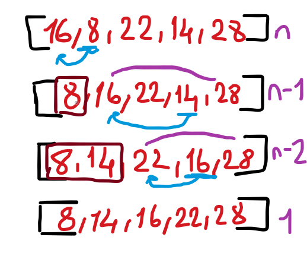
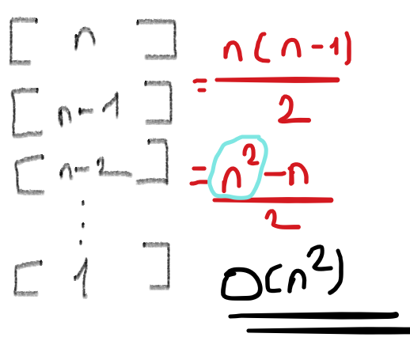

# Insertion Sort

- En basit sorting algoritmalarından biridir.

    

- Verilen örüntüye ait en küçük elemanı buluyor ve en baştaki sayı ile yer değiştiriyor. Peki ya devamı? ikinci en küçük elemanı buluyor ve 2. sıra ile değiştiriyor. Baktın ki 2.sıradaki eleman en küçük **hiç dokunma!!!**. Hemen 3. sıraya geç . 4, 5 derken dizi bitti. İşte insertion sortun temel çalışma prensibini öğrendin.

    
