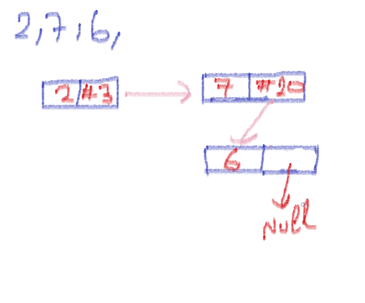
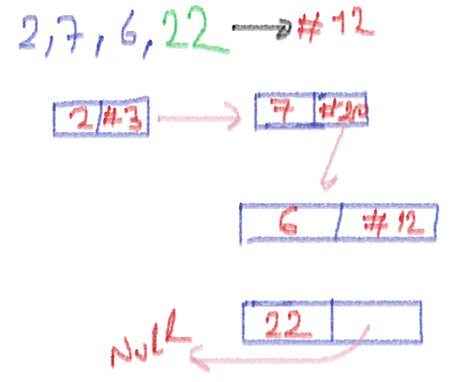
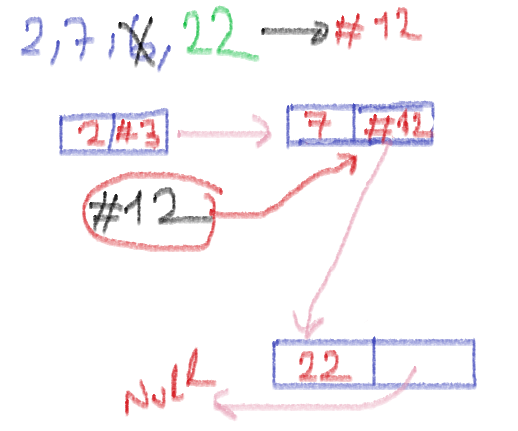

# Eleman ekleme/çıkarma
-Gelin 3 elemanlı bir hücre oluşturalım.

### Eleman Ekleme
Adresi #12 olan 22 sayısını listeye eklemek istiyoruz yapmamız gereken 6 hücresine 22 sayısının adresini yazmak

## Eleman Çıkarma
Adresi #20 olan 6 numaralı hücresini çıkarmak istiyoruz. Linked-List'de bir önceki eleman adresini tutuyordu. Yani 7 numaralı hücrede bulunan 6'nın hücre adresini siliyoruz. Yerine 22 numaralı hücrenin adresini yazıyoruz.

# Sorular
- Bir düğüm kendinden bir önceki düğümün adresini tutabilir.
    - Doğru
    - Yanlış
   

- Yeni bir eleman eklersek linked-list yapısı bozulabilir.
    - Doğru
    - Yanlış
   

- Listeden eleman çıkarmak işleyişi bozmaz.
    - Doğru
    - Yanlış

# Kaynaklar

## Türkçe

- [linked-list-operasyonlar-kod-dökümü](https://medium.com/@tolgahan.cepel/do%C4%9Frusal-veri-yap%C4%B1lar%C4%B1-2-ba%C4%9Fl%C4%B1-liste-linked-list-8e5d3d84c41f)

## İngilizce

- [linked-list-operations](https://www.programiz.com/dsa/linked-list-operations)