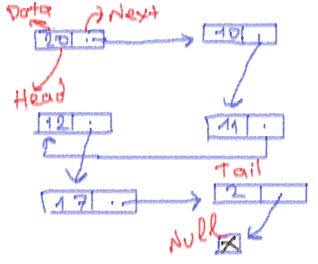

# Linked-List

- Linked-List (Bağlı listeler), yan yana zorunluluğu olmadan veri tutmamızı sağlayan yapılardır. Yeni gelen eleman için hafıza'da yeni bir alan açmamız gerekmez. Array'dan farklı olarak evet elemanlar hafıza içerisinde dağılmış olabilir, fakat son gelen eleman kendinden bir önceki elemana adresini bildirmek zorundadır.

    
    - Yukarıdaki örnekte gördüğünüz üzere, her bir düğüm bir sonrakinin adresini tutar. Her bir önceki eleman bir sonraki eleman ile bağlıdır.

# Sorular
- Linked Listlerde bir düğüm bir önceki düğümün verisini tutar.
    - Doğru
    - Yanlış
   

- Linked Listler içerisindeki düğümler bir veri ve adres tutar.
    - Doğru
    - Yanlış
   

- Aşağıdakilerden hangisi Linked List için doğrudur ?
    - Hafıza konusunda dizilere benzer özelliğe sahiptir.
    - Yeni bir eleman eklerken bellekte yeni bir alan açılır.
    - Her bir düğüm kendinden sonraki düğümün adresini tutar.
    - Linked-List'ler diziler gibi yan yana olmak zorundadır.

# Kaynaklar

## Türkçe

- [Linked-List-Nedir](http://cagataykiziltan.net/veri-yapilari-data-structures/1-linked-list-bagli-listeler/)

## İngilizce

- [Linked-List](https://www.tutorialspoint.com/data_structures_algorithms/linked_list_algorithms.htm)

- [What-is-LinkedList](https://en.wikipedia.org/wiki/Linked_list#:~:text=In%20computer%20science%2C%20a%20linked,which%20together%20represent%20a%20sequence.)