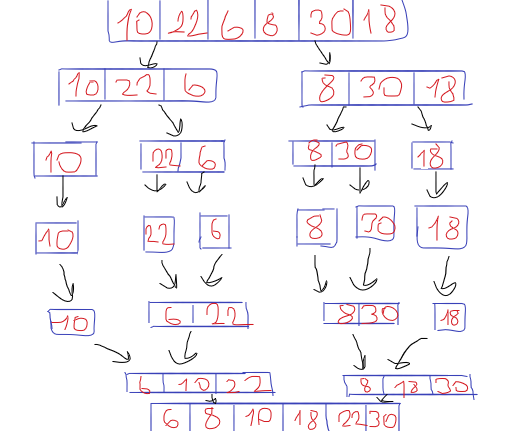
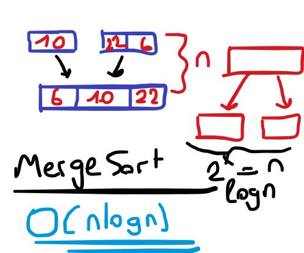

# Merge Sort

- Insertion Sort'da, Big-O gösteriminden dolayı inputum arttığında n^2 olduğunda dolayı çalışma zamanı artıyor.

- Peki daha hızlı bir şekilde sıralama yapılabilir mi? Evet, Merge Sort burda yardımımıza koşuyor. Bir listeyi her adımda parçaya ayırıp tek eleman kalıncaya kadar bölüyor. Böldükten sonra sıralı bir şekilde bize sunuyor (Performans).

    

    

- Insertion sort'da, time complexity n^2 olduğundan ötürü çalışma zamanımız artıyordu. Merge sort'da ise nlogn olduğu için açık ara performans olarak daha iyi diyebiliriz.