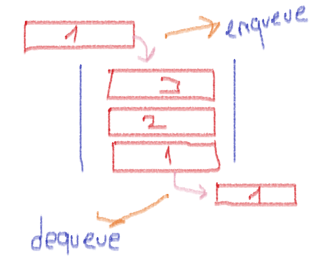

# QUEUE

- Queue (Kuyruk), FIFO(First in First out) (İlk giren ilk çıkar) prensibine dayanan, girişlerde ve çıkışlarda belirli bir kurala göre çalışan yapıdır. Stack de verdiğimiz örneği kuyruğa göre uyarlayalım. Biz örnekte altı kapalı bir koli kutusunu düşünmüştük. Şimdi o koli kutusunun altı yırtılmış. Sonuç olarak ne oluyor? İlk giren ilk çıkmış oluyor.

- Queue (Kuyruk)'da eleman eklemesi yaparken enqueue methodunu kullanıyoruz. Eleman silerken ise dequeue methodunu kullanıyoruz.

    

# Sorular

- Queue ile ilgili verilen bilgilerin hangisi doğrudur?
    - Enqueue methodu ile eleman eklemesi yapılır.
    - Dequeue methodu ile eleman eklemesi yapılır
    - Queuelerde first in last out prensibi kullanılır.
    - Queueler doğrusal olmayan bir veri yapısıdır.
   

- Queue first in first out prensibini kullanır.
    - Doğru
    - Yanlış
   

- Aşağıdakilerden hangisi bir queue örneğidir ?
    - Yemekhaneye önce giden öğrencinin en erken ayrılması
    - Servise yetişen bir öğrenci
    - Erken kalkmak
    - Duş almak
# Kaynaklar

## Türkçe
- [queue-kod-ile-anlatım](https://medium.com/@tolgahan.cepel/do%C4%9Frusal-veri-yap%C4%B1lar%C4%B1-4-kuyruk-queue-dcbd07e8ba77)

- [queue-detaylı-anlatım](https://cdn-acikogretim.istanbul.edu.tr/auzefcontent/20_21_Guz/veri_yapilari/7/index.html)

## İngilizce

- [queue-short-definition](https://www.educative.io/edpresso/what-is-a-queue)

- [queue-detail-definition](https://www.studytonight.com/data-structures/queue-data-structure)