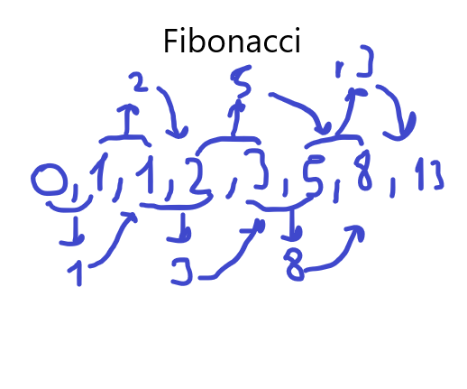

# Recursion

- Bir problemin alt problemlere bölünüp hesaplanmasına, nerde son bulacağımı belirttiğimiz ifadelere recursion (Özyineleme) diyoruz. Peki bu recursion ne anlama geliyor dediğiniz duyar gibiyim. Hadi gelin fibonacci serisi ile konumuzu pekiştirelim.
    
    
    - Fibonacci serisi 0,1 den başlıyarak her önceki 2 sayının toplamı şeklinde bir kurala sahiptir. 0+1 = 1, 1+1=2, 2+1=3, 3+2=5 gibi. Kendinden bir önceki eleman ile iki önceki elemanın toplamı serinin devam sayısını verir. Recursion kullanımı : Fonksiyonumuz fib(x). 3. elemana n diyelim, fib(n-1) + fib(n-2) bize 3.elemanı yani 1 sonucunu verir. fib(n-1) + fib(n-2) => Recursion

# Sorular
- Aşağıdakilerden hangisi recursion olayına örnek olabilir?
    - Halı sahada topa vurmak
    - Sabahları uyanmak
    - Kahve hazırlamak
    - Su taşımak
    

- Aşağıdaki tanımların hangisi yanlıştır?
    - Recursion, bir problemin alt problemlere bölünüp hesaplanması sürecidir.
    - Fibonacci serisinde, 0 ve 1 haricindeki n sayısı kendinden önceki iki sayının toplamında oluşur.
    - Recursion için tekrarın bir önemi yoktur. Önemli olan sonuçtur.
    - Fibonacci serisi, 13. yüzyılın başlarında yayınlanan Liber Abaci kitabında keşfedilmiştir.
    

- Recursion, kendi kendini çağırmak anlamına gelebilir.
    - Doğru
    - Yanlış

# Kaynaklar

## Türkçe

- [Özyineleme-Nedir](https://tr.wikipedia.org/wiki/%C3%96zyineleme)

- [Fibonacci-Tarihçesi-Açıklaması](https://tr.wikipedia.org/wiki/Leonardo_Fibonacci)

## İngilizce

- [Explanation-of-Recursion](https://www.geeksforgeeks.org/recursion/)