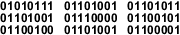

# Bilgisayarda sayısal olmayan verilerin tutulması

- Bilgisayarda var olan herşey 1 ve 0 dan oluştuğunu geçtiğimiz derste gördük. Binary'den onluk tabana nasıl dönüştürüceğimizi öğrendik. Peki ya bir harfi nasıl ifade edicez? Sayısal olmayan bir ifadenin sembol ile gösterimi yapılabilir. Mesela, 1100010010 sayısını onluk tabana çevirdiğimizde değeri 786, fakat sayı olarak değilde bir sembol olarak incelersek karşılığı W harfi olabilir. Başka bir örnek, elimizde 100101010 sembolü var ve bu sembolün karşılık geldiği değer V olabilir. 

    

- Sayısal olmayan verilerin bir sembol olduğunu ve 1 ve 0' lardan oluştuğunu hep birlikte öğrendik. Binary olarak gördüğümüz ifade makine kodundan dolayı farklı bir nesneyi işaret edebilir.

# Sorular
- 1001 sembolü bize 'a' harfini ifade ediyor ise 1010 sembolü aşağıdakilerden hangisi olabilir?
    - 'b'
    - 'c'
    - 10
    - 'a'
    

- Aşağıdakilerden hangisi doğrudur?
    - Bilgisayarda her şey donanımdan oluşur
    - 1001 sembolü bazıları için 9 sayısını ifade ederken, bazıları için 'c' harfini ifade edebilir
    - Sayısal olmayan verilerin bilgisayarda tutulması imkansızdır
    - Sayısal olmayan bir ifadenin sembol ile gösterimi yapılamaz.
    

- 100101010 bilgisayarda bulunan resmin bir kısmını ifade edebilir.
    - Doğru
    - Yanlış

# Kaynaklar

## İngilizce
- [Binary-Symbols](https://en.wikipedia.org/wiki/Binary_code)