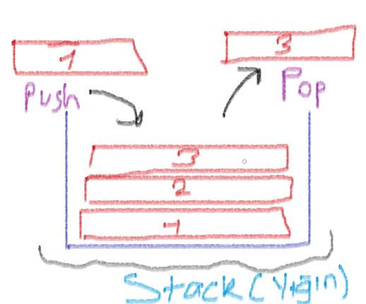

# Stack

- Stack, LIFO (Last in First out) (En son giren en önce çıkar) mantığına dayanan, elemanlar topluluğundan oluşan bir yapıdır. Gelin hemen örneğimize geçelim. Taşınırken topladığınız koli kutusu düşünün. İçerisinde kitaplar var ve en, boy olarak koliye tam olarak koyuluyor. Mantıken kolinin altı kapalı ve üst üste koymanız gerekmektedir. Yeni taşındığınız yerde çıkartırken en üstekinden başlarsınız. İşte stack(Yığın) da aynı mantıkta çalışıyor.

- Yığınlara eleman eklerken ve ya çıkartırken bazı methodlar uygulanır. Bunlardan biri push, diğeri ise pop. Push, yığının üzerine eleman eklemek için kullanılır (Koliye kitap koymak). Pop ise, yığından eleman çıkarmak için kullanılır.

    

# Sorular
- Aşağıdakilerden hangisi stackler için yanlış bir bilgidir ?
    - İlk giren ilk çıkar
    - Son giren ilk çıkar
    - Push methodu ile eleman ekleyebiliriz.
    - Pop methodu ile eleman çıkartabiliriz.

   

- Stack tasarımı dizi veya bağlı liste ile yapılabilir.
    - Evet
    - Hayır

   

- Stackler günümüzde pek fazla kullanılmaz.
    -Evet
    -Hayır
# Kaynaklar

## Türkçe

- [stack-kod-örneği](http://www.baskent.edu.tr/~tkaracay/etudio/ders/prg/dataStructures/Collections/ClassStack.pdf)

- [stack-detaylı-anlatım](https://cdn-acikogretim.istanbul.edu.tr/auzefcontent/20_21_Guz/veri_yapilari/6/index.html)

## İngilizce

- [stack-short-defition](https://runestone.academy/runestone/books/published/pythonds/BasicDS/WhatisaStack.html)

- [stack-defition-with-code](studytonight.com/data-structures/stack-data-structure)