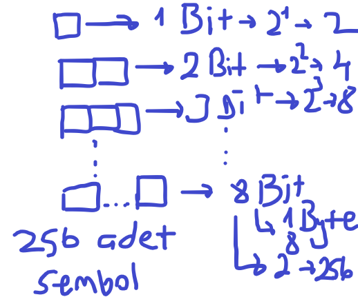
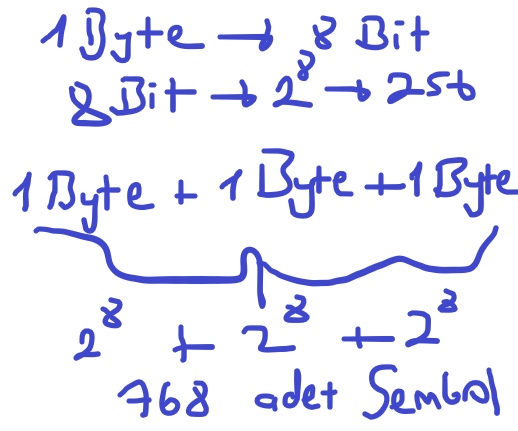
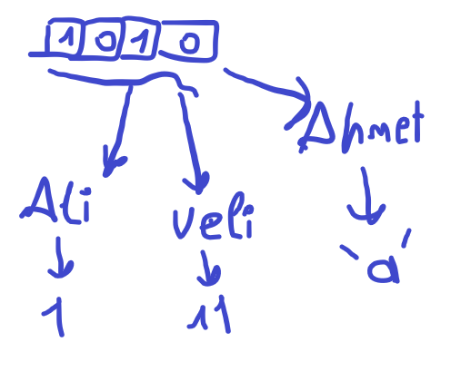

# Bilgisayarda verilen tutulması

- Bilgisayar, yapısından dolayı içerisinde tutulabilecek veri miktarı sınırlıdır. Bu verilerin en küçük yapı taşları bitlerdir. Bu bitleri bir hafıza gibi düşünebiliriz. Ne kadar çok bit dolar ise o kadar az veri depolama alanımız kalmaktadır. Hadi gelin bit ve byte kavramlarını inceleyelim.

    
    
- Şimdi karşımıza çıkan problemlerin bir tanesi, 256 sembolden daha fazla bir depolama alanı isteyebiliriz. Peki bu durum da ne yapıcaz? Aslında çözüm çok basit byte'ları yan yana koyarak depolama alanımızı artırıcaz. Hemmen bir örnek çözelim.
    
    

- Binary semboller, kullanan kişiye göre farklılık gösterebilir. Örneğin, 00 sembolü Ali'ye göre k karakterini sembolize ederken, Veli'ye göre 1 sayısını sembolize edebilir.

    

# Sorular
- Bit ile ilgili verilen bilgilerin hangisi doğrudur?
    - Ne kadar çok bit dolar ise o kadar fazla depolama alanımız vardır.
    - Byte 4 bitten oluşur.
    - Verilerin en küçük yapı taşları bitlerdir.
    - Bit 0 ve 1 haricinde değerler alabilir

- Binary semboller kişiden kişiye farklılık göstermez? Evet ise neden, Hayır ise neden ?
    - Evet
    - Hayır

- Byte 8 bitten daha fazla bit değeri alamaz.
    - Evet
    - Hayır

# Kaynaklar

## Türkçe

- [Bit-Nedir](https://tr.wikipedia.org/wiki/Bit_(bili%C5%9Fim))

- [Byte-Nedir](https://tr.wikipedia.org/wiki/Bayt)

## İngilizce

- [What-is-Bit](https://techmonitor.ai/what-is/what-is-a-bit-4950370)

- [Bit-And-Bytes](https://web.stanford.edu/class/cs101/bits-bytes.html)