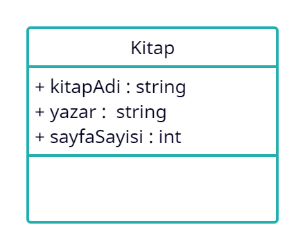
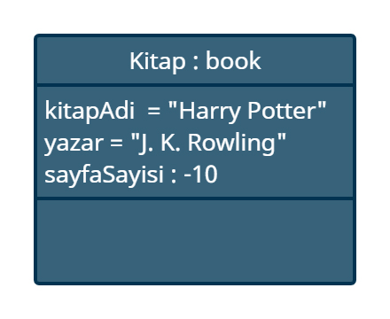
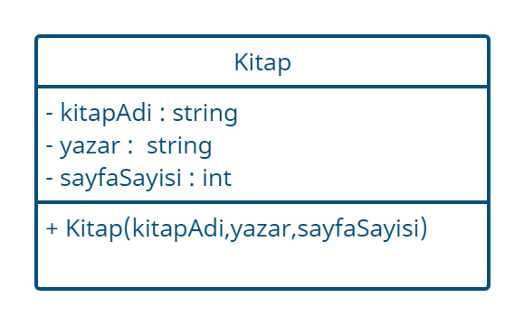
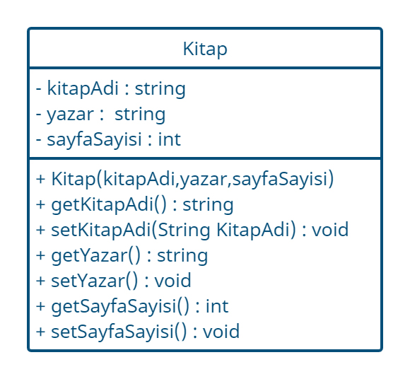

# Encapsulation (Kapsülleme)

Encapsulation (Kapsülleme) ilkesi, bir sınıfa ait niteliklerin ancak o sınıfa ait metotlar tarafından değiştirilebilmesi ve okunabilmesi ilkesidir. Bu ilke
sayesinde nesnelerde oluşacak anlamsızlıkların önüne geçilebilir.

Ayrıca değişkenlere sınıfların dışından erişim olmaması ve bir sınıf içindeki değişkenlerin nasıl ve ne kadar olacağının da başka kodlardan saklanmış olması
anlamına gelir. Böylelikle biz değişkenlerimizi sarmalayarak istenmeyen durumlardan korunacak bir filtre haline dönüştürebiliriz.

## Erişim Belirleyiciler

Bir sınıfa ait nicelik ve özelliklere ulaşabilmek için Erişim Belirleyiciler kullanılır.Erişim belirleyiciler (Access Modifiers), değişken ,metot ve
sınıfların önüne yazılır ve yazıldıkları konuların erişilebilecekleri alanları belirlerler. Java'da 3 adet Erişim Belirleyiciler vardır bunlar ; public ,
private ve protected.

### Private

Private deyimi yazıldığı öğenin sadece ait olduğu sınıftan doğrudan erişilebilir olduğunu ve o sınıfın dışındaki kod parçacıklarından doğrudan
erişilemeyeceğini tanımlar. Nesne Yönelimli Programlama'nın temel ilkelerinden olan Sarmalama ilkesi gereki, sınıf içindeki değişkenler sadece sınıf içinde
doğrudan erişebilir olması gerekir. Bundan dolayı, genellikle değişkenler "private" olarak tanımlanır. Bazı zamanlarda ise sadece o sınıfta çağrılmasını
istediğimiz değişkenler veya metotları da private olarak tanımlarız.

### Public

"public" deyimi , yazıldığı öğenin sadece olduğu sınıf için değil, diğer sınıflar tarafından doğrudan erişilebilir olmasını sağlar. Sınıflara ait
nesnelerin ve diğer nesneler tarafından kullanılması istenilen metotlar için "Public Erişim Düzenleyicisi" kullanılır.

### Protected

"protected" deyimi , public ve private arasında kalan bir erişim düzenleyicidir. Protected ile tanımlanan öğeler, kendisi ile aynı package(paket) bulunan
sınıflar tarafından doğrudan erişebilinir.

### Varsayılan (Default)

Eğer yazdığımız kodlarda herhangi bir öğenin önüne erişim düzenleyici yazmazsak, o öğenin erişimi ait olduğu paket ile sınırlandırılır. Aynı pakette bulunan
başka bir sınıf içinden o öğeye erişilebilinir.


## Encapsuliaton Örneği

Kitap adında bir sınıfımız olsun ve bu sınıfımıza ait 3 adet değişkenimiz olsun bunlar ; kitapAdi, sayfaSayisi ve yazar. Bu değişkenlerin erişim belirleyicileri
public olsun ve her sınıftan erişilsin.



Kitap sınıfından book adlı bir nesne oluşturalım ve bu nesnemizin niteliklerini belirtelim. Peki biz bu sınıfa ait nitelikleri tanımlarken sayfa sayısını
negatif bir değer girseydik ne olurdu ? Hiç bir kitabın sayfa sayısı negatif bir değer olamayacağı için, nesnemizde bir anlamsızlık olacaktır.



Biz bu sorunu constructor (kurucu) metodumuza yazacağımız bir kontrol ile çözebiliriz. Ama sorunlarımız hala bitmedi , biz sınıfa ait niteliklere hala dışarıdan
erişebiliyoruz çünkü erişim belirleyicisi "public". Bu sorunu çözmek için sınıfa ait nitelikleri dışarıdan erişimi kapatmamız gerekir ve oluşturduğumuz
niteliklerin erişim belirleyicilerini (Access Modifiers) değiştirmemiz gerekli. Tüm publicleri private olarak değiştiriyoruz.



Sınıfa ait niteliklerin izinlerini private yaparak bu sorunu çözdük ama, biz book nesnesine ait değişkenlere erişimi tamamen kısıtladık. Yani biz oluşturduğumuz
nesneye ait sayfa sayısını herhangi bir yerden çağıramayız çünkü değişken private olarak tanımlandı. Ya da sayfa sayısı yanlış girilmiş bir nesneyi daha
sonrasında düzenleyemeyiz. Bu sorunu çözmek için sınıfa ait değişkenlerimizi kapsülleyerek, sınıf içerisinde ki metotlar yardımı ile değişkenlerimizi koruma
altına alıyoruz ve kullanıma sunuyoruz. Bu metotlara **Getter** ve **Setter** metotları diyoruz.



## Getter

Sınıfımıza ait private değişkenler mevcut. Bu değişkenlere dışarıdan erişebilmek için her bir değişkenimiz için Getter metodu yazmalıyız. Nesneye ait bu metot
çağrıldığında geriye bir değer döndürmeli ve bu değer bizim istediğimiz private değişken olmalı. sayfaSayisi değişkeni için getter metodu tanımlayalım.

```getSayfaSayisi() : int```

Görüldüğü gibi basit bir metot yardımı ile sınıfa ait private değişkenimize ulaşabildik. Burada dikkat edilmesi gereken noktalar getter metotları geri dönüşü
olan metot tipindedir ve isimlendirilmesi ise get ile başlayıp sonra değişken ismi yazılmalıdır. İsimlendirmeyi bu şekilde yapmasak da çalışacaktır lakin kodun
okunabilirliği adına bu kurala uyulması gerekir.

## Setter

Biz getter metodu ile private olan değişkenimize ulaştık.Peki bu değişkenin değerini değiştirmek istediğimizde ne yapmalıyız ? Bir sınıfa ait private bir
değişkenin değerini değiştirmek için, setter metodu yazılmalıdır. sayfaSayisi değişkeni için setter metodu yazalım.

```setSayfaSayisi(int sayfaSayisi) : void```

Görüldüğü üzere setter metodu sadece değiştirme işlemi yapacağı için void olarak tanımlandı ve bir adet parametre aldı. Bu parametre bizim yeni değerimizi
taşıyor olup, sınıfa ait değişkene aktarılmıştır. Ama burada hala bir sorun söz konusudur, bizler setter metodunu kullanarak sayfa sayısını negatif girebiliriz.
Bu sorunu aşmak için constructor (kurucu) metotta yaptığımız gibi bir koşul ile bu sorunu çözebiliriz. Setter metodunu modifiye ederek nesnemiz için anlamsız
olan durumu ortadan kaldırmış olduk. Setter metodunun genel özellikleri ise , geriye bir değer döndürmeyen metot olması ve isimlendirme yaparken başlangıç
olarak set yazıp sonrasında değişken ismini yazmaktır.

Bu örnekteki sayfaSayisi değişkenini koruma ve anlamsızlaşmasını önlemek için Nesne Yönelimli Programlamanın ilkesi olan Encapsulation (Sarmalama) ilkesinden
yararlandık. Bir sınıfa ait değişkenlerimizi Getter ve Setter metotları yardımı ile sarmaladık ve istenilen şartlara göre oluşmasını sağladık.


