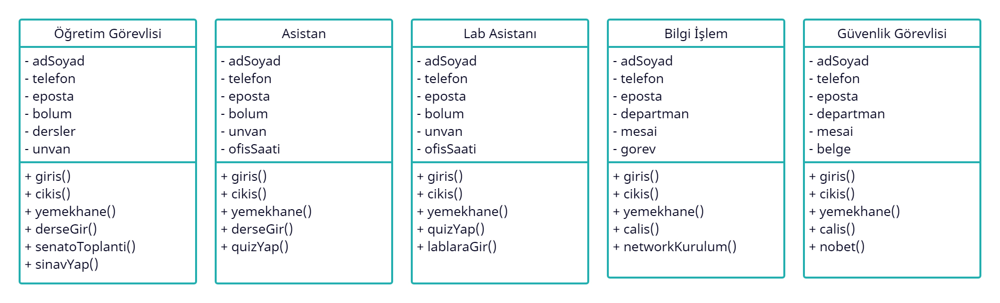
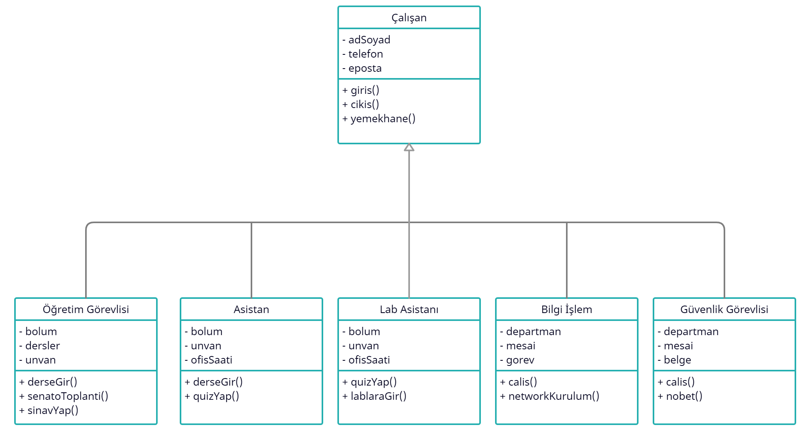
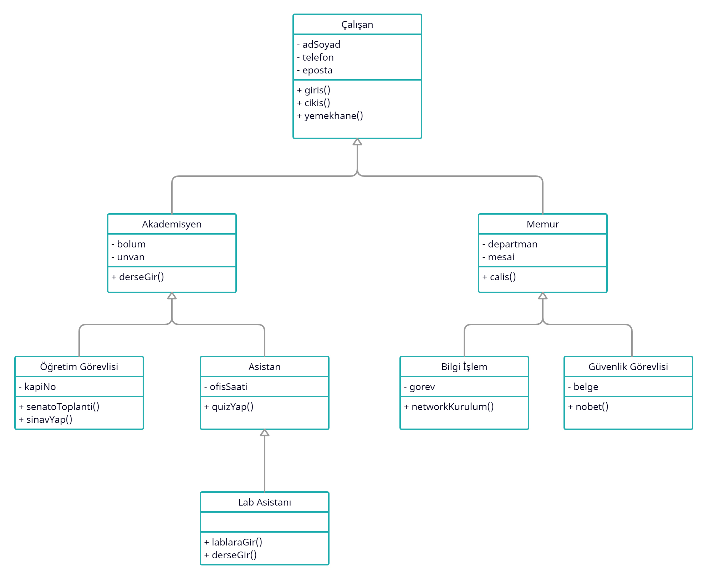

# Kalıtım (Inheritance)

Kalıtım, programlama ortamında da gerçek hayattaki tanımına benzer bir işi gerçekleştirir. Bir sınıfın başka bir sınıftan kalıtım yapması demek, kalıtımı yapan
sınıfın diğer sınıftaki nitelik ve davranışlarını kendisine alması demektir. Kalıtımı yapan sınıfa **alt sınıf**, kendisinden kalıtım yapılan sınıfa **ata
sınıf** dersek, ata sınıfta tanımlı olan herşeyin alt sınıf için de tanımlı olduğunu söyleyebiliriz.

## Kalıtım Türleri

### Tek Yönlü Kalıtım (Single Inheritance)

Bir sınıfın başka bir sınıfı genişlettiği alt ve ata sınıf ilişkisini ifade eder.

Bu örnekte B sınıfı A sınıfını miras alır.

### Çoklu Kalıtım (Multiple Inheritance)

Bir sınıfın birden fazla sınıfı miras almasını ifade eder; bu, bir alt sınıfın iki ata sınıfa sahip olduğu anlamına gelir.

Not : Java çoklu kalıtımı desteklemez. (Interface kullanılır)

### Çok Seviyeli Kalıtım (Multilevel Inheritance)

Bir sınıfa ait alt sınıfın başka sınıfları genişletmesine denir.

Bu örnekte , C sınıfı B sınıfını miras alır, B sınıfı ise A sınıfını miras alır. C sınıfı dolaylı yoldan A sınıfınıda miras almış olur.

### Hiyerarşik Kalıtım (Hierarchical Inheritance)

Birden fazla sınıfın aynı sınıfı genişlettiği bir alt ve üst sınıf ilişkisini ifade eder.

Bu örnekte : B, C ve D sınıfları aynı A sınıfını genişletir.

### Hibrit Kalıtım (Hybrid Inheritance)

Programda birden fazla kalıtım türünün kombinasyonuna denir. Örneğin, A ve B sınıfı, C sınıfını genişletir ve başka bir D sınıfı, A sınıfını genişletir, bu bir
hibrit kalıtım örneğidir, çünkü bu, tek yönlü ve hiyerarşik kalıtımın bir birleşimidir.

## Kalıtım Örneği

Bir üniversitenin işlerinin yürütültüğü bir program yazdığımızı varsayalım. Programda ki tüm olayları modelleyerek sınıflar haline getirelim ve bu sınıfların
niteliklerini, davranışlarını belirleyelim.

Normal şartlarda yukarıda ki gibi bir diyagramın ortaya çıkması gerekli. Programda 5 adet sınıf ve bu sınıflara ait nitelik ve davranışları belirttik. Ama bu
güzel bir tasarım değil ve "Don't Repeat Yourself" ilkesine aykırı. Ayrıca Nesne Yönelimli Programlamanın nimetlerinden de yararlanmamış oluruz. Benzer işi
yapan sınıfların ortak özelliklerini gruplayabiliriz. Gruplamak için Nesne Yönelimli Programlamanın "Kalıtım" ilkesinden yararlanabiliriz. Tüm sınıflara ait
ortak özellikleri tek bir ana sınıfta toplayıp geri kalan sınıfları o ana sınıftan türetelim.

Görüldüğü üzere tüm sınıflardaki ortak özellikleri tek bir sınıf olan "Çalışan" sınıfında topladık ve böylelikle aynı kodları tekrar tekrar yazmaktan kurtulduk.
Ama bu da yine iyi bir tasarım değil, çünkü hala bazı sınıfların kendi aralarında ortak özellikleri bulunmakta. Tekrar bir gruplandırma yapmak programın
tasarımını iyileştirecektir ve işleri kolaylaştıracaktır.

Tasarımın bu hali ile Nesne Yönelimli Programlamanın "Kalıtım" ilkesini kullanarak daha yararlı bir tasarım yaptık. Ortak özellikleri gruplayıp tek bir seferde
yazıp, sonra alt sınıflarda kullanmayı hedefledik. Bu sayede yazacağımız programın kod kalitesini ve okunabilirliğini de sağlamış olduk.
