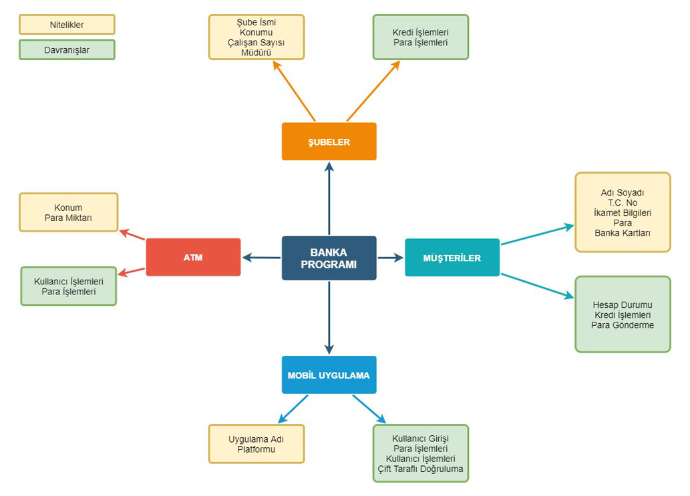
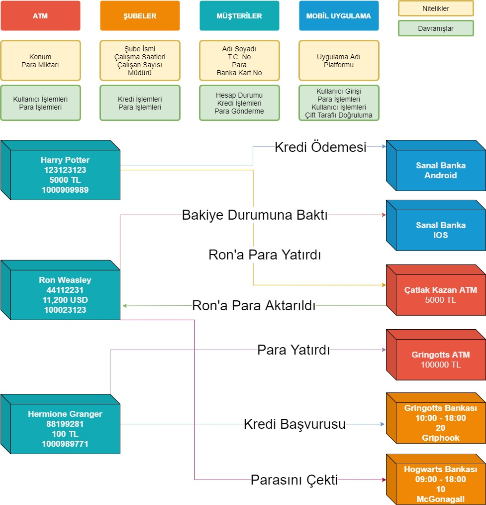

# Sınıf ve Nesne Kavramları

## Nesne (Object) Nedir ?

Nesne kelimesinin TDK'da ki tanımına bir bakalım :

**1.** *isim* Belli bir ağırlığı ve hacmi, rengi olan her türlü cansız varlık, şey, obje.

**2.** *isim, dil bilgisi* Geçişli fiili bütünleyen yalın veya belirtme durumunda bulunan tümleç:
*`Ali bir kitap almış` cümlesinde `kitap` nesnedir.*

**3.** *isim, felsefe* Öznenin dışında kalan her konu, obje:
"*Her nesne ve olaya alaycı bir gözle bakmak ilkesinden yola çıkar bu görüş." -* **Salâh Birsel**

### Nesnelere Örnekler

- Araba, telefon, elma, ördek, kalem gibi günlük hayatta kullandığımız eşyalar.

Bildiğimiz gibi her nesnenin kendine ait **nitelikleri** ve **davranışları** vardır. Nesneler birbirlerinden farklıdır ve kendi **varoluşlarına** göre davranırlar ve kendi kimliklerine sahiptirler.

**Nitelik** : Nitelik kavramı, bir nesnenin özellikleridir ve nesnenin mevcut durumunu tanımlar. Mesela bir ördeğin rengi ve ağırlığı o ördeğin nitelikleridir. Bir ördeğimiz rengi siyah, diğer ördeğimizin rengi beyazdır. Bu durumda her iki nesne (yani ördek) nitelikleri sebebi ile birbirilerinden bağımsızdırlar.

**Davranış** : Bir nesnenin kendine özel yaptığı eylemlerdir. Yine ördek örneğine bakarsak, bir ördek uçabiliyorken diğer bir ördek fiziksel durumu gereği uçamayabilir.

Nesneler hakkında bilmemiz gereken bir diğer husus ise, nesneler bir isimdir. Nesnelerin kendilerine ait nitelik ve davranışları vardır.

## Sınıf (Class) Nedir ?

NYP sınıflar ve nesneler üzerine kurulmuştur, "**Sınıflar**" bir problemi soyutlamak ve genelleştirmek için kullanılan yapılardır veya kılavuzlardır. Sınıflar, bir nesneye ait tüm özellikleri temsil eder. Bu özellikler nesnenin ne tür **nitelikleri ve davranışları** olacağını belirler.

Mesela "**Araba**" bir sınıftır. Arabalara ait nitelikler **renk, hız, vites sayısı, yakıt türü vb.** bir sürü nitelik olabilir. Ayrıca bazı arabalara özel davranışlar olabilir, park sensörü, oto pilot, hız sabitleme gibi arabaların kendilerine özel davranışları da olabilir. Bir araba üretilirken, bir yapım kılavuzuna ihtiyaç vardır. Programlama da bu kılavuzlara "**Sınıf (Class)**" denir.

## Örnek : Banka Sınıf Tasarımı

## Örnek : Banka Nesne İlişkileri

