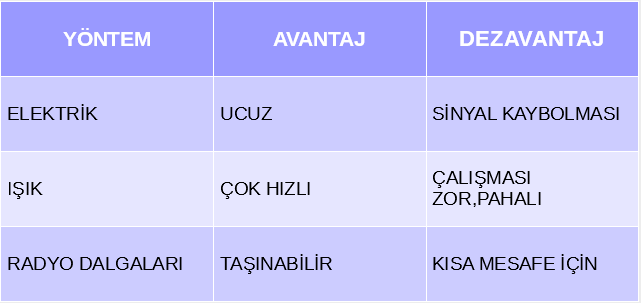

# FİZİKSEL ELEMANLAR ve WİFİ

İnternette paylaştığımız bilgiler [bit](https://tr.wikipedia.org/wiki/Bit_(bili%C5%9Fim)) formatında gidiyor ve ne kullanırsak kullanalım kaynak her zaman fiziksel bir elemana dayanıyor. Bu elektrik veya ışığın geçtiği kablo veya modemden yayılan dalgalar olsun ana kaynak elle tutulur oluyor. Elektrik geleneksel yöntem, ışık ise fiber olarak hayatımıza girmiş bir yöntem. Wifi'ye bağlandığımızda bilgi havadan geliyor gibi görünse de orada da bağlandığımız modemi unutmamak lazım. Dalgalar aracılığı ile iletim yapılıyor bu durumda da.

Bilgi bite dönüştürülüyor ve fiziksel elemanlar aracılığı ile hedefe ulaşıyor. Bant genişliği ise saniyede gönderebildiğimiz bit sayısı. Ne kadar çok olursa o kadar hızlı iletim yaparız. 

Kullandığımız fiziksel elemanların birbirine göre güçlü ve zayıf yanları var. Bunları aşağıdaki tabloda görebilirsiniz.

Aşağıdaki videoda yukarıdaki tablonun detaylı anlatımını bulabilirsiniz. Ayrıca videoyu izlerken altyazılardan "Türkçe" seçmeyi unutmayın.

## Kaynaklar:
- https://roadmap.sh/guides/what-is-internet
- https://www.youtube.com/watch?v=kHxcf2wK_ck&feature=youtu.be
- https://code.org/

