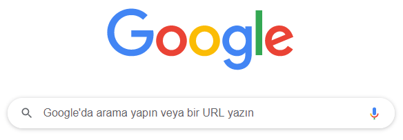

# GOOGLE 

## Google Nedir?

* İnternet tabanlı hizmetler geliştiren ve bunları bünyesinde barındıran Google, internet araması, çevrimiçi bilgi dağıtımı ve reklam teknolojileri alanında yatırımlar yapan çok uluslu bir Amerikan şirketidir.

* Anlık olarak milyonlarca insan tarafından kullanılan Google, 4 Eylül 1998’de Stanford Üniversitesi’nde doktora yapan Sergey Brin ve Larry Page tarafından kuruldu.

* Kurulduğu tarihten itibaren yaklaşık 20 yılda inanılmaz derecede büyüyen Google, bugün dünyanın en değerli ve en prestijli şirketlerinden biri haline geldi.

* [Arama motoru](https://www.vargonen.com/blog/arama-motoru-nedir/), olarak kurulan Google yıllar içinde gelişerek bir sürü [yeni ürün](https://about.google/intl/ALL_tr/products/) piyasaya sürmüştür.

  

### Peki Google neden bu kadar hızlı büyüdü?

* Geleneksel arama motorlarıyla yapılan aramalarda, sonuçlar; aranan terimlerin sayfada kaç kez görüldüğü mantığıyla sıralanıyordu ancak Google siteler arası ilişkilerin analizi konusunda çok daha elverişli iki sistem kuramı ortaya koydu. Bu yeni teknolojiye [PageRank](https://tr.wikipedia.org/wiki/PageRank) adı veriliyordu, bu sisteme göre sayfa dizinlerinin orijinal site ile olan bağlantı dönüşümleri belirlenerek; siteler, gösterilen ilgiye göre sıralanıyordu.

  

# GOOGLE ARAMA

## Google Arama Nasıl Çalışır?

 İşte videoya tam da [buradan](https://www.youtube.com/watch?v=BNHR6IQJGZs&feature=youtu.be) ulaşabilirsiniz!

Google arama motorunda klasik bir arama yaptığınızda, bunlara karşılık gelebilecek binlerce web sayfası bulabilirsiniz. Google bunları belli bir tekniğe göre bulur ve sıralar. Bunu sıralamayı da şu şekilde yapar;

- Arama sayfasına yazdığınız kelimeyi, anlamına karşılık gelen kavramları, dilini ve bu kelimeyi aratan insanların ortak amacına göre bir algoritma çizer.
- Sorguladığınız kavram ile eşleşen web sayfalarını arar. Alakalı bir sayfa bulduğuna dair en temel sinyal ise arama sırasında kullandığınız anahtar kelimeleri içermesidir. Aranan kelimenin hangi sayfada sıklıkla kullanıldığını belirler. Örneğin, ana başlıkta, alt başlıkta ya da metnin içinde mi kullanılıyor olabilir. Alaka düzeyinin artması için yoğunluğu yüksek sayfaları sıralamada yukarı taşır.
- Sonuçları sunmaya bir adım kala web sayfalarındaki bilgilerin bir araya geliş şeklini değerlendirir. Yani sayfada tek bir konuya mı odaklanılmış yoksa birden çok konu tek seferde mi işlenmiş, buna bakılır. Olabildiğince kapsamlı ve geniş bilgiler içeren web sitelerinin bizlere daha çok yardımcı olacağı varsayımıyla hareket eder.
- Bulunduğunuz konumu, geçmiş aramalarınızı, arama için yaptığınız ayarları, geçmişte sık sık kullandığınız web sitelerini de dikkate alarak karşınıza bir sonuç sayfası çıkarır.

## Google Arama Nasıl Etkili Kullanılır?

 

* **İnternet** günlük hayatın vazgeçilmez bir parçası. Sınırlarını hayal etmekte bile zorlandığımız bu devasa bilgi ağında kullanıcılar aradıklarını hızlı bir şekilde bulabilmek için arama motorlarından yardım alıyor.
* Bildiğiniz gibi Google şu an için en popüler arama motoru konumunda. Milyonlarca kullanıcı aradıkları sonuca ulaşabilmek için Google’ın gelişmiş filtreleme ve arama özelliklerini kullanıyor. **Google** her ne kadar gelişmiş filtreleme seçenekleri sunsa da kullanıcıların da atması gereken bir takım adımlar var. Bu adımlar sonuçların daha doğru ve daha net olmasını garantiliyor. Gelin şimdi atılması gereken adımları inceleyelim. Bu adımları oluştururken doğru ve anlaşılır olmasına dikkat ettik. Bu nedenle başta "Tamindir" olmak üzere, çeşitli teknoloji sitesinin yazdığı içeriklerden faydalandık.

### **1- Mümkün olduğunca basite indirgeyin.**

Yapacağınız aramayı ne kadar komplike hale getirirseniz sonuçlar da bir o kadar karmaşık olacaktır. Bu yüzden aramanızı mümkün olduğunca **basit** tutun. Bu tavsiyeyi uygulayabilmek için aramak istediğiniz konu hakkında bir veya iki kelime seçin ve bu şekilde aratın. Bu aramadan çıkan sonuçlar yetersiz gelirse birkaç adet daha konuyla alakalı kelime yazarak arama yapabilirsiniz.

#### Örnek!

**Arama:** Türkiye’nin yüzölçümü kaç kilometrekaredir?

**Daha etkili arama:** Türkiye yüzölçümü

### **2- Kelimelerin dizilimine dikkat edin.**

Arama yaparken doğru kelimeleri seçmek kadar bu kelimelerin nasıl dizildiği de çok önemli. Google’da çıkacak **sonuçlar** tamamen yazdığınız kelimelerle alakalı olacağından anahtar kelimeleri mümkün olduğunca nokta atışı yapacak şekilde seçmek gerekiyor.

Google’da ünlü bir cümle veya özlü söz aratacağınız zaman anahtar kelimelerin sırasına mümkün olduğunca dikkat etmek gerekiyor.

#### Örnek!

**Arama:** Az düşünürse insan konuşur

**Daha etkili arama:** İnsan ne kadar az düşünürse, o kadar çok konuşur

Her ikisinde de sonuçlar çıkıyor fakat ikinci adımdaki mantığı uygularsanız daha karmaşık sonuçlar için daha etkili bir arama metodu uygulamış olursunuz.

### **3- Gereksiz kelimeleri ve işaretleri atlayın**.

Google yapılan aramalardaki eksikleri ve hataları düzeltebilecek kapasiteye sahip. Bu özelliği sayesinde Google anahtar kelime olarak belirtilenler arasından gereksiz olarak algıladıklarını zaten göz ardı edecektir. Bu yüzden o kelimeleri girmekle vakit harcamayın ve direkt olarak sonuç odaklı çalışın.

#### Not: 

Google’da arama yaparken aşağıdaki maddelere dikkat etmeseniz de olur;

- Heceleme

- Büyük ve küçük harf

- Noktalama işaretleri

- Özel karakterler (parantez, artı, eksi vb.)

  

### **4- Sosyal aramalar**

Sosyal medya kanaları üzerinde aradığınız sonuçlar için yapacağınız aramalarda bazı noktalara dikkat etmeniz gerekiyor.

#### **+[profil-ismi]**

​		Google’da yapacağınız aramanın başına + (artı) işareti koyduktan sonra bir isim yazıp arattığınızda o ismin **Google** **Plus** hesaplarına ulaşabilirsiniz.

#### **#[kelime]**

​		Hashtag (#) sembolünü kullanarak yapacağınız aramalarla Google+, Twitter ve diğer **sosyal** **medya** platformlarında yer alan hashtag’lere ait sonuçları listeleyebilirsiniz.

#### **@[kişi-ismi]**

​		Sosyal medya kanalları üzerinde yapacağınız kişi aramaları için kişi isminden önce "@" sembolünü kullanmanız gerekmekte.

### **5- Gün doğumu ve gün batımı sonuçları**

Google’ı dünya üzerindeki herhangi bir şehrin veya bölgenin gün doğumu ve gün batımı saatlerini öğrenmek için kullanabilirsiniz.

Bunu yapabilmek için;  *Gün doğumu/gün batımı, şehir ismi*

### **6- Eş anlamlı kelime ile arama yapma**.

Google’da herhangi bir anahtar kelimeyi eş anlamlı alternatifleriyle aratma şansına sahipsiniz.

**(~)** sembolünden sonra yazacağını herhangi bir kelime eş anlamlı alternatifleriyle aratılacak. Bu sembolü yapmak için;  ***Alt Gr + Ü*** *(ardından kelimeyi yazın)*

### **7- Limitler arası arama yapma.**

Google’da belirli limitler arasında arama yapabilirsiniz. Bu limitler fiyat aralığı, tarih veya ölçü birimi olabilir.

**Tavsiye edilen arama tipi:** *3000..4000 TL Android telefon*

Elbette bu örneğe benzer şekilde birçok farklı arama gerçekleştirebilirsiniz.

### **8- Dosya tipleriyle arama yapın**

Herhangi bir konuda arama yaparken çıkacak sonuçları belli bir dosya tipiyle sınırlandırabilirsiniz.
Örneğin akademik bir makale ararken başa **"pdf" **yazarsanız sadece *pdf* sonuçlardan oluşan bir liste bulabilirsiniz.

**İdeal arama: ** *pdf yazılım öğrenme yöntemleri*

**Google**’da arama yaparken bu adımları izleyerek daha **hedef** **odaklı** aramalar yapabilir ve arama yaparken harcayacağınız vakti hatırı sayılır ölçüde kısaltabilirsiniz. Bahsini ettiğimiz teknikleri tek tek uygulayabileceğiniz gibi birkaç tanesini kombine edip arama yapmak da mümkün. Eğer siz de Google’ı aktif bir şekilde kullanıyorsanız arama sonuçlarınızı daha efektif hale getirmek için yukarıdaki önerileri uygulayabilirsiniz.

# GOOGLE'U NEDEN KULLANIYORUZ?

* "Google'u neden kulanıyoruz?". Seneler öncesinde bu soru ile karşılaşmış olsaydık vereceğimiz cevaplar "Bilmediğim bir şeyi öğrenmek için kullanıyorum." ya da "Araştırma yapmak için kullanıyorum." şeklinde olacaktı.

* Ancak Google, gelişmesiyle birlikte bir arama motorundan fazlası olmaya başladı. Artık gün içinde kullandığımız çoğu uygulamanın Google'un bir ürünü olduğunu söyleyebiliriz. Bir yere giderken kullandığımız haritalar uygulaması, yeni bir dil öğrenirken kullandığımız çeviri uygulaması, fotoğraflarınızı başarılı bir şekilde  yedeklediğiniz fotoğraflar uygulaması ve dahası verebileceğimiz örneklerdir.

  

* Peki gelin sizler için soruyu biraz daha özelleştirelim.

  

## Yazılım Konusunda Google'u Nasıl Kullanıyoruz?

* Kullandığınız yazılım dilinde bilmediğiniz bir kavramla karşılaştığınızda nasıl bir yol izliyorsunuz?

  * Karşılaştığınız kavramı, Google'da aratarak  bu konuda yazılmış birden fazla yazıya, konuyu anlatan görsellere, hatta sizlere bunu daha da iyi açıklamak için hazırlanmış videolara ulaşabilirsiniz. 

  

* Öğrenmeye yeni başladığınız ya da deneyimli olduğunuz bir yazılım dilinde daha önce karşılaşmadığınız bir hata aldığınızda neler yapıyorsunuz?

  * Yazılımı, yıllardır durmadan kendini güncelleyen, gelişen bir kavram olarak düşünebiliriz. Aldığınız hatalar, daha önceden bir başkası tarafından alınmış ve çözüm yolu paylaşılmış hatalar olabilir. Bu nedenle aldığınız bir hatayı Google'da aratarak milyonlarca yazılı, görüntülü ve sesli çözüme ulaşabilirsiniz.

* Diyelim ki, sizlere yönelttiğimiz bu iki soruda da izlediğimiz çözüm yolları işe yaramadı. Bu durumda ne yapacağız? 

  * Karşılaştığıımız ve içinden çıkamadığımız bu durumdan araştırarak, deneyimli insanlara ulaşıp yaşadığımız sorundan bahsederek kurtulabiliriz.
  * İşte tam da bu sırada, sorunumuzu yüzlerce deneyimli, bilgili insanla paylaşabileceğimiz yazılım ile ilgili forum sayfaları devreye giriyor diyebiliriz.
  * ["Kod Koda"](https://www.kodkoda.com/) ve ["Stack Overflow"](https://stackoverflow.com/) bu forum sayfalarına verebileceğimiz örneklerdir.

* "Kod Koda" ile ilgili detaylı bilgiyi [buradan](https://github.com/Kodluyoruz/taskforce/tree/basics/basics-for-everyone/kodkoda); "Stack Overflow" ile ilgili deyatlı bilgiyi de buradan alabilirsiniz.

  

## Kaynaklar

* https://tr.wikipedia.org/wiki/Google
* https://en.wikipedia.org/wiki/Google
* https://www.crmmedya.com/google-nedir/
* https://www.vargonen.com/blog/arama-motoru-nedir/
* https://about.google/intl/ALL_tr/products/
* https://www.tamindir.com/blog/googlei-daha-etkili-kullanmak-icin-ipuclari_15804/
* https://www.kodkoda.com/
* https://stackoverflow.com/