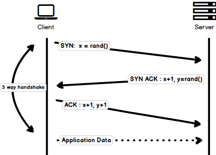
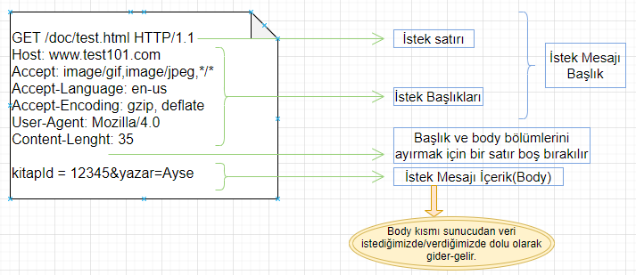
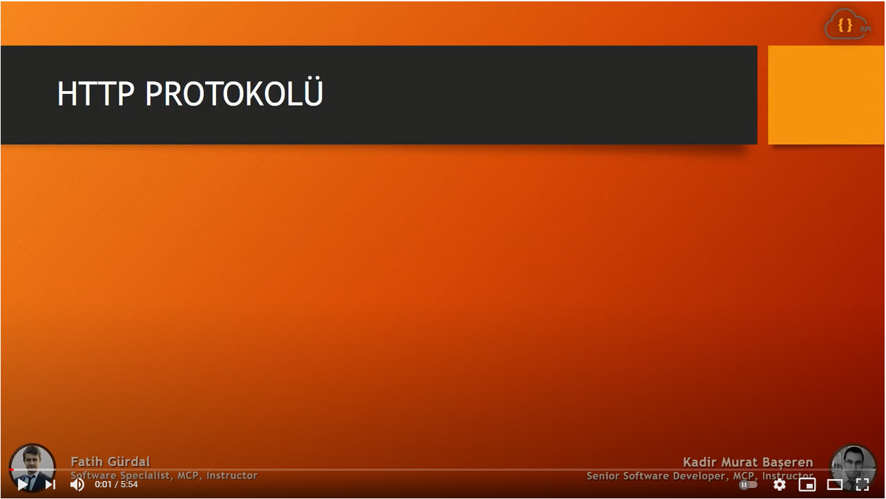
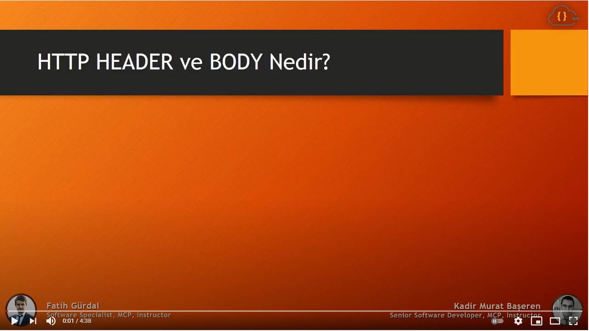
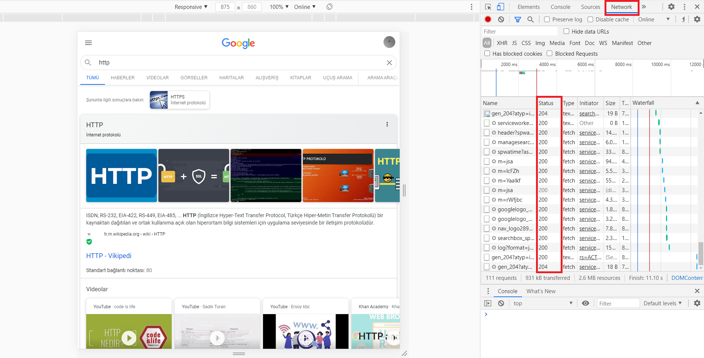
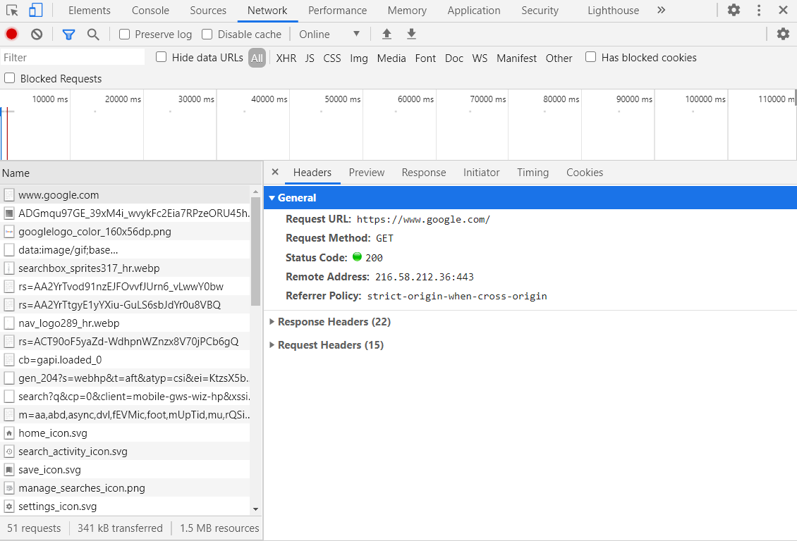

# HTTP NEDİR?

HTTP (Hyper-TextTransfer Protocol), istemci ve sunucunun birbiri ile nasıl iletişim kurduğunu standartlaştıran TCP/IP tabanlı application layer (uygulama katmanlı) iletişim protokolüdür. İçeriğin internet üzerinden nasıl talep edildiğini ve iletildiğini tanımlar. Varsayılan olarak TCP portu 80’dir ama diğer portlar da kullanılabilir. Ama HTTPS 443 portunu kullanır. 

İstemci ve sunucu ilk önce TCP bağlantısı kurar. İletişimin güvenli olduğunu kanıtlamak için üçlü el sıkışma(three-way handshake) denilen paket alışverişi gerçekleştirilir. 

İletişim güvenli olduktan sonra istek ve cevaplar ile veri alışverişi başlar. HTTP protokolü burada devreye girer. HTTP bir protokol olarak mesajlaşmanın nasıl olacağını tanımlar. Belirli formatlar sağlayarak iki tarafın da aynı dili konuşmasını sağlar. 

Genel format "method istek-hedefi HTTP/x" şeklindedir. Örneğin "GET /doc HTTP/1.1" gibi.

* Protokol içerisinde çeşitli metodlar mevcuttur. GET,POST,PUT,HEAD,DELETE,... GET metodu, istemci olarak sunucu üzerinden istediğimiz nesneyi belirtmeye yarar. Bu nesne bir sayfa olabilir, doküman olabilir,..
  - GET:  İstediğimiz web sayfasını okumak için kullanılır. (READ)
  - HEAD:  İstediğimiz web sayfasının header bilgisini sunucudan almak için kullanılır.
  - PUT: Web sayfasına bir dosyayı saklaması için talep gönderilirken kullanılır. (UPDATE)
  - POST: Bir veriyi ilgili sayfaya göndermek için kullanılan http istek mesajında kullanılır. (CREATE, INSERT)
  - DELETE: Bir veri silinmek isteniyorsa kullanılır. 
  - TRACE: Sunucu tarafında gelen istekleri görüntülemek için kullanılır.
  - CONNECT: İstenilen kaynakla iki yönlü iletişim başlatmak için kullanılır. Bir tünel açar.
  - OPTIONS:  Belirli seçenekleri sorgulamak için kullanılır. 

* Host olarak belirtilen hangi web sitesine bu talebi yaptığımızdır. 

* Bağlantının nasıl devam edileceği de belirtilir. İki türlü devam edebilir: "close" ve "keep-alive". Eğer "Connection:close" olarak bağlantı kurulmuşsa istek için cevap gelince bağlantı sonlandırılır. Keep-alive olarak kurulmuşsa bağlantı devam eder. Close her seferinde bağlantı kurmayı gerektirdiği için performans ve kaynak kaybına sebep olabilir.

* Tarayıcılarımızın kendine ait "user-agent" var. Bununla sunucu tarayıcıya özel ayarlar yapabiliyor ya da tarayıcıya özel içerikler üretebiliyor. 
* "Accept-language" başlığı ile tercih edilen dil belirtiliyor. 

Sunucu cevap döndüğünde de istek gibi HTTP formatında gelir. İlk satırda durum kodu olur. Durum kodu(status code), isteğimiz ile cevabın uyumunu gösterir.  Bu kodlar gruplar halindedir. 100 ile başlayan kodlar "Bilgi" amaçlı, 200 ile başlayan kodlar "Başarı" ile gerçekleşen komut bildirmek amaçlı, 300 ile başlayan kodlar "Yönlendirme" amaçlı gönderilir bu kodu gördüğümüzde yönlendirdiği şekilde aksiyon alırız, 400 ile başlayan kodlar "İstemci Hatası" bildirmek içindir yanlış kaynağı istemiş olmak gibi, 500 ile başlayan kodlar "Sunucu Hatası" bildirmek amaçlıdır sunucuda problem olduğunda verilir. Örnek olarak bazı durum kodları şunlardır:

* 102: İşleme devam ediliyor. Bilgi amaçlı sunucu tarafından gönderilir.

* 200: İstek başarılı bir şekilde gerçekleşmiştir. Veriler HTTP cevap mesajı ile gönderilmiştir.
* 301: İstenilen objenin yeri değişmiştir ve location başlığında yeni yeri istemciye söylenmiştir.
* 400: Sunucu istenilen mesajı anlayamamıştır.
* 404: İstenilen obje sunucu üzerinde bulunmamaktadır. (Klasik 404 Not Found hatası)
* 503: Sunucu ulaşılabilir değil.

Cevap içerisinde aynı zamanda sunucu başlığı da bulunuyor. Bu kullanılan web servisinin adı ve işletim sistemi adını dönüyor. Bu başlık zorunlu olmadığı için genelde HTTP cevap mesajında bulunmaz. Bir diğer başlık "Last-modified", istenilen objenin en son ne zaman düzenlendiğini bildiriyor. "Content-Lenght", gönderilen objenin boyutunu byte cinsinden bildiriyor, bu header kullanım amacı veri parça parça geldiğinde istemciye 'Veri akmaya devam ediyor,cevap bitmedi.' mesajını vermek."Set-cookie" başlığı, sunucunun çerez(cookies) oluşturması için bulunuyor."Content-Type", gönderilen verinin tipini belirtiyor.

Başlık kısmından sonra body kısmı bulunuyor ve sunucudan veri geliyorken sunucudan istenilen objenin kendisi bulunuyor(tabi durum kodu OK ise). Body içeriği, istek sırasında header içerisinde "content-type" ile belirtilen format ile gelir.

Buraya kadar öğrendiklerimizi pekiştirmek için aşağıdaki iki videoyu izleyebilirsiniz.

Peki bu HTTP trafiğini nasıl görebiliriz. Günlük internet kullanımımızda bu yapılarla hiç karşılaşmamış olma ihtimalimiz yüksek. Öncelikle bir tarayıcı açalım. Tarayıcı üzerinde F12'ye bastığınızda bir pencere açılacak. Pencerede "Network" seçeneğine tıklarsanız tüm trafiği görebilirsiniz. Durum kodlarını fark ettiniz mi ? 

Gelen-giden paketlerden birinin üstüne tıklarsanız aşağıdaki gibi detaylı bakmak için yan pencere açıldığını göreceksiniz. Bu pencere üzerinden paketin header, cevap ön izlemesi (Preview), cevap body içeriği (Response), zaman detayları (Timing), çerez bilgilerini (Cookies) görebilirsiniz.

Genel HTTP hakkındaki öğrendiklerimizi özetlemek için Kodluyoruz bünyesinde Türkçeleştirilen bir Harvard dersi ile sonlandıralım.

 Kaynak:

* https://kamranahmed.info/blog/2016/08/13/http-in-depth/

* https://umuttosun.com/http-protokolu/

