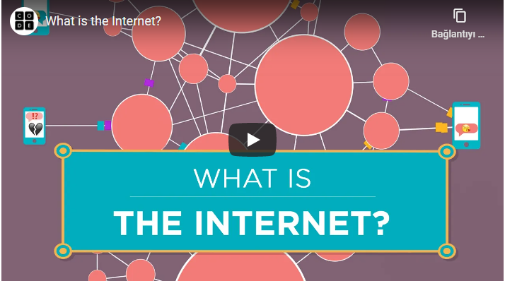

# İNTERNET NEDİR?

İnternet, belirli standartlar dahilindeki protokoller aracılığı ile iletişimi sağlayan küresel bir ağdır. Dağıtık sistem mimarisi vardır, bu sayede merkezi değildir, biri tarafından yönetilmez.

Aşağıdaki videoda "İnternetin babası" olarak adlandırılanlardan biri olan [Vint Cerf](https://tr.wikipedia.org/wiki/Vint_Cerf) ile "İnternet nedir?" konusu konuşulmuş. İnternetin aslında [ARPANET](https://tr.wikipedia.org/wiki/ARPANET) projesinden ortaya çıktığı ve savaşta bir yer bombalanınca sistemin tamamen çökmesini engellemeye karşı çözüm olarak bulunan dağıtık sistem mimarisini kullandığını biliyor muydunuz? 

Not: Aşağıdaki videoyu izlerken altyazılardan "Türkçe" seçmeyi unutmayın.

## Kaynaklar:
- https://roadmap.sh/guides/what-is-internet
- https://www.youtube.com/watch?v=kHxcf2wK_ck&feature=youtu.be
- https://code.org/

