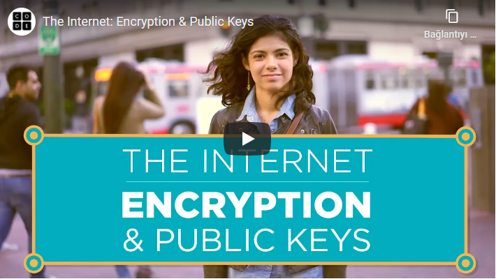

# ŞİFRELEME ve PUBLİC KEY

İki cihaz iletişim kurarken veriyi olduğu gibi gönderseydi araya biri girip veriyi okuyup tekrar saldığında haberimiz olmazdı çünkü veri hedefe ulaştığı sürece ufak bir gecikme olduğunu düşünürdük. Bu sebeple veriyi olduğu gibi göndermiyor şifreliyoruz. Bunun için çeşitli yöntemler var. Günümüzde 256 bitlik anahtarlar ile şifreleme yapılıyor. Bu anahtarlar kullanılarak veri değiştiriliyor anlaşılamaz hale geliyor. Peki anahtar bizde vardı bununla şifreledik karşı taraf nasıl çözecek ? Bu durumu çözmek için de asimetrik şifreleme var.

Asimetrik şifrelemede iki anahtarımız var : genel(public) anahtar ve özel(private) anahtar. Genel anahtar ile ekleme yapılabilir ama özel anahtar kimde ise veriyi o görebilir mantığı vardır. İnternette TLS ve SSL protokollerinde de bu yöntem temel alınır.

Şifreleme yöntemlerinin tarihi ve örneklerle anlatımı için aşağıdaki videoyu izleyebilirsiniz. Ayrıca videoyu izlerken altyazılardan "Türkçe" seçmeyi unutmayın. 

### Kaynaklar:
- https://roadmap.sh/guides/what-is-internet
- https://www.youtube.com/watch?v=kHxcf2wK_ck&feature=youtu.be
- https://code.org/

