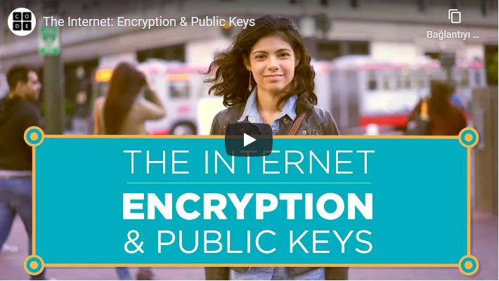

# İnternet Nasıl Çalışır ?

Not: Aşağıdaki videoları izlerken altyazılardan "Türkçe" seçmeyi unutmayın.... 

## İnternet Nedir ?

İnternet, belirli standartlar dahilindeki protokoller aracılığı ile iletişimi sağlayan küresel bir ağdır. Dağıtık sistem mimarisi vardır, bu sayede merkezi değildir, biri tarafından yönetilmez.

Aşağıdaki videoda "İnternetin babası" olarak adlandırılanlardan biri olan [Vint Cerf](https://tr.wikipedia.org/wiki/Vint_Cerf) ile "İnternet nedir?" konusu konuşulmuş. İnternetin aslında [ARPANET](https://tr.wikipedia.org/wiki/ARPANET) projesinden ortaya çıktığı ve savaşta bir yer bombalanınca sistemin tamamen çökmesini engellemeye karşı çözüm olarak bulunan dağıtık sistem mimarisini kullandığını biliyor muydunuz? 

## Fiziksel Elemanlar ve Wifi

İnternette paylaştığımız bilgiler [bit](https://tr.wikipedia.org/wiki/Bit_(bili%C5%9Fim)) formatında gidiyor ve ne kullanırsak kullanalım kaynak her zaman fiziksel bir elemana dayanıyor. Bu elektrik veya ışığın geçtiği kablo veya modemden yayılan dalgalar olsun ana kaynak elle tutulur oluyor. Elektrik geleneksel yöntem, ışık ise fiber olarak hayatımıza girmiş bir yöntem. Wifi'ye bağlandığımızda bilgi havadan geliyor gibi görünse de orada da bağlandığımız modemi unutmamak lazım. Dalgalar aracılığı ile iletim yapılıyor bu durumda da.

Bilgi bite dönüştürülüyor ve fiziksel elemanlar aracılığı ile hedefe ulaşıyor. Bant genişliği ise saniyede gönderebildiğimiz bit sayısı. Ne kadar çok olursa o kadar hızlı iletim yaparız. 

Kullandığımız fiziksel elemanların birbirine göre güçlü ve zayıf yanları var. Bunları aşağıdaki tabloda görebilirsiniz.

Aşağıdaki videoda yukarıdaki tablonun detaylı anlatımını bulabilirsiniz.

## IP Adres ve DNS

İnternete bağlanan her bir cihazın kendine has bir IP(Internet Protocol) adresi vardır. IP adresler sayılardan ve belirli bir formattan oluşur. Bu adresleri belirleyen sistem önceleri IPv4 sistemi olsa da şimdilerde yerini IPv6 alıyor. IPv4 ile 32 bitlik bir IP adres uzunluğuna sahipken, IPv6 ile 128 bitlik bir uzunluğa erişti. Bu ise daha fazla cihaza özel adres verilmesini sağladı. 

Kendi bilgisayarımızın IP adresini öğrenmek istersek komut satırından "ipconfig" yazarak detaylara ulaşabiliriz.

Cihazlar arası iletişimi IP adresler sağlar ama günlük hayatımızda bir web sitesine girmek için o sitenin IP adresini ezberlemeyiz. Bunun yerine sitenin adını biliriz. Web sitesi adını DNS(Domain Name System) sunucuları üzerinde sorgular ve eşleşen IP adres ile iletişim kurarız. Bunu fark etmeden cihazlarımız bizim için yapar ve olumlu sonuç dönüldüğünde siteyi karşımızda görürüz. 

İnternete bağlanan çok fazla cihaz olduğu için DNS sunucusunun da bir tane olmasını bekleyemeyiz. Değilse bir web sitesine girmek günler sürebilirdi. Pide kuyruğuna girmişçesine DNS sunucusundan eşleşme için sıraya girmiş olurduk... DNS sunucuları dağıtık hiyerarşi ile birbirine bağlıdır. 

Aşağıdaki videoda iki cihazın birbiri ile haberleşirken IP adresini ve DNS sunucularını nasıl kullandığını görebilirsiniz.

## Paketler, Yönlendirme ve Güvenilirlik

Bilginin bir cihazdan diğerine gitmesi için illa ki dümdüz bir yola ihtiyacı yoktur. Bu yol karmaşık olabilir. Trafik durumuna göre veri farklı yollardan hedefe ulaşabilir. Bu trafiği yönlendiriciler(routers) yönetir.

Bilgi bitlere dönüştükten sonra paketler içerisinde hedefe gönderilir. Her paket içerisinde hedef ve kaynak IP adresler bulunur. Böylelikle nereden geldiği ve nereye gideceği bilgisi karışmaz. Paketler farklı yollardan veya farklı zamanlarda hedefe ulaşabilir. Tüm paketler hedefe ulaştığında birleştirilir ve bilgi bütünleşir.

Peki paketler hedefe ulaşamazsa ne olur ? Bu durumun çözümü olarak yeni bir protokol karşımıza çıkıyor: TCP(Transmission Control Protocol). TCP tüm paketlerin geldiğini onaylayana kadar paketleri tekrar tekrar talep ediyor. Tüm paketler geldiğinde ise işlem tamamlanıyor, TCP işlemi onaylıyor.

* Farklı yol seçenekleri(Yönlendiriciler yardım eder)-> Arızaya dayanıklılık, Güvenilirlik, Yedeklilik

* TCP+Yönlendiriciler -> Ölçeklendirilebilirlik

Aşağıdaki videoda paket ile iletişimin, yönlendiricilerin ve TCP protokolünün nasıl birlikte çalıştığını görebilirsiniz.

## HTTP ve HTML

HTTP(HyperText Transfer Protocol) web sitelerinde iletişimi sağlayan standart protokoldür. İletişim sırasında çeşitli komutlar ile istekler iletilir. Örneğin kullanıcı giriş sayfasına ulaşmak için GET isteği gider giriş sayfası gelir, parola ve kullanıcı adını girdikten sonra tamama basınca POST komutu  ile girilen bilgiler sunucuya gönderilir. Bilgiler doğruysa kullanıcıya özel sayfa gelir.  

HTML(HyperText Markup Language), bir web sitesinin temel görünümünü oluşturduğumuz dildir. Yazı kalın mı olsun italik mi olsun sağda mı olsun solda mı gibi seçenekler sunar.

İnternette gezinmek gözetlenme ve onay olmadan değiştirme gibi tehlikeleri barındırır. Bilgilerimizin çalınma tehlikesi olduğu için güvenilir olmayan siteler konusunda dikkatli olmalıyız. Bir web sitesini güvenilir yapan nedir ? Öncelikle TLS(Transport Layer Security) ve SSL(Security Sockets Layer) kullanarak güvenli bir kanal oluşturması gereklidir. HTTPS(HyperText Transfer Protocol Security) protokolü kullanarak istekleri iletmesini bekleriz. Bu kanalda kullanmak üzere bir sertifikaya da ihtiyacı vardır. Peki bunları nasıl hızlıca anlayacağız ? Aşağıdaki gibi https ve kilit işaretinin olduğuna dikkat etmeliyiz, sertifika olmadığında tarayıcımız uyarı verecektir.

Aşağıdaki videoda detaylı bir anlatım ile tarayıcı üzerinde bir araştırmanın arka planını öğrenebilirsiniz.

## Şifreleme ve Public Key

İki cihaz iletişim kurarken veriyi olduğu gibi gönderseydi araya biri girip veriyi okuyup tekrar saldığında haberimiz olmazdı çünkü veri hedefe ulaştığı sürece ufak bir gecikme olduğunu düşünürdük. Bu sebeple veriyi olduğu gibi göndermiyor şifreliyoruz. Bunun için çeşitli yöntemler var. Günümüzde 256 bitlik anahtarlar ile şifreleme yapılıyor. Bu anahtarlar kullanılarak veri değiştiriliyor anlaşılamaz hale geliyor. Peki anahtar bizde vardı bununla şifreledik karşı taraf nasıl çözecek ? Bu durumu çözmek için de asimetrik şifreleme var.

Asimetrik şifrelemede iki anahtarımız var : genel(public) anahtar ve özel(private) anahtar. Genel anahtar ile ekleme yapılabilir ama özel anahtar kimde ise veriyi o görebilir mantığı vardır. İnternette TLS ve SSL protokollerinde de bu yöntem temel alınır.

Şifreleme yöntemlerinin tarihi ve örneklerle anlatımı için aşağıdaki videoyu izleyebilirsiniz.

## Siber Güvenlik ve Suçlar

En bilinen siber suçlar: Virüsler, DDoS ataklar ve oltalama(fishing) yöntemleridir.  Virüsler bilgisayarımızda çoğu şeye erişime sahip olabiliyorken, DDoS ataklarda ise virüsler sayesinde ele geçirilmiş bilgisayarlardan bir ordu oluşturularak bir web sitesini aşırı talebe boğma amaçlanır. Oltalama ise kandırma yeteneğine bağlıdır. Örneğin mail atarlar bankadan geldiğine inanırsınız linke tıklayarak giriş bilgilerinizi vererek giriş yaparsınız o sırada bilgisayar korsanları bilgileriniz ile gerçek sistemden giriş yaparlar ve tüm paranıza güle güle ...

Siber suçlar yazılım kaynaklı gibi görünse de çoğu insan kaynaklıdır. Biz ne kadar dikkat edersek saldırıya uğrama ihtimalimiz o kadar azalır.

Yukarıda bahsettiğimiz siber suçlar ile alakalı daha detaylı bilgi için aşağıdaki videoyu bırakıyoruz. 

Şuana kadar interneti internet yapan tüm temel terimlere değindik. Bir kez daha üstünden geçmek ve daha detaylı bilgi için aşağıdaki videonun da izlenmesini tavsiye ederiz. Bu video aynı zamanda Kodluyoruz bünyesinde Türkçe seslendirilen bir Harvard dersi :)

## Kaynaklar:
- https://roadmap.sh/guides/what-is-internet
- https://www.youtube.com/watch?v=kHxcf2wK_ck&feature=youtu.be
- https://code.org/

