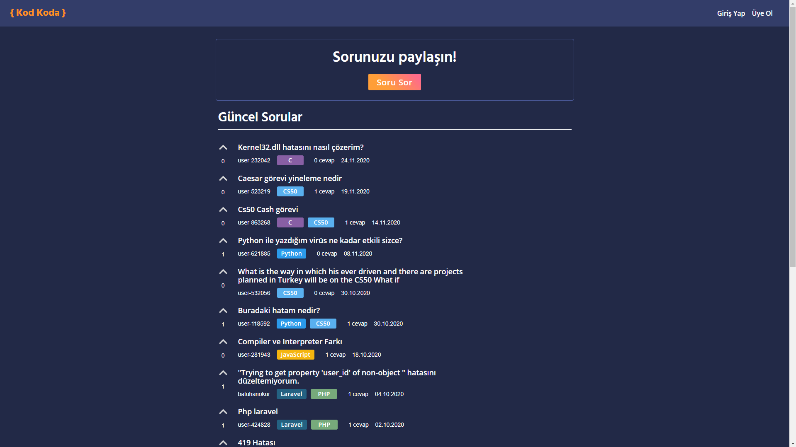
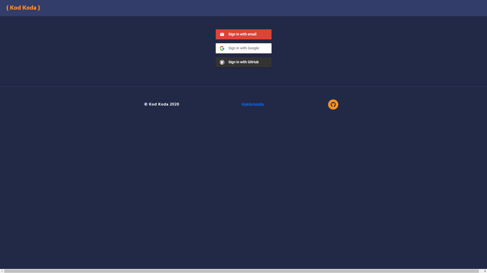
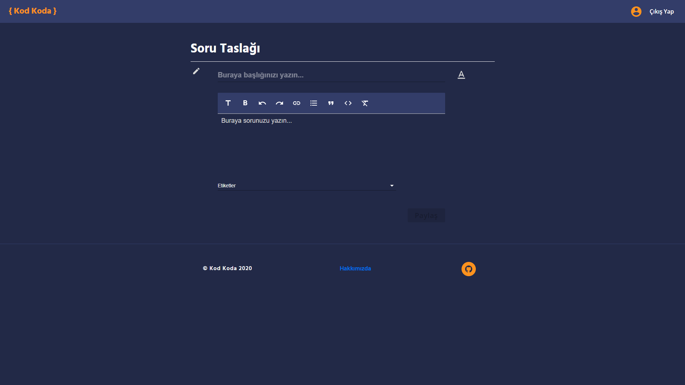
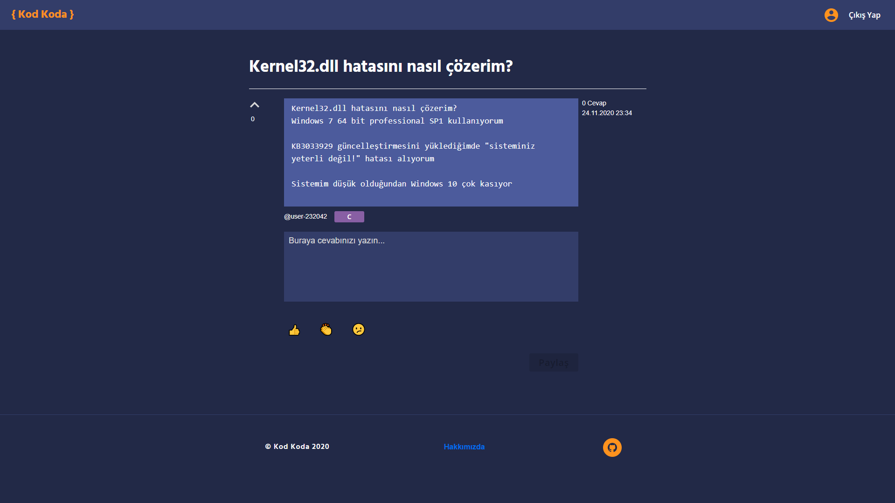

# KOD KODA

​	

[Kod Koda](https://www.kodkoda.com/), 2020 yılında [Kodluyoruz](https://www.kodluyoruz.org/) tarafından hazırlanan, yazılımla ilgilenen kişilerin sorular sorup cevaplayabildiği bir platformdur. Gelin, şimdi de Kod Koda sayfasını ziyaret edelim ve inceleyelim.

## Kod Koda Sayfası İlk İzlenim

​			

Kod koda sitesine girdiğimizde bizleri yukarıdaki gibi, mavi rengin hakim olduğu, sade bir web sayfası karşılıyor. Sol üst kısımda Kod koda logosunu; sağ üst kısımdaysa "Giriş Yap" ve "Üye Ol" seçeneklerini görüyoruz. Sayfanın ortasında sorularımızı paylaşabileceğimiz bir "Soru Sor" seçeneği ve onun da altında güncel soruların yer aldığı bir kısım bulunuyor. Bu düzeniyle Kod koda sitesi, anlaşılır ve sade bir tasarımı elde etmiş diyebiliriz.

## Nasıl Üye Olunur ve Giriş Yapılır?

İlk izlenimimizde belirttiğimiz gibi, Kod Koda web sayfasını açar açmaz sağ üst kısımda bizleri "Üye Ol" ve "Giriş Yap" seçenekleri bulunuyor. 

1. Daha önceden üye olmadıysanız "Üye Ol" seçeneğine tıklayabilirsiniz.

* Bu kısımda sizler yukarıdaki gibi bir sayfa karşılayacaktır. Buradan 3 tane üye olma seçeneğinden birini seçerek başaralı bir şekilde Kod Koda kullanıcısı olabilirsiniz.

2. Daha önceden üye olduysanız "Giriş Yap" seçeneğine tıklayabilirsiniz.

* Bu kısımda sizleri yukarıdaki gibi bir ekran karşılayacaktır. Buradan 3 seçenekten birini seçerek giriş yapabilirsiniz.

## Nasıl Soru Sorulur ve Cevaplanır?

### Nasıl Soru Sorulur?

Kod Koda platformuna giriş yaptıktan sonra karşımıza çıkan seçeneklerden bir diğeri de "Soru Sor" seçeneğiydi. Bu seçeneği seçerek yaşadığınız sorunları, aldığınız hataları yazabilirsiniz. Yalnız önceden belirtmek isteriz ki bu kısımda bahsettiğimiz işlemleri uygulayabilmeniz için daha önceden oluşturduğunuz profilinize giriş yapmanız gerekmektedir.

"Soru Sor" seçeneğine giriş yaptığınızda yukardaki gibi bir ekranla karşılaşacaksınız. Bu kısımdan yaşadığınız sorunu veya aldığınız hatayı diğer kullanıcıların da anlayabileceği şekilde, açık bir şekilde, yazabilirsiniz. Sorununuzu yazdıktan sonra "Etiketleri"i kullanarak sorunun ait olduğu konuyu seçebilirsiniz. Bu sayede diğer kullanıcılardan cevap almanız kolaylaşacaktır.

### Sorulara Nasıl Cevap Verilir?

Web siteye ilk giriş yaptığımızda "Güncel Sorular" başlığının altında kullanıcılardan gelen soruların bulunduğundan bahsetmiştik. Peki bu sorular arasından yanıtı bildiklerimize nasıl cevap vereceğiz?

1. İlk olarak, cevabından emin olduğunuz sorunun üzerine tıklamalısınız.

2. Daha sonra yukarıdaki gibi bir ekranla karşılaşacaksınız. Bu ekranda *"Buraya cevabınızın yazın..."* metninin bulunduğu kısma soru için düşündüğünüz çözümü yazarak paylaşabilirsiniz.

### Bonus Özellik: Sorular Nasıl Oylanır?

Şimdi ise Kod Koda platformunun bizlere sunduğu bonus özellik hakkında konuşacağız. Bonus özellik, bizlere başka kullanıcı tarafından sorulan ancak sizin de takıldığınız bir soruyu oylamanızı böylece güncel sorular kısmında sorunun üst sıralarda gözükmesini sağlamaktadır. Soruları, her sorunun yanında bulunan yukarı yöndeki ok işaretine basarak oylayabilirsiniz.

# Neden Kod Koda Platformunu Kullanmalıyız?

Yazılımın günden güne gelişen, büyüyen bir sektör olduğunu söyleyebiliriz. Bu sektör içinde unutulmamak ve geri kalmamak içinse sürekli kendimizi geliştirmeli, araştırmalı ve bolca deneme yapmalıyız. Ayrıca çalışmalarımızda ve yaptığımızda denemelerde çokça engelin bizleri beklediğini, hata yapmamızın kaçınılmaz olduğunun farkında olmalıyız. Hatta tam da kısımda Albert Einstein'ın sözünü sizlerle paylaşmak isteriz.

Artık hata yapmamızın doğal bir süreç olduğunun farkına vardık, peki her şey bu kadar mı? Tabii ki de değil! Bizi geliştirecek ve güncel tutacak asıl kısma gelelim. Karşılaştığımız sorunların çözümünü en iyi şekilde yapmak. Aklınızdan "Sorunun çözümünü bilseydim, zaten çözerdim." dediğinizi duyar gibiyiz. Kesinlikle haklısın. İşte tam da bu kısımda, araştırma yapmak ve sizin geçtiğiniz yollardan daha önce geçmiş deneyimli kişilere ulaşmak faydalı olacaktır.

"Kod Koda Platformunu Neden Kullanmalıyız?". Sorumuzu yanıtlayacak olursak, Kod Koda platformu, bizleri çözüme götürecek, geçtiğimiz yollardan daha önce geçmiş deneyimli insanlarla buluşturacak bir ortam hazırlıyor diyebiliriz. Bu nedenden dolayı yaşadığınız sorunlarda, aldığınız hatalarda yaptığınız araştırmalarla işin içinden çıkamadıysan [Kod Koda](https://www.kodkoda.com/) platformunda sorununuzu paylaşabilirsiniz.

 

## Kaynaklar
- https://www.kodkoda.com/
- https://www.kodluyoruz.org/