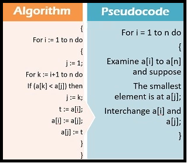

# PSEUDOCODE (SÖZDE KOD)

## Pseudocode (Sözde Kod) Nedir?

   **Pseudocode (Sözde Kod)**, [bilgisayar bilimleri](https://tr.wikipedia.org/wiki/Bilgisayar_bilimleri) alanında [algoritmalar](https://tr.wikipedia.org/wiki/Algoritma) ve [programlar](https://tr.wikipedia.org/wiki/Program) oluşturulurken ve aktarılırken kullanılan, günlük konuşma diline benzer ve belli bir programlama dilinin detaylarından uzak anlatımlardır. Programın yapısının ve çalışma mantığının yüksek seviyeli bir biçimde, gerektiği yerde doğrudan [doğal dil](https://tr.wikipedia.org/wiki/Doğal_dil) cümleleriyle, ama yine de bir program yapısı ve akışı içinde anlatılmasıdır. Böylelikle sözde kodu okuyan ya da yazan birisi, programlama dillerinin [söz dizim](https://tr.wikipedia.org/wiki/Sözdizim) detaylarına dikkat etmek zorunda kalmadan, programın ve algoritmanın çalışma mantığını düşünebilir.

	

## Pseudocode Neden Kullanılır?

* Pseudocode (Sözde Kod)’ a ihtiyaç duyulmasının temel nedeni programlama dillerini bilmeyen sıradan bir insanın ve her türden yazılımcının programlardaki algoritma mantığını anlamasını sağlamaktır.

* Sözde kodun kullanılmasının bir diğer amacı programın yapımcısına veya programın kullanıcılarına kullanılan programlama dilinden bağımsız olarak, o programın çözüm, çalışma mantığının sunulmasının sağlanmasıdır.

## Pseudocode Özellikleri

* İsminde her ne kadar "Code (Kod)" geçiyor olsa da kod niteliği taşımaz.

* Kod niteliği taşımadıkları için;herhangi bir derleyici tarafından derlenemezler.

* Üzerlerinde hata ayıklaması ([debugging](https://searchsoftwarequality.techtarget.com/definition/debugging)) yapılamaz. Sade ve kolaylıkla anlaşılabilir olmalıdır.

* Söz dizim (syntax) kurallarına dikkat etmek zorunda olunmadığı için algoritma özelliği göstermezler.

 Şekil 1: Pseudocode ve algoritma farkı.

// Sözel ve görsel örnek ekle.

## Sorular

1. **Pseudocode (Sözde Kod) ile ilgili verilen bilgilerden hangisi** **yanlıştır?**

A) Pseudocode program akışı içinde yazılmalıdır.

B) Pseudocode proglama dilinin detaylarından uzaktır.

C) Pseudocode’da proglamlama dilinin söz dizimlerinde dikkat edilir.

D) Pseudocode’da gerektiği yerlerde doğal dil cümleleri kullanılır.

---

2. **Pseudocode (Sözde Kod) özellikleri ile ilgili verilen bilgilerden hangisi** **doğrudur?**

A) Üzerlerinde hata ayıklaması (debugging) yapılabilir.

B) Herhangi bir derleyici tarafından derlenemezler.

C) Söz dizim (syntax) kurallarına dikkat edilir.

D) Kod niteliği taşırlar.

---

3. *Sabah işe giden bir çalışanı düşünelim. İşe gidene kadar hangi işlemleri yapması gerekiyor bunu düşünelim.*

```pseudocode
1. Uyan.
2. Yatağından kalk.
3. Lavaboya yürü.
4. Mutfağa git.
5. Kahvaltı hazırla.
6. Yemeğini ye.
7. Ayakkabılarını giy.
8. Evden çık.
9. Durağa git.
10. Otobüs ile ofise git.
```

**Aşağıdakilerden hangisi örnek verilen pseudocode’ un bir parçasıdır?**

A)

``` pseudocode
1. Yatağından kalk.
2. Uyan.
3. Lavaboya yürü.
4. Evden çık.
5. Otobüs ile ofise git.
```

B)

```pseudocode
1. Kahvaltı hazırla.
2. Yemeğini ye.
3. Oto. büs ile ofise git.
4. Ayakkabılarını giy.
5. Evden çık.
```

C)

```pseudocode
1. Mutfağa git.
2. Kahvaltı hazırla.
3. Yemeğini ye.
4. Ayakkabılarını giy.
5. Evden çık.
```

D)

```pseudocode
1. Durağa git.
2. Kahvaltı hazırla.
3. Yemeğini ye.
4. Uyan.
5. Yatağından kalk.
```

---

4. İki sayının toplamını veren algoritmayı pseudocode ile yazacak olsaydık şu şekilde görünecekti.

A)

```pseudocode
1. Başla.
2. Birinci sayıyı oku. (sayi1)
3. toplam = sayi1 + sayi2
4. İkinci sayıyı oku. (sayi2)
5. toplam
6. Bitir.
```

B)

```pseudocode
1. Başla.
2. Birinci sayıyı oku. (sayi1)
3. İkinci sayıyı oku. (sayi2)
4. Bitir.
5. toplam
6. toplam = sayi1 + sayi2
```

C)

```pseudocode
1. Birinci sayıyı oku. (sayi1)
2. Başla.
3. İkinci sayıyı oku. (sayi2)
4. toplam = sayi1 + sayi2
5. Bitir.
6. toplam
```

D)

```pseudocode
1. Başla.
2. Birinci sayıyı oku. (sayi1)
3. İkinci sayıyı oku. (sayi2)
4. toplam = sayi1 + sayi2
5. toplam
6. Bitir.
```

---

5. **İki sayının bölümünü veren pseudocode aşağıdakilerden hangisidir?**

A)

```pseudocode
1. Birinci sayıyı oku.
2. İkinci sayıyı oku.
3. Başla.
4. Büyük olan sayıyı, küçük olan sayıya bölmeye başla.
5. Yazabileceğin en büyük bölümü yaz ve işleme devam et.
6. İşlem sonucunda kalan;
	a. Bölümden küçük ise işlemi bitir.
	b. Bölümden büyük ise 4. adıma git.
```

B)

```
1. Başla.
2. Birinci sayıyı oku.
3. İkinci sayıyı oku.
4. Yazabileceğin en büyük bölümü yaz ve işleme devam et.
5. Büyük olan sayıyı, küçük olan sayıya bölmeye başla.
6. İşlem sonucunda kalan;
	a. Bölümden küçük ise işlemi bitir.
	b. Bölümden büyük ise 4. adıma git.
```

C)

~~~pseudocode
1. Başla.
2. Birinci sayıyı oku.
3. İkinci sayıyı oku.
4. Büyük olan sayıyı, küçük olan sayıya bölmeye başla.
5. Yazabileceğin en büyük bölümü yaz ve işleme devam et.
6. İşlem sonucunda kalan;
	a. Bölümden küçük ise işlemi bitir.
	b. Bölümden büyük ise 4. adıma git.
~~~

D)

~~~pseudocode
1. Başla.
2. Birinci sayıyı oku.
3. İkinci sayıyı oku.
4. Büyük olan sayıyı, küçük olan sayıya bölmeye başla.
5. İşlem sonucunda kalan;
	a. Bölümden küçük ise işlemi bitir.
	b. Bölümden büyük ise 4. adıma git.
6. Yazabileceğin en büyük bölümü yaz ve işleme devam et.	
~~~

---

6. **Elinizde aşağıdaki gibi karışık bir yapboz olduğunu düşünün. Bu yapbozu şıklardaki hangi pseudocode kullanılarak çözülebilir?**


A)

~~~pseudocode
1. Başla
2. 1 numaralı parçayı sağa kaydır.
3. 4 numaralı parçayı yukarı kaydır.
4. 2 numaralı parçayı sola kaydır.
5. Yapbozu bitir.
~~~

B)

~~~pseudocode
1. Başla
2. 3 numaralı parçayı sola kaydır.
3. 5 numaralı parçayı yukarı kaydır.
4. 6 numaralı parçayı yukarı kaydır.
5. Yapbozu bitir.
~~~

C)

~~~pseudocode
1. Başla
2. 3 numaralı parçayı sola kaydır.
3. 5 numaralı parçayı yukarı kaydır.
4. 2 numaralı parçayı sağa kaydır.
5. Yapbozu bitir.
~~~

D)

~~~pseudocode
1. Başla
2. 2 numaralı parçayı yukarı kaydır.
3. 5 numaralı parçayı sola kaydır.
4. 6 numaralı parçayı yukarı kaydır.
5. Yapbozu bitir.
~~~

---

## Cevap Anahtarı

* 1)  C
* 2)  B
* 3)  C
* 4) D
* 5)  C
* 6)  D


## Kaynaklar
- https://en.wikipedia.org/wiki/Pseudocode
- https://tr.wikipedia.org/wiki/Sözde_Kod
- https://technogezgin.com/pseudocode-nedir-sozde-kod/
- https://medium.com/@edisdev/algoritma-ve-pseudo-kodu-nedir-38ad7d09a73e