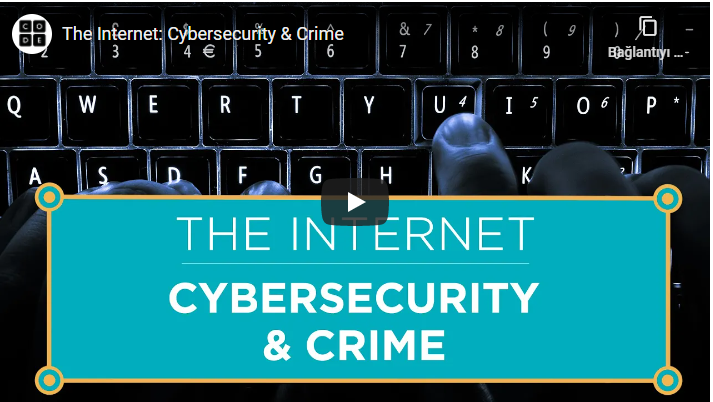

# SİBER GÜVENLİK VE SUÇLAR

En bilinen siber suçlar: Virüsler, DDoS ataklar ve oltalama(fishing) yöntemleridir.  Virüsler bilgisayarımızda çoğu şeye erişime sahip olabiliyorken, DDoS ataklarda ise virüsler sayesinde ele geçirilmiş bilgisayarlardan bir ordu oluşturularak bir web sitesini aşırı talebe boğma amaçlanır. Oltalama ise kandırma yeteneğine bağlıdır. Örneğin mail atarlar bankadan geldiğine inanırsınız linke tıklayarak giriş bilgilerinizi vererek giriş yaparsınız o sırada bilgisayar korsanları bilgileriniz ile gerçek sistemden giriş yaparlar ve tüm paranıza güle güle ...

Siber suçlar yazılım kaynaklı gibi görünse de çoğu insan kaynaklıdır. Biz ne kadar dikkat edersek saldırıya uğrama ihtimalimiz o kadar azalır.

Yukarıda bahsettiğimiz siber suçlar ile alakalı daha detaylı bilgi için aşağıdaki videoyu bırakıyoruz. Ayrıca videoyu izlerken altyazılardan "Türkçe" seçmeyi unutmayın. 

Şu ana kadar interneti internet yapan tüm temel terimlere değindik. Bir kez daha üstünden geçmek ve daha detaylı bilgi için aşağıdaki videonun da izlenmesini tavsiye ederiz. Bu video aynı zamanda Kodluyoruz bünyesinde Türkçe seslendirilen bir Harvard dersi :)

### Kaynaklar:
- https://roadmap.sh/guides/what-is-internet
- https://www.youtube.com/watch?v=kHxcf2wK_ck&feature=youtu.be
- https://code.org/

