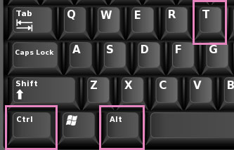

# TERMİNAL 

## Terminal Nedir?

​	Terminal nasıl kullanılır anlamak için önce terminalin ne olduğunu anlamak gerekir. Bunun için de ilk olarak komut satırından bahsetmek istiyoruz. Komut satırı, bilgisayarınız için bir yazı arabirimidir. Terminal ise yazdığınız komutları bilgisayar işletim sistemine göndermek için geliştirilmiş bir programdır. 

​	Yazılım alanında kendinizi daha da geliştirmek istediğinizde yollarınız terminalle kesişebilir ve bazı komut satıları girmeniz gerekebilir. Peki terminali nasıl kullanacaksınız? Gelin şimdi bundan bahsedelim.

## Terminal Nasıl Kullanılır?

​	Bu kısımda terminale yazdığınız komut satırlarıyla, tıpkı **Finder** uygulaması ile **Mac OS**‘da veya **Windows Explorer** ile **Windows**‘da yaptığınız gibi, bilgisayarınızdaki dosya veya klasörlere nasıl ulaşabileceğinize ve nasıl yeni klasörler oluşturabileceğinizi anlatacağız. 

### Adım 1: Terminali Açmak

​	İlerlemeden önce, sizlerden kullandığınız işletim sisteminin terminali açmanızı ve sonrasında adımlarda yer verdiğimiz komut satırlarını denemenizi rica ediyoruz. Bu şekilde açıklamasını okuduğunuz komut satırlarını daha kolay öğrenebilir ve hatırlayabilirsiniz.

​	Ek olarak terminalde kullanacağınız komut satırları Linux ve Mac OS işletim sistemlerinde benzerlik gösterirken; Windows işletim sisteminde küçük farklılıklar gösterebilir. Gelin şimdi "Adım 1"e dönelim ve terminali nasıl açacağımızdan bahsedelim.

**Terminal** uygulamasını başlatmak için:

* **Mac OS** bilgisayarlarda ilk önce **⌘** **+** **Space** tuşlarına birlikte basın ardından **Spotlight Search** açıldıktan sonra **terminal** yazıp **Enter** tuşuna basabilirsiniz.

//Buraya adım adım görseller ekleyebiliriz

* ​	**Linux** tabanlı sistemlerde **Ctrl** + **Alt** + **T** tuşlarına birlikte basabilirsiniz.

  //Buraya adım adım görseller ekleyebiliriz

  

* **Windows** tabanlı sistemlerde ilk önce **Win** + **R** tuşlarına birlikte basın ardından, açılan **Çalıştır** penceresine *cmd* yazıp **Enter** tuşuna basabilirsiniz.

  //Tuş kombinasyonları ve açılan pencerenin fotoğraflarını ekleyebiliriz.

### Adım 2:  İçerikleri Sıralamak

​	Bulunduğunuz dizindeki ya da klasördeki içerikleri sıralamak için:

* **Mac Os** ve **Linux** tabanlı sistemlerde terminale *ls* komut satırını yazabilirsiniz.

#### Bilgi Köşesi!

*ls* : Bu komut satırı terminale yazıldığında Mac Os ve Linux tabanlı sistemlerde dizindeki veya klasördeki içerikleri listeler.

