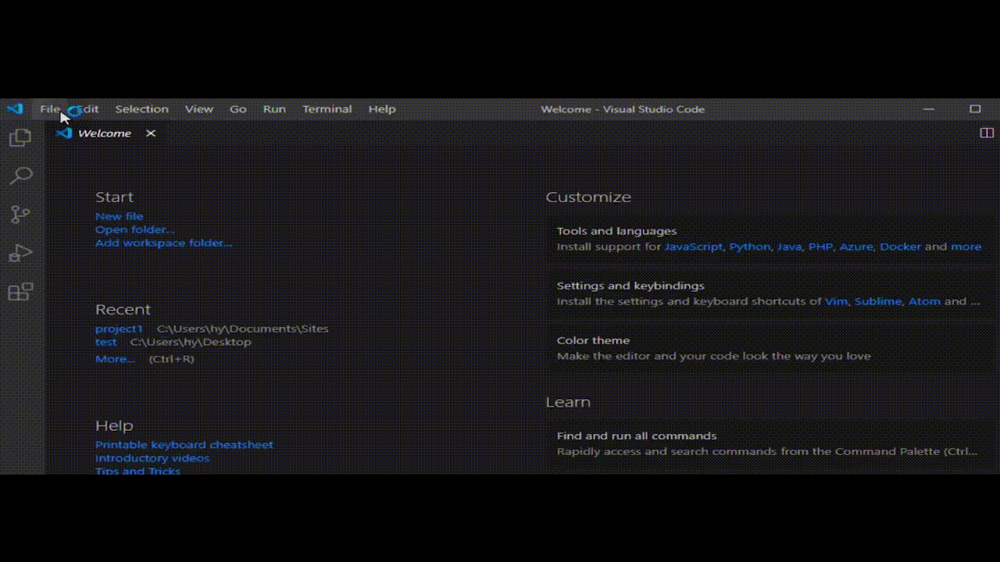

# Proje Klasörünün Oluşturulması, Açılması ve Dosyalarla Çalışmak 

Bu yazımızda sizlere Visual Studio Code editöründe proje klasörünün nasıl açılacağını ve nasıl dosyalarla çalışacağını anlatacağız. Ama ondan öncesinde aklınızda "Visual Studio Code nedir?" sorusu varsa [buradan](https://github.com/Kodluyoruz/taskforce/tree/basics/basics-for-everyone/visual-studio-code-nedir) Visual Studio Code editörüne giriş yaptığımız yazıyı okumanızı rica ediyoruz. 

## Proje Klasörünün Oluşturulması ve Açılması  

Visual Studio Code içerisinde proje klasörünü oluşturmak ve açmak oldukça basittir. Ancak oluşturacağınız proje klasörünün yerine dikkat etmelisiniz. Tam da bu kısımda yapılan en büyük hatalardan biri proje klasörlerinin masaüstünde açılmasıdır. Çünkü masaüstünde oluşturacağınız proje klasörünü kolayca silebilir ve bir daha ulaşamayabilirsiniz. 

### Adım 1: Proje Klasörünü Oluşturmak

Yazımızın başında bahsettiğimiz hatayı göz önünde bulundurarak proje klasörünü "Belgelerim" kısmında oluşturalım. Bunu yapmak için ilk öncelikle belgelerim klasörüne giriş yapabilir ve sonrasında boş bir alana tıkladıktan sonra, yeni klasör seçeneğini seçebilirsiniz.

Klasörün ismini dilediğiniz gibi düzenleyebilirsiniz. Biz "Documents" içerisinde "Sites" adında bir klasör oluşturduk.

 

Sonrasındaysa bu klasör içerisine ilk proje dosyamızı oluşturduk.

 

### Adım 2: Visual Studio Code İçerisinde Proje Klasörünü Açmak

Visual Studio Code içerisinde proje klasörünü açmak için birkaç yol bulunuyor. Gelin şimdi sizlerle bu yolları inceleyelim.

#### a) Sürükle Bırak

Visual Studio Code, çeşitli programlar gibi sürükle bırak yöntemini destekliyor. Bu özelliği kullanarak kolay bir şekilde proje klasörünü açabilirsiniz.

#### b) File Menüsünü Kullanmak

Visual Studio Code içerisinde proje klasörünü açmak için diğer bir yol da "File" menüsünden "Open Folder" seçeneğini seçerek klasörünüzün konumuna gitmektir.

## Dosyalarla ve Klasörlerle Çalışmak

Visual Studio Code içerisinde yeni dosya ve klasör oluşturabileceğiniz kısımlar bulunuyor. Ek olarak çeşitli kısayolları da bizleri karşılıyor. Şimdi gelin bunları inceleyelim.

### Dosya Oluşturma

Visual Studio Code içerisinden proje klasörünüzün içine yeni bir dosya oluşturmak istediğinizde görseldeki kısma tıklayabilirsiniz.

### Klasör Oluşturmak

Visual Studio Code içerisinden proje klasörünüzün içine farklı ve yeni bir klasör oluşturmak istediğinizde görseldeki kısma tıklayabilirsiniz.

### Dosyaları Klasör İçine Taşımak

Proje klasörünüz içindeki bir dosyayı yine proje klasörünüz içindeki bir klasöre taşımak istediğinizde sürükle bırak yöntemini kullanabilirsiniz.

Bu örneğimizle "style.css" dosyasını "css" klasörünün içine taşındığını görebiliriz.

### Aynı Anda Klasör İçinde Dosya Oluşturmak

Bu işlemi gerçekleştirmek için ilk önce yeni bir dosya oluşturmak istediğimizde tıkladığımız kısma tıklamalıyız. Sonrasında ise `klasörismi/dosyaismi` yazarak yeni bir klasör içindeki dosyayı oluşturabiliriz. Buradaki `/` işareti klasör ile dosyayı birlikte oluştur anlamına geliyor.

Bu örneğimizde "scss" klasörünün içinde "main.css" dosyasının oluşturulduğunu görebiliriz.

Bu yazımızda sizlere Visual Studio Code'da proje dosyasının nasıl oluşturulacağını ve açılacağını aynı zamanda yine Visual Studio Code içerisinde dosyalarla ve klasörle nasıl çalışılacağını anlatmaya çalıştık. Yazımızda değindiğimiz her şey Mac Os ve Windows tabanlı sistemlerde birebir aynı şekilde gerçekleştiriliyor. Yine de tüm bu işlemlerin Mac Os işletim sisteminde nasıl gerçekleştirildiğini merak ediyorsanız bu videoyu ziyaret edebilirsiniz.

