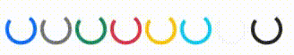

# Bootstrap Bileşenlerine(UI Components) Genel Bakış

Bootsrap sizler için önceden tasarlanmış ve hazırlanmış bir çok component sunuyor. Bu hazır componet'ler ile sitelerinizi kolayca stillendirebilir hızlıca porjeler çıkarabilirsiniz. Bu bölümde Bootstrap'ın bizlere sunmuş olduğu component'lere genel bir bakış atacağız. 

> Not: Bu doküman hazırlanırken Bootsrap 5.0 versiyonu baz alınmıştır. Componet'ler ile güncel dokümana **[burdan](https://getbootstrap.com/docs/5.0/components/accordion/)** ulaşabilirsiniz.

<p align="center">
	
	<br>
	<em></em>
</p>

Accordion, Alerts, Badge, Breadcrumb, Buttons, Button group, Card, Carousel, Close button, Collapse, Dropdowns, List group, Modal, Navs & tabs, Navbar, Pagination, Popovers, Progress, Scrollspy, Spinners, Toasts, Tooltips

## Accordion

> [**https://getbootstrap.com/docs/5.0/components/accordion/**](https://getbootstrap.com/docs/5.0/components/accordion/)

Sizlere açılır kapanır başlıklar yapmanıza olanak tanıyan bir component. Akordiyon müzik aletine benzediği için bu isimi almış. 

Bu component temelde collapse component'i üzerine geliştirilerek yapılmıştır. O component'e de yazının ilereleyen bölümlerinde değineceğiz. 

<p align="center">
	
	<br>
	<em></em>
</p>

> **NOT:** Component ile ilgili kodlara en güncel hali ile bootsrap'in kendi dokümantasyonundan ulaşabilirsiniz.

## Alerts

> **[https://getbootstrap.com/docs/5.0/components/alerts/](https://getbootstrap.com/docs/5.0/components/alerts/)**

Projenizdeki bildirimleri, uyarıları bootsrap'in alert'leri ile gösterebilirsiniz. Buradaki resimde alert çeşitlerini görebilirsiniz.

<p align="center">
	
	<br>
	<em></em>
</p>

```html
<div class="alert alert-primary" role="alert">
  A simple primary alert with <a href="#" class="alert-link">an example link</a>. Give it a click if you like.
</div>
<div class="alert alert-secondary" role="alert">
  A simple secondary alert with <a href="#" class="alert-link">an example link</a>. Give it a click if you like.
</div>
<div class="alert alert-success" role="alert">
  A simple success alert with <a href="#" class="alert-link">an example link</a>. Give it a click if you like.
</div>
<div class="alert alert-danger" role="alert">
  A simple danger alert with <a href="#" class="alert-link">an example link</a>. Give it a click if you like.
</div>
<div class="alert alert-warning" role="alert">
  A simple warning alert with <a href="#" class="alert-link">an example link</a>. Give it a click if you like.
</div>
<div class="alert alert-info" role="alert">
  A simple info alert with <a href="#" class="alert-link">an example link</a>. Give it a click if you like.
</div>
<div class="alert alert-light" role="alert">
  A simple light alert with <a href="#" class="alert-link">an example link</a>. Give it a click if you like.
</div>
<div class="alert alert-dark" role="alert">
  A simple dark alert with <a href="#" class="alert-link">an example link</a>. Give it a click if you like.
</div>
```

> **NOT:** Component ile ilgili kodlara en güncel hali ile bootsrap'in kendi dokümantasyonundan ulaşabilirsiniz.

## Badge

> [**https://getbootstrap.com/docs/5.0/components/badge/**](https://getbootstrap.com/docs/5.0/components/badge/)

Bu componet'i bildirim sayısını göstermek ya da bir component'in ek bir öğe olarak kullanabilirsiniz.

Yine bu component'in de alert'lerde olduğu gibi renk seçenekleri mevcut.

<p align="center">
	
	<br>
	<em></em>
</p>

<p align="center">
	
	<br>
	<em></em>
</p>

<p align="center">
	
	<br>
	<em></em>
</p>

## Bredcrumb

> [**https://getbootstrap.com/docs/5.0/components/breadcrumb/**](https://getbootstrap.com/docs/5.0/components/breadcrumb/)

Bu component sayesinde sayfalarınız arasında gezinirken kullanıcının kaybolmadan nerde olduğunu gösterebiliyorsunuz. Hansel ve Gretel masalında olduğu gibi :)

<p align="center">
	
	<br>
	<em></em>
</p>

## Buttons

> [**https://getbootstrap.com/docs/5.0/components/buttons/**](https://getbootstrap.com/docs/5.0/components/buttons/)

Bootstrap sizlere kullanabilceğiniz birçok buton çeşidi sunmakta.

<p align="center">
	
	<br>
	<em></em>
</p>

<p align="center">
	
	<br>
	<em></em>
</p>

## Button group

> [**https://getbootstrap.com/docs/5.0/components/button-group/**](https://getbootstrap.com/docs/5.0/components/button-group/)

Bu butonları bu şekilde gruplayıp da kullanabilirsiniz.

<p align="center">
	
	<br>
	<em></em>
</p>

<p align="center">
	
	<br>
	<em></em>
</p>

<p align="center">
	
	<br>
	<em></em>
</p>

## Cards

> [**https://getbootstrap.com/docs/5.0/components/card/**](https://getbootstrap.com/docs/5.0/components/card/)

Bootstrap'in kartları, birden çok varyant ve seçeneğe sahip esnek ve genişletilebilir bir içerik konteyneri sağlar.

<p align="center">
	
	<br>
	<em></em>
</p>

<p align="center">
	
	<br>
	<em></em>
</p>

## Carousel

> [**https://getbootstrap.com/docs/5.0/components/carousel/**](https://getbootstrap.com/docs/5.0/components/carousel/)

Resimlerinizi göstermeye yarayan bir galeri componet'i.

<p align="center">
	
	<br>
	<em></em>
</p>

## Close button

> [**https://getbootstrap.com/docs/5.0/components/close-button/**](https://getbootstrap.com/docs/5.0/components/close-button/)

Kapatma tuşu

<p align="center">
	
	<br>
	<em></em>
</p>

## Collapse

> [**https://getbootstrap.com/docs/5.0/components/collapse/**](https://getbootstrap.com/docs/5.0/components/collapse/)

Açılır kapanır kartlar.

<p align="center">
	
	<br>
	<em></em>
</p>

## Dropdowns

> [**https://getbootstrap.com/docs/5.0/components/dropdowns/**](https://getbootstrap.com/docs/5.0/components/dropdowns/)

Düşen menüler

<p align="center">
	
	<br>
	<em></em>
</p>

## Navbar

> [**https://getbootstrap.com/docs/5.0/components/navbar/**](https://getbootstrap.com/docs/5.0/components/navbar/)

Genelde web sitelerinin en üstünü dolduran gezinti bölümünün bootsrap tarafından özelleştirilmiş ve componet haline getirlmiş hali.

<p align="center">
	
	<br>
	<em></em>
</p>

## Pagination

> [**https://getbootstrap.com/docs/5.0/components/pagination/**](https://getbootstrap.com/docs/5.0/components/pagination/)

Sayfada görüntüleceyeğiniz elemanlar yeterince coğaldığında sayfada yapılan istekleri boyutlandırmak için pagination'ı kullanırız. Bu da Bootsrap'in pagination için hazırlamış olduğu componet'leri

<p align="center">
	
	<br>
	<em></em>
</p>

```html
<nav aria-label="Page navigation example">
  <ul class="pagination justify-content-center">
    <li class="page-item disabled">
      <a class="page-link" href="#" tabindex="-1" aria-disabled="true">Previous</a>
    </li>
    <li class="page-item"><a class="page-link" href="#">1</a></li>
    <li class="page-item"><a class="page-link" href="#">2</a></li>
    <li class="page-item"><a class="page-link" href="#">3</a></li>
    <li class="page-item">
      <a class="page-link" href="#">Next</a>
    </li>
  </ul>
</nav>
```

> **NOT:** Component ile ilgili kodlara en güncel hali ile bootsrap'in kendi dokümantasyonundan ulaşabilirsiniz.

## Popovers

> [**https://getbootstrap.com/docs/5.0/components/popovers/**](https://getbootstrap.com/docs/5.0/components/popovers/)

Buton'lar üzerinde gösterdiğimiz açılan açıklamalar.

<p align="center">
	
	<br>
	<em></em>
</p>

## Progress

> [**https://getbootstrap.com/docs/5.0/components/progress/**](https://getbootstrap.com/docs/5.0/components/progress/)

İlerleme ifade eden bar'lar.

<p align="center">
	
	<br>
	<em></em>
</p>

## Spinners

> [**https://getbootstrap.com/docs/5.0/components/spinners/**](https://getbootstrap.com/docs/5.0/components/spinners/)

Yükelenme durumlarını ifade etmek için kullanılan componet'ler.

<p align="center">
	
	<br>
	<em></em>
</p>

## Toasts

> [**https://getbootstrap.com/docs/5.0/components/toasts/**](https://getbootstrap.com/docs/5.0/components/toasts/)

Tosast componet'i daha çok kullanıcıya bir bildirim göstermek için kullanılıyor. 

<p align="center">
	
	<br>
	<em></em>
</p>

## Tooltips

> [**https://getbootstrap.com/docs/5.0/components/tooltips/**](https://getbootstrap.com/docs/5.0/components/tooltips/)

Elementlerin üzerinde geldiğinizde size ip uçu veren componentler.

<p align="center">
	
	<br>
	<em></em>
</p>

Bu yazımızda Bootsrap'in tüm arayüz bileşenlerinden bahsetmeye çalıştık. Daha çok bu bileşenlerin tanıtımı gibi oldu. Bunlardan birine ihtiyacınız var ise bootsrap'in kendi dökümantasyonuna gidip bu componet'leri kendi projelerinize nasıl dahil edeceğinize bakabilirsiniz.

[https://getbootstrap.com/docs/5.0/](https://getbootstrap.com/docs/5.0/)