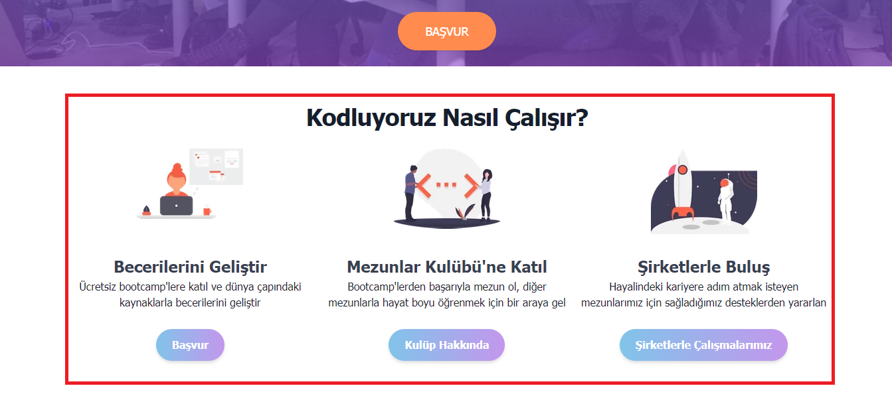

# Bootstrap - Genel Tutucu(Container), Satır Blokları(Row) ve Kolon(Col) Yapısı
Container, row ve column yapısı aslında bootstrap kullanım mantığının temellerini oluşturuyor diyebiliriz. Bu yapıyı anlamak bootstrap ile çalışmayı çok çok kolaylaştıracaktır. Öncelikle container ile başlayalım.

## Container
Containerı(konteynır) isminden de biraz anlaşılacağı gibi, içine web sitemizde bulunması gereken yazıları, resimleri, videoları veya herhangi bir içeriği koyduğumuz kapsayıcı bir çerçeve, kutu gibi düşünebiliriz. Biz içeriklerimizi bu container içerisine koyuyoruz ve bir tarayıcıdan web sitemiz görüntülendiğinde container kendisini ekranın tam ortasına gelecek şekilde ayarlıyor. Görsel bir örnek üzerinden ilerlemek daha açıklayıcı olacaktır. Örnek olarak aşağıda [kodluyoruz](https://www.kodluyoruz.org/)'dan aldığım bir ekran görüntüsünü inceleyebiliriz.

Becerilerini geliştir, Mezunlar Kulübü'ne Katıl ve  Şirketlerle Buluş kısımlarını kapsayan ancak bize gözükmeyen bir çerçeve olduğunu düşünelim. Bu çerçeve ile sayfayı görüntülediğim ekran arasında sağ taraftan ve sol taraftan eşit miktarda boşluklar var gördüğünüz gibi, yani container ortalanmış.

Kırmızı renk ile göstererek bu containeri gözümüzde canlandırmamızı kolaylaştırmaya çalıştım.

İşte sayfamızın içeriklerini böyle belirli ölçülerde containerlar içerisine koyuyoruz ve ayrıca containerlara vereceğimiz class isimlerine göre onlara farklı özellikler katıyoruz. Örneğin containerlar boyutlarını değiştirip responsive bir tasarım yapmamıza yardımcı oluyorlar. Yani biz bir sayfayı cep telefonu, tablet veya laptop ile görüntülediğimizde cihazların ekran boyutları farklı olacağı için, containerımızda kendisini bu ekran boyutuna göre yeniden ölçeklendiriyor, ortalıyor veya düzenliyor. Tüm sayfayı tek bir container içerisine koyup düzenleyebileceğimiz gibi, birden fazla container veya iç içe containerde kullanılabiliyor gerektiği durumlarda.

Aşağıdaki tabloyu [bootstrap](https://getbootstrap.com/docs/4.4/layout/overview/)'in official sayfasından aldım.

En soldaki sütunda container class isimlerini görüyoruz, mesela `.container` veya  `.container-md` gibi. Classların kullanımını örnek ile göstermek gerekirse;
`

` şeklinde bir html dosyası içerisinde kullanabiliriz. Html dosyası içerisinde class isimleri tanımlarken başındaki "."(nokta) yı kaldırmamız gerekli. Peki bu tablo bize neyi anlatıyor? `.container-md` classını kullanarak bu tabloyu açıklamaya çalışacağım. `.container-md` classına sahip bir container;

* **extra small** bir cihazda, yani **576px'den küçük** olan bir cihazda, ekran boyutunun **100%**'ünü kaplamaktadır.
* **small** bir cihazda, yani **576px'den büyük veya eşit** olan bir cihazda, ekran boyutunun **100%**'ünü kaplamaktadır.
* **medium** bir cihazda, yani **768px'den büyük veya eşit** olan bir cihazda, bu containerın genişliği **720px** olacaktır.
* **large** bir cihazda, yani **992px'den büyük veya eşit** olan bir cihazda, bu containerın genişliği **960px** olacaktır.
* **X-large** bir cihazda, yani **1200px'den büyük veya eşit** olan bir cihazda, bu containerın genişliği **1140px** olacaktır.
* **XX-large** bir cihazda, yani **1400px'den büyük veya eşit** olan bir cihazda, bu containerın genişliği **1320px** olacaktır.

_boyutlar umarım kafa karışıklığına yol açmamıştır, örneğin small bir cihaz small boyutundan medium boyutuna kadar olan aralığı ifade ediyor._

Containerlarımız bu tablodaki verilen boyutlara göre kendilerini ortalıyacak, etrafındaki boşlukları ayarlayacak ve değişen ekran boyutlarına tepki verecektir.
Genel olarak containerların kullanımı bu şekilde diyebiliriz.

## Row ve Column yapısı
Row(satır), column(sütun) sistemi bootstrap'in grid system denilen düzenini oluşturuyor. 
