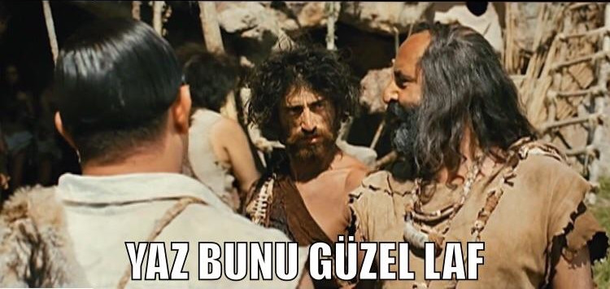

# Ödev 2

## Bootstrap ile Instagram Clone

Yukarıda görmüş olduğunuz şahane yapıyı Kodluyoruz mühendisleri üstün dil CSS ile 6 yıl boyunca Ağrı Dağı eteklerinde geliştirdiler. Büyük acılar, büyük zorluklar sonrası bu muhteşem yapıyı oluşturdular desek tabii ki doğru olmaz.
Bootstrap ile sizin için böyle bir yapı geliştirdik ve geliştirme sırası şimdi sizde. Bütün vicdansızlığımızı kullanarak yukarıdaki yapıyı aşağıdakine dönüştürdük ve gerekli düzenlemeleri yaparak bu yapı üzerinde çalışıp bu cloneu tekrar yazmanızı istiyoruz.

Hazırlamış olduğumuz Instagram cloneuna [buradan](instagramclone/) ulaşabilirsiniz.

- Navbarı yukarı sabitleyip sayfayı aşağı kaydırdığınızda hala yukarıda durmasını sağlayın. İçerik ile birleşmemesi için body'e padding veriniz.

- Navbarın heightı 54 px olmalı ve arkaplan rengi beyaz olmalı.

- Navbardaki elementlerin doğru yerde olmadığını fark ettiniz mi? Öncelikle navbarın başındaki logo classının içine 192px soldan margin verin.

- Arama kısmını d-flex ile ortay alıp soldan 5 birim margin verin.

- CSS dosyası içindeki ::placeholder kısmının arkaplanına assets klasörü içinde bulunan arama simgesini ekleyin. Ve resmin tekrar etmemesini sağlayın.

Clone ödevimizdeki ikonları [FontAwesome](https://fontawesome.com/) sitesinden aldık. Daha detaylı bilgi için web sitesini ziyaret edin ve nasıl çalıştığını öğrenin.

- Menü kısmına soldan 5 birim üstten 2 birim margin verin.

- Menü kısmına sayfa sm boyutunda olunca kaybolacak şekilde display verin. Bunun için [Bootstrap Display property](https://getbootstrap.com/docs/4.5/utilities/display/) sayfasını inceleyebilirsiniz.

- İçerik alanı (ortadaki alan) offset 4 olmalı ve üstten 2 birim margin almalı.

- Classta belirttiğimiz middlearea içinde maksimum yükseklik 200px olmalı ve bunu important ile yazmalısınız.

- Bu alanın col'unun default değerini 12, diğer tüm ölçekleri ise 6 olarak ayarlayın.

- Hikayeler kısmında isimler nasıl resimlerin altına gelecek? (İpucu: Arama kısmında kullandığımız özellik)

- İçerik kısmında üç nokta sağda olmalı.

- Beğenme, yorum yapma, paylaşma kısmında border olmamalı.

- Bookmark ikonunun offseti 7 birim olmalı.

- Card header ve card footerlar beyaz renk olmalı.

- Yorum paylaş metnini sağa alın.

- Sağ panele verilen alan sizce yeterli mi? Değilse düzeltin.

- Sağ panel için stickysidebar ve rightpanel diye iki class verdiğimizi fark etmişsiniz. Stickysidebar bu panelin sayfayı aşağı kaydırdıkta onun da gelmesini sağlıyor. Bunu sağlamak için için CSS'in [position property](https://www.w3schools.com/css/css_positioning.asp)sini kullanabilirsiniz. Rightpanelde de arkaplan rengi beyaz olup kenarlık olmamalı.

- Tümünü gör ve takip et yazılarını sağa alınız.

- Bütün sayfanın arkaplan rengini Instagram'dan alıp uygulayın.

Burada belirtmediğimiz ama gözünüze takılan bir yer olursa orayı da düzeltin. Bu ödev için bol bol Instagram sitesini inspect etmeniz gerekecek.

Buradaki ana amacımız bootstrap elementlerini kullanarak ve özellikle deneyip yanılarak doğru yöntemi bulmanız. Mükemmel olmasına gerek yok.
Unutmayın efektif olması mükemmel olmasından daha önemlidir. 

Hepinize başarılar, kolay gelsin!

