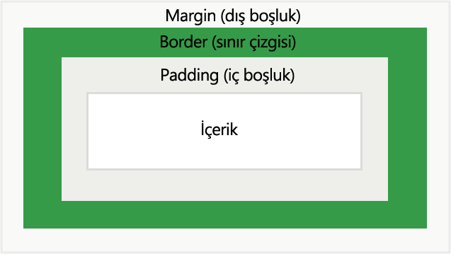

# CSS Kutu Özellikleri(Margin, Padding, Width, Height) Kullanımı
CSS kutu özelliklerini iyi kavrayabilmek ve kullanabilmek için "kutu model" konusunu incelemek gerekir. Gelin önce "kutu modeli" konusuna bakalım.
## CSS Kutu Modeli 

Resimde [Kodluyoruz'un anasayfasını](https://kodluyoruz.org) görüyoruz. İşaretlediğim alanlar birer HTML elementleri ve bir yapıyı oluşturan lego parçalarından sadece birkaçı. Kutu denmesinin sebebi de bir bütünü oluşturan lego parçaları veya kutu gibi olması. Bu kutuların aralarında mesafelerin ve içeriklerinin de kendi aralarında bir düzen olduğunu görmekteyiz. Bunun sebebi "kutu özelliklerinin" kullanılıyor olması. Özellikle yeşil kutuların içindeki yazıların belli bir mesafede olmasından ve çizdiğim yeşil hatlara değmemesinden anlayabiliriz. Burada kutu modelini şema halinde göstereceğim:



Kutu modeli margin,padding,border ve içerikten oluşur.
- İçerik(content): Elementin içinde olan resim,ses ya da yazıdır.
- Padding: İçerik ile border arasında olan boşluk.
- Border: Padding ile margini ayıran sınırdır. 
- Margin: Kutunun diğer kutularla arasındaki mesafeyi ayarlayan boşluk.

Yukarıda saydığım kavramların dışında kutunun boy ve uzunluğunu belirleyen width ve height kavramları vardır. Bunları da alıştırmalarımızda göstermeye çalışacağım.
## CSS Width ve Height
Width ve height özellikleri ile elementin,yani lego parçamızın boy ve genişliğini ayarlayabiliriz. Bu özellikleri biz yazmadığımız takdirde tarayıcı kendisi ayarlar ve yapacağımız web uygulamasında istenmeyen sonuçlara neden olur :)  Bu özellikleri px,em veya % ile kullanabiliriz. % ile kullandığımız zaman elementimiz hangi elementin içindeyse ona göre oranlanır. Yani 800px boyunda bir <div> tagının içinde bulunan bir elementin boyunu 50% olarak ayarlarsanız elementin boyu 400px olur. Max-width özelliği ise bir elementin genişliğini sınırlamak istediğimizde kullanırız. Diyelim ki bir element tarayıcı ekranından fazla geniş veya uzun. Bu durumda scrollbar(kaydırma çubuğu) çıkar. 

### Alıştırma-1: Width ve Height Kullanımı
```<style>
   p{
   width: 0;
   height: 0;
   }
   <style>
   <p>
   Lorem ipsum dolor sit amet, consectetur adipiscing elit, sed do eiusmod tempor incididunt ut labore et dolore magna aliqua. Ut enim ad minim veniam, quis nostrud exercitation ullamco laboris nisi ut aliquip ex ea commodo consequat. Duis aute irure dolor in reprehenderit in voluptate velit esse cillum dolore eu fugiat nulla pariatur. Excepteur sint occaecat cupidatat non proident, sunt in culpa qui officia deserunt mollit anim id est laborum.
   </p>
```
Bu kodda width ve heighti 0 yaptım. Paragraf tuhaf bir şekilde görünecektir. Bu alıştırmada yapmanız gereken şey paragrafın düzgün görünmesi açısından width ve heighti istediğiniz şekilde kullanın. Burada width ve heigthi görmeniz için % ve px in ikisini de kullanmanızı tavsiye ediyorum. Alıştırmaya [buradan](https://codepen.io/hyperborean17/pen/xxEXjYY) ulaşabilirsiniz. 


## CSS Margin ve Padding


