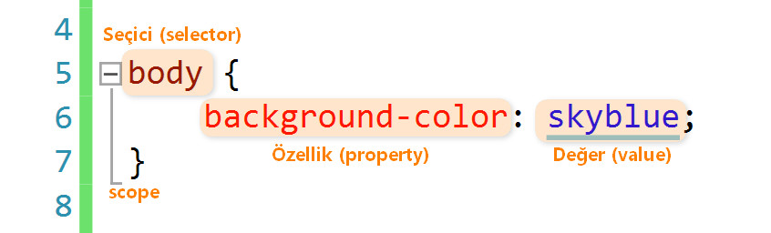
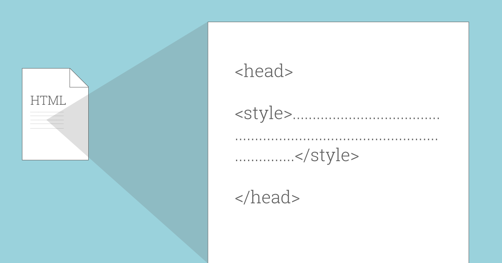

# External, Internal ve Inline CSS Kullanımı

CSS, web sitenizin ekranda nasıl görüneceğini belirleyen belirli stil kurallarına sahip dosyalardır. CSS kuralları, web sitenizin HTML dosyalarına çeşitli şekillerde ve yerlerde uygulanabilir. External yani harici bir stil sayfası, Internal yani dahili bir stil sayfası veya Inline yani satır içi stil kullanabilirsiniz. Her yöntemin belirli kullanımlara uygun avantajları vardır.


External stil sayfası, bir web sayfasından bağlanan bağımsız bir ``.css`` dosyasıdır. External stil sayfasının avantajı, bir kez oluşturulabilmesi ve birden çok web sayfasına uygulanabilmesidir. Site tasarımınızda geniş çaplı değişiklikler yapmanız gerekirse eğer, stil sayfasında tek bir değişiklik yapabilirsiniz ve bu değişiklik tüm bağlantılı sayfalara uygulanarak zamandan ve emekten tasarruf sağlar.



Internal stil sayfası, HTML dosyasının ``<head>`` bölümünde sayfa için CSS kural kodlarını barındırır. Kural kodları yalnızca o sayfa için geçerlidir, ancak sayfa kodunda birden çok öğeye stil uygulamak için kullanılabilecek class ve id’leri yapılandırabilirsiniz. Yine, CSS kodunda yapılacak tek bir değişiklik, sayfadaki tüm etiketlenmiş öğelere uygulanacaktır.
  


Inline stili, belirli bir sayfa öğesine stil vermek için, belirli bir HTML etiketi içinde kullanılır. Hızlı ve kalıcı değişiklikler için kullanışlıdırlar, ancak bir tasarım değişikliği yapmaya karar vermeniz durumunda, oluşturduğunuz her Inline stilin ayrı ayrı düzenlenmesi gerektiğinden, External ve Internal stil sayfalarından daha kullanışlı değildir ve diğerlerine göre çok fazla tercih edilmez.

##External CSS Kullanımı

Yukarıda bahsettiğimiz gibi External CSS, normal HTML dosyanızdan bağımsız bir dosyadır ve ``.css`` uzantılıdır. CSS dosyanızı oluşturduktan sonra mutlaka HTML dosyanıza linklemeniz gerekir. Yoksa CSS dosyanız işlevsiz kalacak ve HTML sayfanızda yaptığınız değişiklikleri göremeyeceksiniz. Hadi gelin bir de örnek üzerinde görelim.

``.css`` uzantılı dosyamızı oluşturduktan sonra içine kodlarımızı bu şekilde yazıyoruz: 

```javascript
body {
  background-color: #f7cac9;
}

.firstDiv, .secondDiv, .thirdDiv {
  border: 7px outset gold;
  background-color: lightblue;
  text-align: center;
}
```

Daha sonra HTML sayfamıza geri dönüyoruz ve yazdığımız bu External CSS kodunu ``<head>`` bölümüne aşağıdaki gibi linkliyoruz. İşte bu kadar. :)

```javascript
<link rel="stylesheet" href="style.css">
```

[Codepen'de dene.](https://codepen.io/lovelysmilee/pen/xxEYeyE)


##Internal CSS Kullanımı

Internal CSS, stil kodlarının direk HTML dosyasının içinde ``<head>`` bölümünde kullanıldığı bir yöntemdir. ``<head>`` bölümünün içinde bir ``<style>`` etiketi açtıktan sonra içine gerekli CSS kodlarını yazabilirsiniz. Örnek vermek gerekirse; kodunuz şu şekilde görünecektir:
  
```javascript
<!DOCTYPE html>
<html>
<head>
<style>
body {
  background-color: #f7cac9;
}

.firstDiv {
  border: 7px outset gold;
  background-color: lightblue;
  text-align: center;
}
</style>
</head>
<body>
<div class="firstDiv">
  <h2>Lorem ipsum</h2>
  <p>Lorem ipsum dolor sit amet consectetuer</p>
</div>
</body>
</html>
```

[Codepen'de dene.](https://codepen.io/lovelysmilee/pen/zYKRXpx)


##Inline CSS Kullanımı

Inline yani satır içi stiller, doğrudan HTML kodunuzdaki herhangi bir öğeye uygulanır. Stil niteliği ve ardından normal CSS özellikleri bir HTML etiketi içinde belirtilir. Kullanımı aşağıdaki örnekte gösterildiği gibidir:

```javascript
<!DOCTYPE html>
<html>
<head>
</head>
<body>
<div style="border-width:7px; border-style:outset; border-color:gold; background-color:lightblue; text-align:center;">
  <h2>Lorem ipsum</h2>
  <p>Lorem ipsum dolor sit amet consectetuer</p>
</div>
</body>
</html>
```

[Codepen'de dene.](https://codepen.io/lovelysmilee/pen/MWjQRQM)


Bu üç CSS özelliğinin nasıl kullanıldığını öğrendiğinize göre aşağıdaki alıştırma ve iki adet çoktan seçmeli soruyla öğrendiğiniz bilgileri pekiştirebilirsiniz.

###Alıştırmalar

[Alıştırma 1 için tıkla.](https://www.w3schools.com/css/exercise.asp?filename=exercise_howto2)
[Alıştırma 2 için tıkla.](https://www.w3schools.com/css/exercise.asp?filename=exercise_howto3)
[Alıştırma 3 için tıkla.](https://www.w3schools.com/css/exercise.asp?filename=exercise_howto4)

###Sorular

*[1)	Internal yöntemi kullanırken yazdığımız CSS kodlarını hangi element içine yazmamız gerekir?]
*<body>
*<script>
*<head> (Doğru)
*<footer>
*[2)	Aşağıda verilen kod hangi CSS yöntemi ile kullanılmıştır?]

```javascript
<!DOCTYPE html>
<html>
<head>
<title>This is a title.</title>
</head>
<body>
<h1 style="color:blue; font-size:50px;"> This is a heading. </h1>
<p> This is my space. </p>
</body>
</html>
```
*Internal
*Inline (Doğru)
*Float
*External
