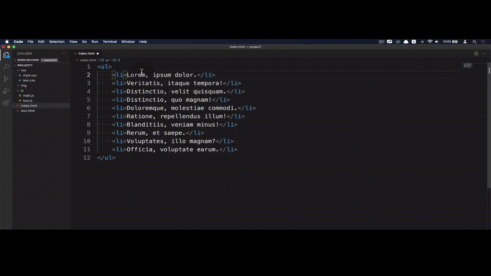
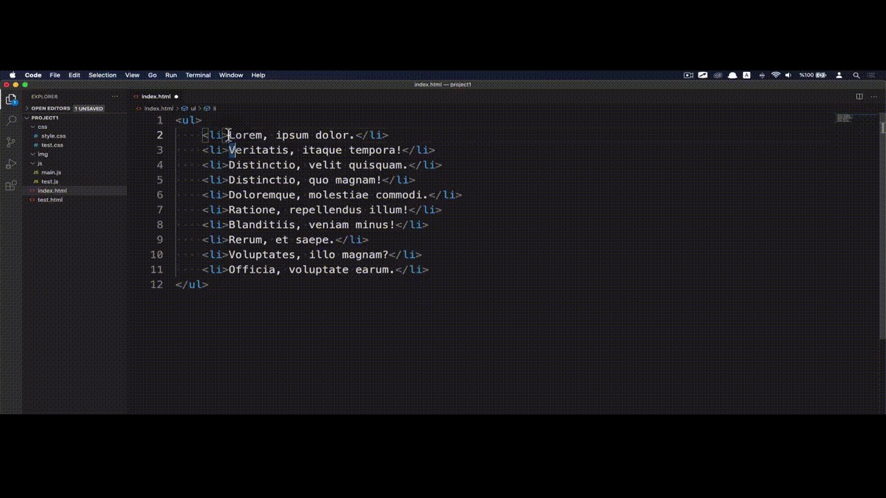
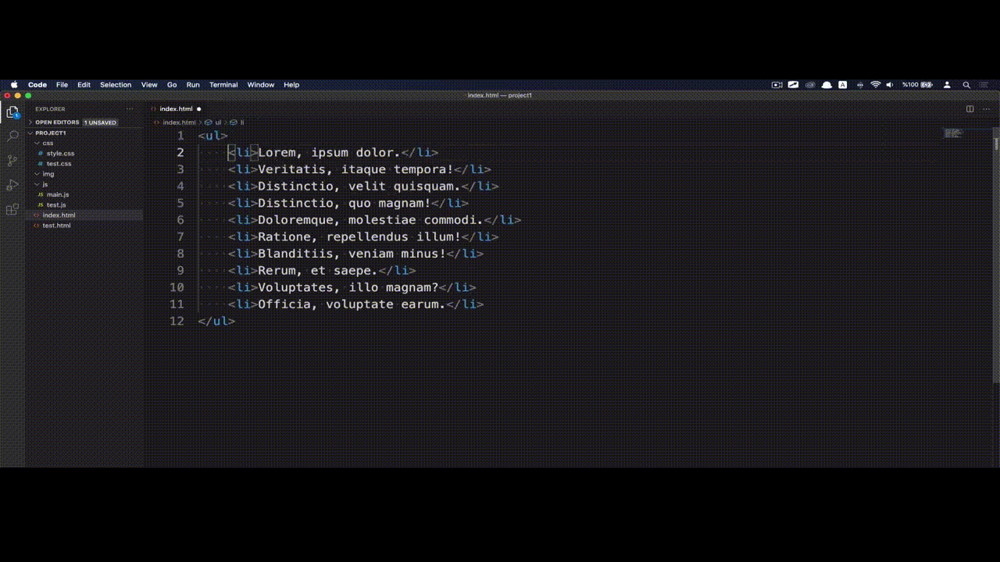

# VS CODE | MultiCursor (Çoklu İmleç) Kullanımı

Visual Studio Code'un en güzel özelliklerinden biri MultiCursor yani çoklu imleç özelliğidir. Bu özellik bizlere birden fazla yeri aynı anda değiştirme imkanı sunmaktadır.

 

Çoklu imleç özelliğinde;

* **ALT** tuşuna basılı tutarak işlem yapmak istediğiniz yerleri tek tek seçebilir ve değişiklik yapabilirsiniz.

  

* **ALT** + **Shift** kombinasyonuna basılı tutarak çoklu seçim yapabilir ve değişiklik yapabilirsiniz.

  

Ek olarak, Visual Studio Code içerisinde bir satırda seçmiş olduğunuz ifade diğer satırlarda da tekrarlanıyorsa kod editörü onları bulur ve sizin görebileceğiniz hale getirir. Çoklu imleç özelliği de aynı ifadeleri  **CTRL** + **D** kombinasyonuyla seçebilmenizi ve tek seferde değiştirebilmenizi sağlar.

Son olarak çoklu imleç özelliğini kapatmak için **ESC** tuşuna basabilirsiniz.