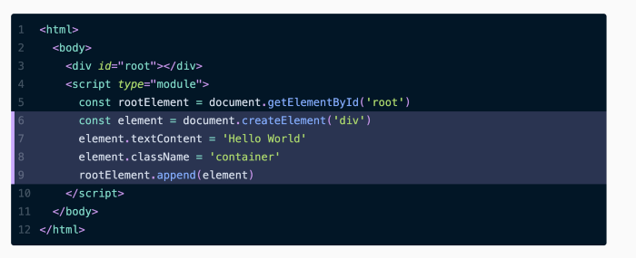

# JSX


## Altbaşlık

İçerik gövdesi : Lorem ipsum dolor sit amet, consectetur adipiscing elit. Quisque ut nulla eu eros luctus dapibus. Proin porttitor sapien tortor, vitae molestie mauris malesuada sed. Aliquam risus odio, malesuada a nulla vitae, ullamcorper porttitor mauris. Donec nec iaculis magna. Curabitur vitae mauris sit amet lorem semper ultrices. Aliquam pharetra malesuada placerat. Nam a varius ante, et placerat sem. Vivamus pellentesque dictum nulla, id blandit ligula. Etiam pharetra libero arcu, quis pretium lorem molestie non.

#### Resim ekleme



Morbi efficitur porttitor nisl luctus aliquam. Etiam eget magna eu nisl laoreet interdum. Ut accumsan consequat dignissim. Ut ligula lorem, hendrerit nec sagittis a, vulputate eget neque. Maecenas dapibus nulla arcu, maximus iaculis nisi rutrum ut. Proin tincidunt dolor eu nulla sollicitudin congue. Mauris vel enim sit amet turpis posuere mattis. Nunc feugiat pretium feugiat. Sed vitae hendrerit quam. Etiam rhoncus vitae sapien a bibendum. Sed ultricies vehicula dolor a mollis. Maecenas tempor rhoncus scelerisque. Ut id dolor placerat, consequat erat id, accumsan ex. Sed leo justo, mollis ut ante eget, vestibulum dapibus velit. Donec semper massa at vestibulum pulvinar.

### Özellikler

#### Numarasız Liste

* Numarasız liste
* Numarasız liste

#### Numaralı liste

1. Numaralı liste
2. Numaralı liste

#### Karma liste 

* Karma liste 
  1. numaralı
     * numarasız

#### Link

[Açıklama](http://LİNK)

#### Alıntı verme

> JQuery yazarı [The DOM is a Mess](https://www.youtube.com/watch?v=dgI52y27O_I). konuşmasında DOM API JS direk kullanmanın zorluklarını, karmaşıklığını JQuery ile bunun üzerine nasıl bir katman oluşturmak istediğini anlatmaktadır.

#### Satır içi kod paylaşma

Klasör içerisinde terminali başlattıktan sonra `npm start` komutuyla sistemi canlandırabiliriz.

#### Kod bloğu paylaşma

Yukarıda oluşturduğumuz `productList` arrayimizi map metoduyla dönebiliriz.

```JavaScript
<form className="mt-3">
    <div class="form-row">
        <div class="col-md-6 mb-3">
            <input className="form-control" type="text" placeholder="Marka, model arayın." aria-label="Search" />
        </div>
        <div class="col-md-4 mb-3">
            <select class="custom-select form-control">
                {
                productList.map(product => (                        
                <option selected>{product.marka}</option>
        ))
        }
            </select>
        </div>
        <div class="col-md-2 mb-3">
            <button class="form-control btn products__btn" type="submit">Filtrele</button>
        </div>
	</div>
</form>
```


#### Örnek Youtube videosu ekleme:

[](https://www.youtube.com/watch?v=YOUTUBE_VIDEO_ID_HERE)

## Kaynaklar: 

* [Kaynak adı / site adı / kişi adı](http://#)