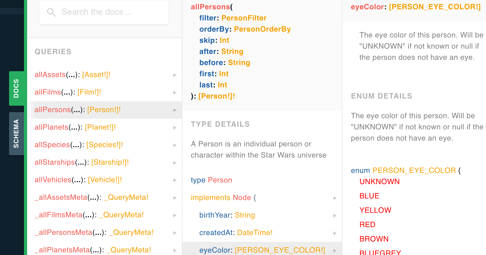

# GraphQL Nedir?


GraphQL, REST'in üzerine inşa edilmiş ve onun eksikliklerini kapatan yeni bir anlayış, yeni bir mimaridir. Facebook tarafından geliştirilmiştir ve Facebook, Instagram, PayPal ve Netflix gibi büyük ölçekli şirketler tarafından yoğun olarak kullanılmaktadır.

İsminde Graph kelimesi geçtiğinden, genelde bir veritabanı yönetim sistemi olarak düşünülebiliyor. GraphQL, yeni bir programlama dili veya veritabanı yönetim sistemi değildir. 


## GraphQL Avatanjları

Bu başlık altında GraphQL'i, Rest ile karşılaştırarak avantajlarını görmeye çalışacağız.


## 1. Sadece Gerekli Kolonları Sorgulayabilmek
Bir backend geliştirdiğimizi düşünelim. Bu backend'i kullanacak olan bir mobil uygulama ve bir de web uygulaması geliştirdiğimizi ve anasayfada kullanıcı postlarını listelememiz gerektiğini varsayalım. Ancak bu postları listelerken web uygulamasında id, username, description, created date, comments gibi alanları göstermemiz gerekirken mobil uygulama tarafında sadece id, username ve description kolonlarına ihtiyacımız olduğunu varsayalım.

Eğer bu backend'i Rest API olarak geliştirseydik anasayfadaki postların sahip olduğu tüm kolonlar db üzerinde select edilecekti. Ancak biz mobil uygulama tarafında sadece iki kolona ihtiyaç duyuyoruz. Böyle olmasına rağmen yine de o ihtiyacımız olmayan veriler API'dan bize gelmek durumundaydı.

Ama eğer bunu GraphQL ile yapsaydık böyle bir zorunluluğumuz olmayacaktı. Çünkü GraphQL ile sadece istediğimiz alanlar için özel Query'ler yazabiliriz.

Web uygulaması için çalıştırmamız gereken Query;
```
  query WebAppPostsQuery{
    posts{
      id
      username
      description
      created_at
      comments{
        id
        username
      }
    }
  }
```

Mobil uygulamamız için çalıştırmamız gereken Query;
```
  query WebAppPostsQuery{
    posts{
      id
      username
      description
    }
  }
```

Görüldüğü üzere aynı backend üzerine farklı client'lar tarafından erişip, farklı farklı cevaplar bekleyebiliyoruz. Bu da bize günün sonunda bandwidth optimizasyonu olarak geri dönüyor.


## 2. Tek bir API Endpoint
Eğer backend'i REST ile geliştiriyor olsaydık oluşturmamız gereken onlarca farklı endpoint olacaktı. Sisteme kayıtlı kullanıcılarımız, bu kullanıcıların gönderileri ve bu gönderilere ait yorumların olduğunu varsayalım. Bu durumda endpointlerimiz muhtemelen şöyle olacaktı;


| Açıklama  | Endpoint |
| ------------- | ------------- |
| Tüm kullanıcılar  | /users  |
| Tek kullanıcı  | /users/:id |
| Tüm gönderiler  | /posts  |
| Tek gönderi  | /posts/:id |
| Tüm yorumlar  | /comments  |
| Tek yorum  | /comments/:id |
| Bir kullanıcıya ait gönderiler  | /users/:id/posts |
| Bir gönderiye ait yorumlar  | /posts/:id/comments |

Bu liste daha da uzar gider elbette. Kullanıcı, gönderi veya yorumlar için ekleme, silme, güncelleme gibi endpoint'leri eklemedim bile. O endpointlerin de diğer HTTP metodları(POST,UPDATE,DELETE) ile yazılması gerekir.

Ancak işin GraphQL tarafına baktığımız zaman böyle bir endpoint karmaşası ile uğraşmamız gerekmiyor. GraphQL tarafında istekleri bekleyen tek bir endpoint bizi karşılıyor. Tüm isteklerimizi buraya yapmamız gerekiyor. Ve aynı Query içerisinde birden fazla veriyi getirme imkanımız da var.

Örneğin biz bir istek içerisinde tüm kullanıcıları, tüm gönderileri ve tüm yorumları getirmek istersek aşağıdaki Query'i çalıştırmamız yeterli olacaktır.

```
  query getAll{
    users{
      id
      username
    }

    posts{
      id
      description
    }

    comments{
      id
      text
    }
  }
```


## 3. İlişkili Veriler
GraphQL ilişkili veriler ile çalışırken size çok büyük kolaylıklar sağlar. Aşağıdaki Query, sistemde bulunan tüm kullanıcıları, her bir kullanıcının sahip olduğu gönderileri ve bu gönderilere ait yorumları listeler.

```
  query{
    users{
      id
      username
      posts{
        id
        description
        comments{
          id
          text
        }
      }
    }
  }
```

Aynı işi REST ile yapmak isterseniz backend üzerindeki üç ayrı endpoint'e istek atmanız gerekecekti. Veya bu verileri sağlayacak tek bir endpoint üzerinde birleştirmeniz ve artık oraya istek atamanız gerekecekti. Bu da backend geliştiricilere ek bir yük demektir.


## 4. Otomatik Dokümanlama
GraphQL şemalarınızı tasarlamaya başladığınız anda sizin için otomatik olarak dokümanlar oluşturulur. Bu dokümanlar API'ı implemente edecek olan frontend geliştiricinin ihtiyaç duyduğu tek şeydir. Bu dokümanı inceleyerek hızlıca implementasyon yapmaya başlayabilir. Artık dokümanlama için de ekstra efor sarf etmenize gerek yok.




## GraphQL Terminolojisi
Aslında GraphQL terminolojisini üç ana başlık altında toplayabiliriz. Bunlar [Query](https://graphql.org/learn/queries/), [Mutation](https://graphql.org/learn/queries/#mutations) ve [Subscription](https://www.apollographql.com/docs/react/data/subscriptions/).


### 1. Query
Aslında bunu GET methoduna benzetebilirsiniz. Bir veri kaynağına erişmek istediğinizde kullanacağınız tanımdır. Aşağıda örnek bir GraphQL Query örneği verilmiştir.

Bu Query, veritabanında bulunan `3` id'li ürünün id,title,description ve price kolonlarını getirecektir.
```
  query{
    products(id: 3){
      id
      title
      description
      price
    }
  }
```

### 2. Mutation
Eğer Mutation tanımını da REST mimarisinden örneklemek gerekirse; kullandığınız POST, UPDATE, PATCH, DELETE metodları da Mutation tanımına karşılık geliyor diyebiliriz. Örneğin bir kullanıcı ekleme, silme ve güncelleme işlemi Mutation tanımı ile yapılabilir.


Yeni bir kullanıcı oluşturmak istersek aşağıdaki gibi bir mutation çalıştırabiliriz. 
```
  mutation{
    insertUser(
      data: {
        username: "Mehmet"
        surname: "Seven"
        isActive: false
      }
    ){
      id
      username
      surname
      isActive
    }
  }
```

Örneğin `3` id'li kullanıcının soyismini güncellemek istersek;
```
  mutation{
    updateUser(
      id: 3
      data: {
        surname: "Kaya"
      }
    ){
      surname
    }
  }
```

`3` id'li kullanıcıyı silmek istersek;
```
  mutation{
    deleteUser(id: 3){
      id
    }
  }
```


Tüm kullanıcıların `isActive` kolonunu `true` olarak belirlemek istersek aşağıdaki gibi bir mutation çalıştırabiliriz. 
```
  mutation{
    updateUsers(
      data: {
        isActive: true
      }
    ){
      users{
        id
        isActive
      }
    }
  }
```

### 3. Subscription
GraphQL, gerçek zamanlı çalışan projeler geliştirirken de çok büyük kolaylıklar sağlıyor. Subscription tanımı ile herhangi ekleme, silme, güncelleme işlemi yapıldığı anda bundan gerçek zamanlı olarak haberdar olabiliriz.


Bir kullanıcı oluşturulduğunda, bu kullanıcı ile alakalı verilere ulaşmak istersek çalıştırmamız gereken query aşağıdaki gibi olacak;
```
  subscription{
    userCreated{
      id
      username
      surname
    }
  }
```

Bir kullanıcı güncellendiğinde, bu kullanıcı ile alakalı güncel verilere ulaşmak istersek çalıştırmamız gereken query aşağıdaki gibi olacak;
```
  subscription{
    userUpdated{
      id
      username
      surname
    }
  }
```

Bu ve bunun gibi örnekler daha da çoğaltılabilir elbette. Örneğin, gerçek zamanlı çalışan chat uygulamasını GraphQL ile geliştirmek gerçekten çok ama çok basit.


## Ek Kaynaklar

[An Introduction to GraphQL](https://graphql.org/learn/)

[GraphQL is the better REST](https://www.howtographql.com/basics/1-graphql-is-the-better-rest/)
