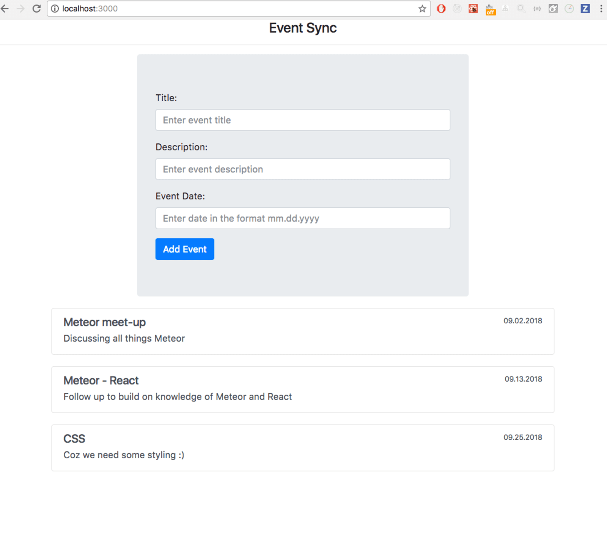

# Ödev 4

Diğer ödevlerde hazırlamış olduğunuz backend'i kullanarak [Apollo Client](https://www.apollographql.com/docs/react/) ile React uygulaması geliştirmeniz gerekiyor.

## Gereksinimler
- [ ] [create-react-app](https://create-react-app.dev/) ile bir React uygulaması ayağa kaldırınız.
- [ ] [Apollo Client](https://www.apollographql.com/docs/react/) kurulumunu gerçekleştiriniz.
- [ ] Veri setinde bulunan Etkinlikleri anasayfada listeleyiniz.
- [ ] Burada etkinlik adı, açıklaması ve zamanı listeleyiniz.
- [ ] Etkinlik detayına gidildiğinde etkinlik sahibi, konum ve katılımcılar da görüntülenmelidir.