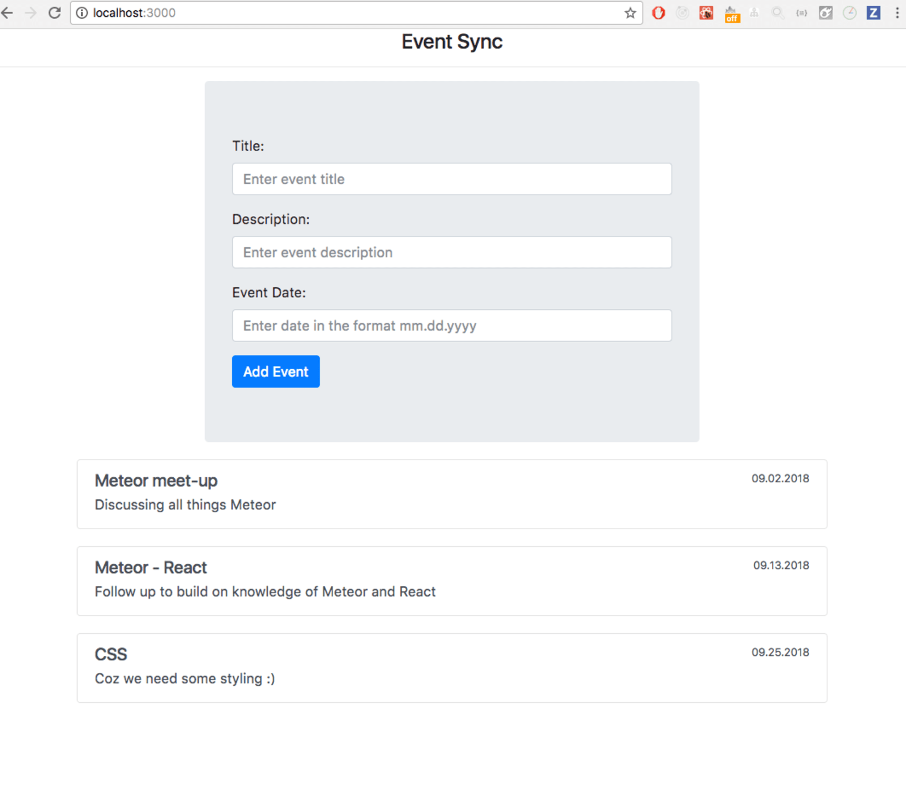

# Ödev 6

Bu ödevde yeni etklik ekleme formunu hazırlamanız gerekiyor.

## Gereksinimler
- [ ] Etkinlik başlığı, açıklaması, konumu, tarih ve saati ve user inputları oluşturulmalıdır.
- [ ] Etkinlik eklendikten sonra anasayfada gerçek zamanlı olarak listeleme işleminin gerçekleştiğinden emin olunuz.
- [ ] Form gönderildikten, cevap gelene kadar geçen sürede inputları disable edin ve buton üzerinde bir loading indicator gösteriniz.

Kolaylıklar :)