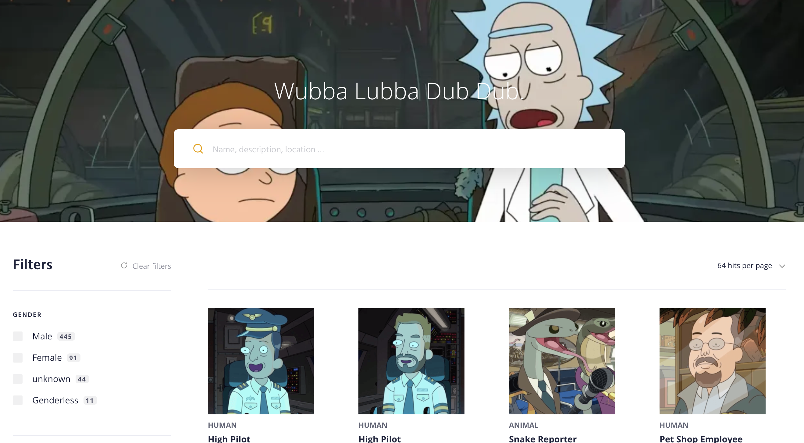

# Proje 2 - Rick and Morty Characters

Hali hazırda bulunan bir GraphQL backend'i kullanarak Rick and Morty karakterlerini listeleyebileceğimiz, arayabileceğimiz ve filtreleyebileceğimiz bir React uygulaması geliştirmeniz gerekiyor.

Örnek çalışmaya [şuradan](https://rick-and-morty-chars.netlify.app/) ulaşabilirsiniz.

Kullanılacak olan GraphQL backend'e [şuradan](https://rickandmortyapi.com/graphql) erişebilirsiniz.

## Gereksinimler
- [ ] Karakterler fotoğraflarıyla birlikte anasayfada listelenmelidir.
- [ ] Karakter listesi için sayfalama yapılmalıdır.
- [ ] Arama input'u aracılığı ile herhangi bir karakter aranabilmelidir.
- [ ] Filtreleme bölümü aracılığı ile herhangi cinsiyet, tür  veya location seçimi yapılabilmelidir.
- [ ] Filtre seçimleri temizlenebilmelidir.

Bol şans :)

