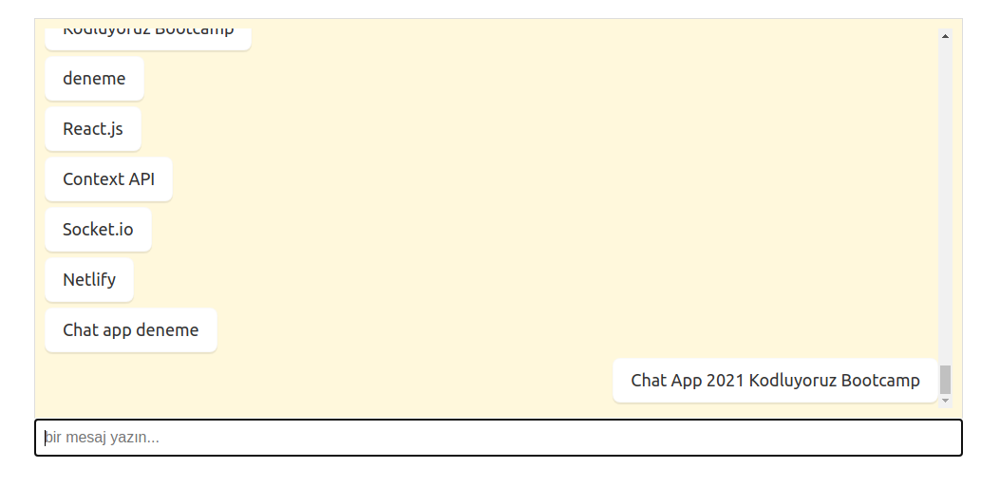

# Proje 3 - Anonymous Chat

GraphQL ile gerçek zamanlı çalışan anonim chat uygulaması geliştirmeniz gerekiyor.
Bu proje için hem backend hem de client geliştirmeniz gerekiyor.

## Gereksinimler
- [ ] Mesajların listeleneceği bir alana ve mesaj göndermek için kullanılacak bir input'a ihtiyacınız var.
- [ ] Mesajları gönderebilmek için bir GraphQL Mutation'u geliştirmeniz gerekiyor.
- [ ] Gönderilen mesajları gerçek zamanlı yakalayabilmek için de bir Subscription hazırlamanız gerekiyor.
- [ ] Subscription yapısını Redis PubSub ile hazırlayınız.

Kolaylıklar :)