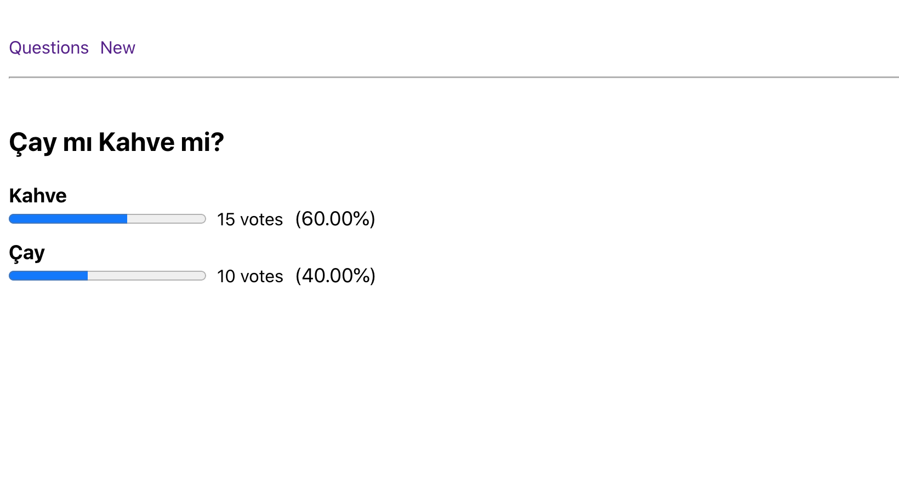

# Proje 4 - Realtime Voting App

GraphQL ile gerçek zamanlı çalışan oylama uygulaması geliştirmeniz gerekiyor.
Bu proje için hem backend hem de client geliştirmelisiniz.

Örnek çalışmaya [şuradan](https://oyluyoruz.netlify.app/) ulaşabilirsiniz.

## Gereksinimler
- [ ] Tüm sorular anasayfada gerçek zamanlı olarak listelenmelidir. Yeni bir soru eklendiği anda anasayfadaki listenin en üstünde bu yeni soru görüntülenebilmelidir.
- [ ] Yeni bir soru oluşturulurken, soru ve buna verilebilecek cevaplar eklenebilmelidir. Oylamayı açan kişi dilediği kadar option ekleyebilmelidir.
- [ ] Soru detayına gidildiğinde, option'lar listelenmeli ve herhangi seçim yapıldıktan sonra sonuç ekranı görüntülenmelidir.
- [ ] Sonuçlar gerçek zamanlı olarak görüntülenmelidir.
- [ ] Bir option'a verilen oy sayısı ve oy oranları görüntülenebilmelidir.

Kolaylıklar :)