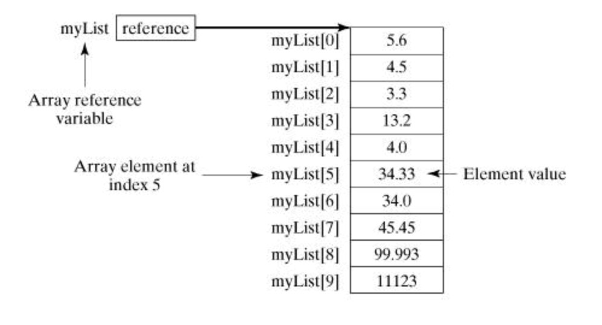

# Java'da Dizi ve Matris'ler

## Java&#39;da Dizi (Array)

Değişkenler hafızada tek bir değer tutmamızı sağlar. Fakat bazı durumlarda, birden çok veriyi bir arada bulundurmak isteriz. Örneğin, bir sınıfta okuyan 20 öğrenci olsun. Bu 20 öğrenci için hafızada ayrı ayrı 20 tane değişken oluşturmak yerine, tek bir değişken kullanarak 20 öğrencinin koleksiyonunu tutmak isteyebiliriz.

Bu gibi durumlarda dizileri kullanırız. Dizi, aynı türden birden fazla değişkeni tutmamızı sağlayan hafıza birimidir. Kısaca, dizileri aynı türden elemanları gruplamak için kullanırız. Dizi oluşturduktan sonra dizinin içerisindeki elemanlara indeks numarasıyla ulaşır ve değiştiririz. Ayrıca, çok boyutlu diziler oluşturmak da mümkündür. Tek boyutlu dizi kullanabileceğimiz gibi 2 veya 3 boyutlu diziler de oluşturabiliriz. 2 boyutlu dizilere matris denir.

Dizi (Array) kavramı programlama dillerinde bir veri tipini ifade eder. Bu veri tipi liste halindeki ardışık verileri bir arada tutan yapıya denilir. Bu ardışık yapıya ait elemanlara indeks yoluyla erişim sağlanabilir. Diziler sabit boyutludur. Örneğin: 10 elemanlık dizi. Dizilerde aynı tipten veri tutulur. Örneğin: tüm elemanları &quot;int&quot; olan bir dizi.

Dizi&#39;nin hafızada bir başlangıç adresi olur ve ardışık olan diğer elemanlar sırayla hafızaya yerleştirilir. Dizi&#39;ler &quot;new&quot; anahtar sözcüğüyle oluşturulur. Böylece, Heap Hafıza bölgesinde yer kaplarlar.

````java
double[] myList;   // tercih edilen yol

veya 

double myList[];   // başka türlü tanımlama biçimi
````

Diziler veri tipi ve [] parantezler ile belirtilir. Yukarıda iki farklı tanımı görülmektedir. Hafızadan yer alıp diziye alan ayırabilmek için &quot;new&quot; anahtar kelimesi kullanılır.

 ````java
double[] myList = new double[10];
 ````

Yukarıda maksimum 10 eleman alabilen &quot;double&quot; veri tipinde olan bir dizi oluşturulmuştur.



Yukarıda &quot;myList&quot; isminde bir dizi tanımlamıştık. Tanımlanan dizi hafıza yukarıdaki şekildeki gibi tutulur. &quot;myList&quot; değişkeni dizinin başlangıç adresini tutar. Dizilerde ardışık bir sıra olduğu için ilk elemandan sonra gelen elemanların hafıza adresleri de birer birer artar. Dizi blok halinde yer kaplar. Diziye erişmek için indeks numarası kullanılır. Örneğin: &quot;myList[0]&quot; demek dizinin 1. Elemanını verecektir. Java&#39;da dizilerin indeksleri sıfırdan başlar. Örneğin: &quot;myList[5]&quot;, yani 5 nolu indeksteki dizi elemanını ver dediğimizde aslında dizinin 6. Elemanına erişmiş oluruz.

Örnekler:

````java
// Java'da diziye ilk değerler süslü parantezler arasında verilir.
double[] myList = { 1.9, 2.9, 3.4, 3.5 };

// tüm dizi elemanlarını arada boşuk bırakarak sırayla ekrana yazdırır.
for (int i = 0; i < myList.length; i++)
{
	System.out.println(myList[i] + " ");
}
````

Yukarıdaki örnekte myList isimli diziye ilk değerleri hemen verilmiştir. Süslü parantezler arasında kalan değerler dizi elemanlarıdır.

Ardından, bir &quot;for&quot; döngüsü ile dizi elemanları ekrana yazdırılır.

### Dizileri fonksiyonlara parametre olarak göndermek

Tanımladığınız dizileri fonksiyonlara parametre olarak gönderebilirsiniz.

Örneğin elimizde static bir fonksiyon olsun. Bu fonksiyona int tipinde verileri olan bir diziyi girdi (input) olarak vermek istersek aşağıdaki gibi olur.

````java
public static void printArray(int[] array) 
{
   for (int i = 0; i < array.length; i++) 
   {
      System.out.print(array[i] + " ");
   }
}
````

printArray ( int[] array ) kırmızı olarak işaretlediğimiz yer diziyi yerel değişken olarak fonksiyona gönderdiğimiz noktadır. Java&#39;da tüm değişkenler &quot;Pass by Value&quot; yöntemiyle geçilir. Bu şu demektir. Sizin tanımladığınız değişkenin, nesnenin veya dizinin birebir kopyası oluşturulur. Bu kopya değer fonksiyona yerel değişken olarak gider. Bu Java mülakatlarında size sorulabilecek bir detaydır.

### Dizileri fonksiyonlardan geri döndürmek

Fonksiyonlar belli bir işi yapıp sonucunda değer dönebilen veya dönmeyen kod bloklarıdır. Fonksiyonlar için altın kural, her fonksiyonun tek bir işi olmalıdır. Örneğin: dizi ortalaması alma işi yapan bir fonksiyon dizileri ekrana yazdırma işini yapmamalıdır. Veya dizilerin ortalamasını alma işi ile dizileri toplama işlemi aynı fonksiyon içinde olmamalıdır. Her biri ayrı fonksiyonlar olmalıdır.

````java
public static int[] reverse(int[] list) 
{
   int[] result = new int[list.length];

   for (int i = 0, j = result.length - 1; i < list.length; i++, j--) 
   {
      result[j] = list[i];
   }
   
   return result;
}

````

Yukarıda dizinin tersine çevrilmiş halini döndüren bir fonksiyon vardır. public static **int[]** reverse(…)  koyu renkle işaretlenen alan dizi döndüreceğimizi ve bu dizinin veri tipini söylüyoruz. Burada veri tipimiz &quot;int".

## Tek Boyutlu Diziler

Tek boyutlu diziler basitçe, aynı türden elemanların listesini tutan bir yapıdır.
Dizi oluşturmak için, önce dizide yer alacak elemanların türü belirtilir, sonra diziye bir isim verilir ve isimden sonra köşeli parantezler ( [ ve ] ) konulur.

```java
int numbers[]; // Burada numbers isminde bir dizi oluşturuluyor
```

Köşeli parantezleri değişken isminden sonra koymak yerine, tür isminden sonra da yazabilirsiniz. Örneğin aşağıdaki kodun yukarıdakiyle bir farkı yoktur:

```java
int[] numbers; // Burada numbers isminde bir dizi oluşturuluyor
```

Diziler new deyimiyle oluşturulur. Dizi oluştururken kapasite değeri vermek **zorunludur**. Kapasite değeri, dizinin kaç eleman barındıracağını belirtir. Aşağıdaki örnekte, 5 adet int değişkeni tutabilecek bir dizi oluşturuluyor:

```java
int[] numbers = new int[5];
```

Bu ifade çalıştırıldığında, hafızada 5 adet int değişken için yetecek kadar alan ayrılır. Bu alanı düzenleyebilmek için indeks numaraları kullanırız. **Dizi indeksleri 0’dan başlar** ve kapasitenin 1 eksiğine kadar gider. Örneğin, yukarıdaki dizinin indeksleri 0’dan 4’e kadardır. Şimdi bu dizinin ilk elemanını verelim:

```java
numbers[0] = 10; // Dizinin ilk elemanı 5 olarak ayarlandı.
```

Dizinin diğer elemanlarını şu şekilde verelim:

```java
numbers[1] = 15;
numbers[2] = 20;
numbers[3] = 25;
numbers[4] = 30;
```

Bu kodlar çalıştırıldığında dizinin elemanları sırasıyla aşağıdaki gibi olur:

{ 10, 15, 20, 25, 30 }

Aşağıdaki kodu çalıştırdığınızda konsola 25 yazar:

```java
System.out.println(numbers[3]);
```

Dizilerle uğraşırken indeks numaralarına çok dikkat etmelisiniz. Eğer dizinin aralığı dışında bir indekse erişmeye çalışırsanız, **_IndexOutOfBoundsException_** hatası meydana gelir.

```java
System.out.println(numbers[5]); // Hata!
```

Yukarıdaki satır hataya neden olur; çünkü numbers dizisinin kapasitesi 5 olmasına rağmen dizinin 6. elemanına erişmeye çalışıyoruz.

Eğer dizinin içindeki elemanlar dizi oluşturulurken belliyse, diziyi oluştururken elemanları küme parantezi içinde ve virgülle birbirinden ayırarak verebiliriz:

```java
String[] weekDays = new String[] { "Pazartesi", "Salı", "Çarşamba", "Perşembe", "Cuma", "Cumartesi", "Pazar" };
```

Bu şekilde oluşturulan dizilere kapasite vermemize gerek yoktur; çünkü kapasite değeri zaten eleman sayısından bellidir. Yukarıdaki örnekde **_weekDays_** dizisinin kapasitesi otomatik olarak 7 olur.

Yukarıdaki gibi dizi oluştururken new deyimini kullanmaya gerek yoktur. Yani, yukarıdaki kodu aşağıdaki gibi yazabiliriz:

```java
String[] weekDays = { "Pazartesi", "Salı", "Çarşamba", "Perşembe", "Cuma", "Cumartesi", "Pazar" };
```

### Dizinin Kapasitesini Öğrenmek

Her dizinin **length** adında bir özelliği bulunur. Bu özelliği kullanarak dizinin kapasitesini öğrenebilirsiniz.

Örneğin, aşağıdaki kodu inceleyelim:

```java
int[] numbers = new int[100];
System.out.println(numbers.length); // Konsolda 100 yazar
```

## Java&#39;da Matris İşlemleri (Matrice)

Java&#39;da matrisler varsayılan bir veri tipi olarak bulunmazlar. Dizilerin 2 boyutlu halleri şeklinde tanımlanırlar. Matris satır ve sütun şeklinde tablo verisi formatındaki verileri tutmak için kullanılır. Diziler liste halinde veriler için uygunken, matrisler tablo şeklindeki veriler için uygundur.

Örnek:

3x2 &#39;lik bir matris olduğunu düşünelim.


2x4 &#39;lük başka bir ise aşağıdaki gibi olacaktır.


Bu iki matrisin çarpımıyla ise C isminde 3x4 &#39;lük bir matris oluşacaktır. Buradaki çarpma yöntemi A&#39;nın satırını komple al, B&#39;nin sütunu komple al ve birbiriyle çarp sonucu C matrise yaz. Kabaca yöntem bu şekilde, bu yöntemin matematiksel izahı ise aşağıdaki gibidir.


C matrisi sonuç matrisidir.

Formül:


Yukarıdaki A ve B matrisinin Java&#39;da tanımlanması aşağıdaki gibidir.

````java
double[][] A = {
  new double[]{1d, 5d},
  new double[]{2d, 3d},
  new double[]{1d, 7d}
};
 
double[][] B = {
  new double[]{1d, 2d, 3d, 7d},
  new double[]{5d, 2d, 8d, 1d}
};

````

Dizilerden tek farkı [] parantez yanına bir tane [] açıyoruz. Zaten her [] ifadesi yeni bir boyut anlamına geliyor. &quot;**double[][][] ucBoyutlu;**&quot; şeklinde bir ifadeyle 3 boyutlu veri saklayan bir veri yapısı oluşturmuş oluyoruz.

````java
public double[][] multiplyMatrices(double[][] firstMatrix, double[][] secondMatrix) {

	// firstMatrix.length ile ilk matrisin satır sayısını buluyoruz. örneğimizde 3 olarak gelecektir.
	// secondMatrix[0].length ile ikinci matrisin sütun sayısını buluyoruz. örneğimizde 4 olarak gelecektir.

	// C matrisi olacak olan matrisi tanımlıyoruz.
    double[][] result = new double[firstMatrix.length][secondMatrix[0].length];
 
 	// matrislerde çarpma, toplama gibi işlemleri yapabilmek için iç içe 3 tane döngüye ihtiyaç duyarız.
    for (int row = 0; row < result.length; row++) {
        for (int col = 0; col < result[row].length; col++) {
            result[row][col] = multiplyMatricesCell(firstMatrix, secondMatrix, row, col);
        }
    }
 
    return result;
}


double multiplyMatricesCell(double[][] firstMatrix, double[][] secondMatrix, int row, int col) {
	// A matrisinin satırı ile B matrisinin sütunu çarpma işlemi.
	/*
	*   row = 3, col = 4  olarak gelecektir.
	*   i = 0 ise
	*   firstMatrix[3][0] * secondMatrix[0][4] 
	*   i = 1 ise
	*   firstMatrix[3][1] * secondMatrix[1][4] 
	*   i = 2 ise
	*   firstMatrix[3][2] * secondMatrix[2][4] 
	* şeklinde i değişerek satır ve sütun çarpılır.
	*/
    double cell = 0;
    for (int i = 0; i < secondMatrix.length; i++) {
        cell += firstMatrix[row][i] * secondMatrix[i][col];
    }
    return cell;
}

````

Yukarıdaki “multiplyMatrices” fonksiyonu iki tane matrisi girdi olarak alır. Fonksiyon matrislerin çarpım sonucunu matris olarak döndürür.

“multiplyMatrices” fonksiyonu içinde bir başka fonksiyon daha çağrılmıştır. “multiplyMatricesCell” bu fonksiyon ise iki matrisin satır ve sütununu çarpıp sonucu double tipte bir değer döndürür.

Yukarıdaki &quot;multiplyMatrices&quot; fonksiyonu iki tane matrisi girdi olarak alır. Fonksiyon matrislerin çarpım sonucunu matris olarak döndürür.

&quot;multiplyMatrices&quot; fonksiyonu içinde bir başka fonksiyon daha çağrılmıştır. &quot;multiplyMatricesCell&quot; bu fonksiyon ise iki matrisin satır ve sütununu çarpıp sonucu double tipte bir değer döndürür.

Çok boyutlu dizilere biraz daha ayrıntılı bakalım.

Bir değişkenin dizi olduğunu köşeli parantezler ile belirtmiştik. Bir tane köşeli parantez tek boyutlu dizi belirtir. Eğer çok boyutlu dizi oluşturmak istiyorsak, boyut sayısı kadar köşeli parantez belirtmeliyiz. Örneğin aşağıdaki satır 2 boyutlu bir dizi (yani matris) belirtir:

```java
int matrix[][];
```

İlk köşeli parantez birinci boyutu (satırları), diğeri ise ikinci boyutu (sütunları) belirtir. Aşağıdaki kodu çalıştırırsak, 3 satırlı ve 4 sütunlu bir matris oluşturur:

```java
int matrix[][] = new int[3][4];
```

Bu matrisin bütün elemanlarına ulaşmak için kullanmamız gereken indeks numaralarını aşağıdaki tabloda görebilirsiniz:

| \[0] \[0] | \[0] \[1] | \[0] \[2] | \[0] \[3] |
| - | - | - | - |
| \[1] \[0] | \[1] \[1] | \[1] \[2] | \[1] \[3] |
| \[2] \[0] | \[2] \[1] | \[2] \[2] | \[2] \[3] |

```java
matrix[1][2]; // Matrisin 2. satır ve 3. sütunundaki elemana erişiliyor
matrix[0][3]; // Matrisin 1. satır ve 4. sütunundaki elemana erişiliyor
matrix[2][0]; // Matrisin 3. satır ve 1. sütunundaki elemana erişiliyor
```

Şimdi güzel bir örnek yapalım. 3 satırdan ve 4 sütundan oluşan bir matris yaratalım ve bu matrisin elemanlarını sırayla 1’den başlayacak şekilde dolduralım. Aşağıdaki kodu inceleyelim:

```java
int[][] matrix = new int[3][4];
int number = 1;

for (int x = 0; x < matrix.length; x++)
{
	int[] row = matrix[x];

    for (int y = 0; y < row.length; y++)
	{	
		row[y] = number;
		number++;
	}
}
```

Şimdi yukarıdaki kodu inceleyelim. İki boyutlu diziyi oluşturduktan sonra önce for döngüsüyle dizinin satırlarını geziyoruz. Daha sonra içerideki for döngüsüyle dizinin sütunlarını dolaşıyoruz. Bu örneği vermemizdeki amaç, matrisin elemanlarına ulaşmak için iç içe 2 for döngüsü kullanmak gerektiğini göstermektir. Ayrıca dizinin _length_ metodunun faydasını da burada görmüş oluyoruz.

Yukarıdaki kod çalıştığında matrisin elemanları şu şekilde olur:

| 1 | 2 | 3 | 4 |
| - | - | - | - |
| 5 | 6 | 7 | 8 |
| 9 | 10 | 11 | 12 |

### Sütun Kapasiteleri Farklı Matris Oluşturmak

2 boyutlu dizilere matris denir. Başka bir açıdan bakıldığında ise, 2 boyutlu dizileri, dizinin dizisi olarak düşünmek doğru olur. Diziler aynı türden elemanlardan oluşur. int türünde bir dizi olabileceği gibi, dizinin dizisi de olabilir. Matrisleri **dizilerin dizisi** (**array of arrays**) olarak düşünebiliriz.

Yukarıdaki örneklerde matrisin sütun sayısını 4 olarak belirledik. Bu şekilde oluşturulursa matrisin bütün satırları 4 elemanlı olur. Fakat bu zorunlu değildir. Matris oluştururken sütun sayısı belirlemezsek, her bir satırdaki dizilerin kapasitesi farklı olabilir. Örneğin aşağıdaki kodu inceleyelim:

```java
int[][] matrix = new int[3][];
matrix[0] = new int[1];
matrix[1] = new int[2];
matrix[2] = new int[3];
```

Burada önce 3 satırdan oluşan bir matris belirttik, fakat sabit bir sütun sayısı vermedik. Sonra her bir satır için ayrı ayrı sütun sayısı belirledik. Bu kodu çalıştırdığımız zaman aşağıdaki gibi bir matris oluşur:


Çok boyutlu dizi oluştururken, yalnızca ilk boyutun (en soldaki) kapasitesini belirlemeniz yeterlidir. Diğer boyutların kapasitesini dinamik olarak belirleyebilirsiniz.