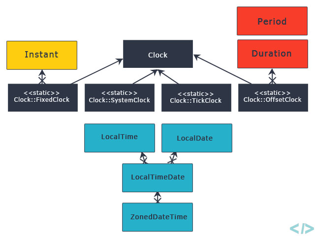

# Java Gün ve Zaman İşlemleri (Date &amp; Time)


Java 7 ve öncesinde Date ile ilgili işlemlere yardımcı olan sınıflar &quot;java.util&quot; paketi altındadır. Özellikle, Date sınıfı tarih ve zamanı ifade eden nesneler oluşturulmasını sağlar.

Date sınıfının iki tane kurucu metodu vardır.

````java
Date now = new Date();

Date userDefinedDate = new Date(102938102222);

````

Yukarıdaki boş kurucuyu çağırıp bir Date nesnesi oluşturursanız şimdiki zamanı size verecektir.

İçine milisaniye cinsinden değer alan diğer kurucu ile nesne oluşturursanız. Bu durumda sizin belirtmiş olduğunuz zamanı işaret edecektir. 1 Ocak 1970 tarihinden günümüze kadar tarihleri mili saniye cinsinde belirtebiliriz.

&quot;boolean after(Date date)&quot; fonksiyonu kendisine gönderilen zaman bilgisi ile mevcuttaki zaman bilgisi kendisinden sonraki bir tarih ise true döndürür.

````java
Date c = new Date(209830121131L);
boolean result =c.after(new Date());
````

&quot;boolean before(Date date)&quot; fonksiyonu after gibi çalışır. Verilen zaman bilgisi mevcut zaman bilgisinden önce ise true döndürür.

&quot;int compareTo(Date date)&quot; fonksiyonu ile iki zaman bilgisi kıyaslanır. Eğer birbirine eşitse sıfır döner. Eğer, gönderilen zaman bilgisi mevcuttaki zaman bilgisinden sonra ise pozitif değer döndürür. Eğer, gönderilen zaman bilgisi önce ise negatif döndürür.

&quot;long getTime()&quot; fonksiyonu ile Date sınıfına ait nesneden tuttuğu zaman bilgisi milisaniye cinsinden alınır.

&quot;void setTime(long time)&quot; fonksiyonu ile istediğimiz zaman bilgisini set edebiliriz. Fonksiyona gönderilecek değer milisaniye cinsinden olmalıdır.

`````java
// Date nesnesi oluştur
Date date = new Date();

// Zaman ve tarih bilgisini toString metoduyla göster.
System.out.println(date.toString());
`````

Çıktı:

````
Thu Mar 05 22:16:09 EET 2020
````

## Java&#39;da Tarih Zaman Bilgisinin Formatlanması

Java&#39;da tarih ve zaman bilgisini formatlanması ve yazıdan Date tipinde bir nesne dönüştürülmesi işini &quot;SimpleDateFormat&quot; sınıfı yapmaktadır.

```java
SimpleDateFormat formatter = new SimpleDateFormat ("yyyy.MM.dd");
System.out.println("Current Date: " + formatter.format(date));
```

Çıktı:

````java
Current Date: 2020.03.05
````

Elimizde &quot;2020-02-10&quot; şeklinde yıl-ay-gün şeklinde String tipinde bir veri olsun. Bunu Date tipinde bir nesneye çevirmek için &quot;SimpleDateFormat&quot; sınıfına ait &quot;parse&quot; metodunu kullanmamız gerekecektir.

````java
SimpleDateFormat formatter = new SimpleDateFormat ("yyyy-MM-dd");
String dateAstext = "2020-02-10";
Date parsedDate = formatter.parse(dateAstext);
System.out.println("Parsed Date: " + parsedDate.toString());
````

## Java8 Tarih/Zaman (Date/Time) API



> *Resim: DateTime API paket içeriği*

Java 8 ile birlikte tarih ve zaman bilgisini işleyen yapılar ve sınıflar değiştirildi. Daha esnek ve kullanımı kolay fonksiyonlar ve sınıflar haline dönüştü.

İlgili tüm sınıflar &quot;java.time&quot; paketi altında toplandı.

Java8&#39;in yeni Date/Time kütüphanesi aşağıdaki özelliklere sahiptir.

- Thread Safety özelliğini varsayılan olarak sağlar. Yani multi thread yazılımlar geliştirirken Date ve Time ilgili nesneler için ekstra önlemler almanıza gerek kalmaz. Veri tutarlılığını garanti eder.
- Kullanımı çok basittir.
- Dünya üzerindeki zaman farkı hesaplamaları için yazılımcının ekstra çözümler üretmesine gerek bırakmadan kendisi bu sorunu çözer.

## LocalDate Sınıfı ile Örnekler

````java
LocalDate localDate = LocalDate.now();
System.out.println(localDate.toString());
````

Yukarıdaki gibi LocalDate sınıfından bir nesne ile günümüz tarihini kolayca alıp ekrana yazdırabilirsiniz.

````java
LocalDate currentDate = LocalDate.of(2020, 03,12);
System.out.println(currentDate.toString());
````

Yukarıdaki örnekte de yıl, ay ve gün bilgilerini &quot;int&quot; tipinde ayrı ayrı geçerek belirli bir tarih atayabilirsiniz.

````java
LocalDate definedDate = LocalDate.parse("2015-02-20");
System.out.println(definedDate.toString());
````

Yukarıdaki örnekte de String tipindeki tarih bilgisini parse ederek, LocalDate tipinde bir nesneye çevirip ekrana yazdırıyoruz.

````java
LocalDate tomorrow = LocalDate.now().plusDays(1);
````

Yukarıdaki örnekte mevcut tarih üzerine 1 gün ekleme yapılmıştır. Görüldüğü gibi bu işlem tek satırda basitçe yapılabilmektedir.

````java
LocalDate previousMonthSameDay = LocalDate.now().minus(1, ChronoUnit.MONTHS);
````

&quot;minus&quot; fonksiyonu ile 1 ay önceki bugünkü tarihi alabiliriz. ChronoUnit.MONTHS aylık bir çıkarma yapılacağını belirtiyor. Gün, Ay, Yıl gibi değerler seçersek o miktarda bir çıkarma işlemi uygulayacaktır.

`````java
DayOfWeek sunday = LocalDate.parse("2016-06-12").getDayOfWeek();
System.out.println(sunday);
`````

Haftanın gününü basitçe &quot;getDayOfWeek&quot; metoduyla alabiliriz.

````java
boolean leapYear = LocalDate.now().isLeapYear();
````

Yeni Date/Time kütüphanesi artık yıl olup olmadığını da kolayca söylüyor. 

### LocalTime Sınıfı ile Örnekler

LocalTime sınıfı ise daha saat bazında zamansal işlemler içindir.

`````java
LocalTime now = LocalTime.now();

System.out.println(now);
`````

Şimdiki zamanı saat bazında alabilirsiniz.

Çıktı: 22:54:12.997

````java
LocalTime sixThirty = LocalTime.parse(&quot;06:30&quot;);
````

String şeklindeki saat bilgisini parse metoduyla LocalTime nesnesine çevirebiliriz.

````java
// 1 saat eklemek. 7:30 olacaktır.

LocalTime sevenThirty = LocalTime.parse(&quot;06:30&quot;).plus(1, ChronoUnit.HOURS);

// saat bilgisini almak. 6 cevabı gelecektir.

int six = LocalTime.parse(&quot;06:30&quot;).getHour();
````

### LocalDateTime Sınıfı ile Örnekler

LocalDateTime sınıfı hem tarih hem de saat işlemleri için Java 8 ile gelen bir sınıftır. LocalTime ve LocalDate Sınıflarının metotlarını içerir. Bu sınıf da LocalDate ve LocalTime sınıfları gibi type-safe özelliğine sahiptir. 

```
LocalDateTime simdi= LocalDateTime.now();
//Formatlama yapılmaz ise çıktısı
//Yıl-Ay-GünTSaat:Dakika:Saniye:Salise şeklinde olur.
//Metotların geri dönüşü LocalDateTime olduğu için
//Stringe dönüştürmek için String.valueOf kullandık
String onGunOnce=String.valueOf(simdi.minusDays(10));
String onGunSonra=String.valueOf(simdi.plusDays(10));
String onDakikaOnce=String.valueOf(simdi.minusMinutes(10));
String onAyOnce=String.valueOf(simdi.minusMonths(10));
```

simdi Çıktı: 2021-01-02T22:42:04.146390400

onGunOnce Çıktı: 2020-12-23T22:42:04.146390400

onGunSonra Çıktı: 2021-01-12T22:42:04.146390400

onDakikaOnce Çıktı: 2021-01-02T22:32:04.146390400

onAyOnce Çıktı: 2020-03-02T22:42:04.146390400

### Java'da DateTimeFormatter Sınıfı ile Tarih ve Zaman Formatlama Örnekleri

DateTimeFormatter sınıfı Java 8 ile gelmiştir, LocalDate ve LocalTime sınıfı gibi type-safety özelliği vardır. SimpleDateFormat Sınıfıyla tarih-zaman formatlamak aynı anda iki threadin tarih-zaman formatı değiştirmeye çalıştığında, threadlerin birbirinin formatını kullanma ihtimali doğduğu için DateTimeFormatter zaman formatlamada önerilir. DateTimeFormatter sınıfı ile LocalDate, LocalTime ve LocalDateTime ile oluşturulmuş değerleri formatlar.

**LocalDate Sınıfı için bir örnek;**

```java
//Bugünün tarihini alıyoruz.
LocalDate tarih=LocalDate.now();

//ofPattern metodu aracılığıyla formatımızı giriyoruz..
//Burada tarih LocalDate objesini formatlıyorisek ayı(month) belirtmek için 'MM' kullanılmalıdır.
//Aksi takdirde 'mm' olarak kullanılması dakika(minute) anlamına gelir.
//ve 'UnsupportedTemporalTypeException' hatasını alarız.
DateTimeFormatter tarihFormatlayici=DateTimeFormatter.ofPattern("dd$MM$yyyy");

//tarihFormatlayici nesnemizi formatlayıp tarihStringi değişkenine atıyoruz.
//Burada tarih objesinin içindeki tarihimiz bizim formatımıza dönüştürülerek
//Değişkene atılır.
String tarihStringi=tarih.format(tarihFormatlayici);
```

Çıktı: 02$01$2021

**LocalTime Sınıfı için bir örnek;**	

```java
// Bu saat formatımız 24 saatlik dilimi içerir.
DateTimeFormatter saatFormatlayicisi1=DateTimeFormatter.ofPattern("hh*mm");
//Bu saat formatımız ÖÖ/ÖS (AM/PM) şekilindedir.
DateTimeFormatter saatFormatlayicisi2=DateTimeFormatter.ofPattern("hh$mm a");

LocalTime saat=LocalTime.now();

//Formatlarımızı string değişkenlere atıyoruz.
String ilkFormat=saat.format(saatFormatlayicisi1);
String ikinciFormat=saat.format(saatFormatlayicisi2);
```

ilkFormat çıktısı: 10*05

ikinciFormat çıktısı: 10$05 ÖS

**LocalDateTime sınıfı için bir örnek;**

```java
LocalDateTime tarihSaat= LocalDateTime.now();

//LocalDateTime formatlarken hem tarih için hem de saat için format girilmelidir.
DateTimeFormatter tarihSaatFormat=DateTimeFormatter.ofPattern("dd&&MM&&yyyy // hh:mm a");

//Önceki örneklerde olduğu gibi formatımızı bir String değere atıyoruz.
String formatliTarihSaat=tarihSaat.format(tarihSaatFormat);
```

Çıktı: 02&&01&&2021 // 10:47 ÖS

> **1.Soru**:  Tarih ve saat işlemlerini nerelerde kullanabiliriz?
>
> **2.Soru**: Tarih ve saatlerin formatlanmasına neden ihtiyaç duyarız?
>
> **3.Soru:** Type-Safe olmayan tarih-zaman işlerinde ne gibi problemler yaşayabiliriz?.

## Kaynak:

* [Kaynak 1](https://howtodoinjava.com/java/date-time/java8-datetimeformatter-example/)
* [Kaynak 2](https://docs.oracle.com/javase/8/docs/api/java/time/format/DateTimeFormatter.html)
* [Kaynak 3](https://www.javatpoint.com/java-date)
* [Resim Kaynağı](https://codenuclear.com/java-8-date-time-intro/)

