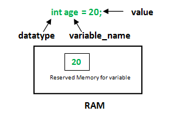

# Java Değişkenler (Variables)

​		Değişkenler, içinde veri barındıran ve bilgisayarın geçici hafızasında (RAM) fiziksel olarak yer kaplayan yapılardır. Değişkenlere değer (veri) ataması yapılabilir. Java&#39;da değişkenlerin veri tipleri vardır. Bu tipler Java&#39;da varsayılan olarak tanımlı gelen tipler de olabilir yahut yazılımcıların kendi tanımladığı tipler de olabilir.

```java
<veri tipi> <değişken ismi> = veri (değer)
```



​		Değişken tanımlaması yapıldığında aslında bilgisayar hafızasında bir yeri ayırmış oluyoruz. Her veri tipinin farklı boyut ve içerikleri vardır. Tanımladığımız bu alan, değişken veri tipinin boyutu kadar bir alanı ifade eder ve o alanda hangi tipte veri içereceğini bildirir. Örneğin: 2 Byte&#39;lık bir veri tipine sahipsek ve bu tipte bir değişken tanımlıyorsak her değişken için hafızadan 2 Byte&#39;lık yer ayrılacaktır. Java'daki değişken tiplerini hemen alttaki fotoğrafta görebiliriz: 


​		Burada ilkel (primitive) ve ilkel olmayan (non-primitive) veri tipleri ayrımına da ayrıca dikkat ediniz. String, array, class, interface gibi ilkel olmayan(non-primitive) veri tiplerine ileride daha detaylı bakılacaktır. Ancak bu noktada bu tiplerin farkları olarak şunları söyleyebiliriz:

- İlkel(primitive) veri tipleri önceden tanımlanmıştır. İlkel olmayan(non-primitive) tipler ise geliştirici tarafından oluşturulur.
- İlkel tipler her zaman bir değere sahiptir. İlkel olmayan tipler ise 'null' (boş) olabilir.
- İlkel olmayan türlerin tümü aynı boyuta sahipken ilkel veri tiplerin boyutu alacağı veri tipine bağlıdır. Yani bir int tipi 4 byte iken alacağı sayı int tipi aralığından büyük bir sayı ise long tipinde tutulur ve boyutu 8 bit olur.[2]

### Değişken Tanımlamak

​		Şimdi değişken tanımlamaya ve örneklerine biraz daha ayrıntılı bakalım. Java’da bir değişken, sırasıyla önce türü ve sonra ismi belirterek tanımlanır.

```java
int number;
// number isminde, int türünde bir değişken tanımlanmış
```

​		Aynı satırda birden fazla değişken tanımlayabilirsiniz, fakat türleri aynı olmak zorundadır:

```java
double a, b, c;
// double türünde 3 ayrı değişken tanımlanmış
```

​		Değişkeni tanımladıktan sonra, atama operatörü (=) kullanarak değişkene bir değer verebilirsiniz:

```java
double pi; // Önce double türünde bir değişken tanımladık
pi = 3.14; // Daha sonra bu değişkene bir değer verdik
```

​		Eğer bir değişkene hemen değer atayacaksanız, bunu iki satırda yapmak yerine tek bir satırda halledebilirsiniz:

```java
double pi = 3.14;
```

​		Aynı satırda aynı türden birden fazla değişken tanımlıyorsanız bunlara şu şekilde değer verebilirsiniz:

```java
int year = 2020, age = 25;
// Aynı satırda int türünde 2 farklı değişken tanımlanmış ve ikisine de değer verilmiş
```

​		Değişkene verilen değer herhangi bir anda değiştirilebilir:

```java
int year = 2020; // Bir değişken tanımlanmış ve değer verilmiş
year = 2021; // Değişkenin değeri değiştirilmiş
year = 2022; // Değişkenin değeri tekrar değiştirilmiş
```

​		Bir değişkeni tanımladığınız zaman, aynı kapsam içinde aynı isimde başka bir değişken tanımlayamazsınız:

```java
boolean a = true; // a isminde bir değişken tanımlanmış
boolean a = false; // Bu satır hataya neden olur, a değişkeni zaten var
```

​		Buraya kadar olan örneklerimizde değişkene hep kesin bir değer atadık; fakat Java’da bir metodun sonucunu da değişkene atayabilirsiniz (metodlar konusunu ileride ayrıntılı göreceğiz):

```java
double result = Math.sqrt(16.0);
// Karekök metodu çağrılıyor ve sonucu bir değişkene atanıyor
// Bu işlem sonucunda result değişkeninin değeri 4.0 olur
```

​		**int** tipinde, yani sayı tipinde tanımlanmış **a,b,c,d** isimli değişkenlerin her biri hafızada bir alanı kaplarlar.

​		Yukarıdakilere benzer şekilde aşağıdaki değişken tanımlama örneklerine de bakalım:

```java
int a, b, c; // 3 tane değişken virgüller ile ayrılarak tek satırda tanımlanabilir.

int a = 10, b = 10; // Birden fazla değişken aynı satırda ilk değerleri atanarak //tanımlanabilir.

byte b = 22; // Tek değişkene ilk değer ataması yapılarak

double pi = 3.14159; // Tek değişkene ilk değer ataması yapılarak

char a = "a" ; // Tek değişkene ilk değer ataması yapılarak

String str = "Hello"; //İlkel olmayan String veri tipinde de ilkel veri tipleri gibi direkt değer

//atama veya sonradan değer atama yapılabilir

// veritipi [] değişkenAdı = new veritipi[eleman sayısı];

int[] array = new int[3]; // İlkel olmayan tiplerde tanımlama yaparken referans değişkenler oldukları

//için 'new' sözcüğüyle bir referans tanımlanır. Bu tiplere daha detaylı bakılacaktır.
```

​		

​		Hafızada veri tutmak için değişkenleri kullanırız dedik. Değişkenlerle ilgili 5 önemli kavram vardır. Şimdi bunlara bakalım.

###### Değişkenin veri tipi: 

- Java tip güvenliği (type safety) olan bir dildir. Bunun bir sonucu olarak, her değişkenin bir veri tipi vardır. Bu tipler, değişken tanımlarken belirtilir ve bir daha değiştirilemez. 
- Veri tipini belirtmeden değişken tanımlayamazsınız. 
- Veri tipi belirlenmiş bir değişkene başka tipte bir değeri tip güvenliği sebebiyle direkt olarak atamazsınız. Bunun tek yolu değişken ve değerin aynı veri tipinde olmasıdır. Bunun da tip dönüşümü (type casting) gibi dolaylı yolları mevcut olup ilerleyen konularda bahsedilecektir.

###### Değişkenin ismi 

- Her değişkene bir isim verilir ve değişken isimleri büyük/küçük harfe duyarlıdır. Bu ismi değişkene değer atamak ve gerekirse bu değeri değiştirmek için kullanırız. 

- Her ne kadar örnek için tanımlamış olsak da değişken isimlerinin kısaltmalar(a, b, c1 vb.) yerine, değişkenin görevini belirten kısa, tam kelime/kelimelerden oluşması tavsiye edilir. Bir çok konu gibi değişken isimlendirmesinde de, yıllardır geliştirme yapan yazılım geliştiricilerinin tecrübeleri ile pratikte iyi olduğu görülmüş ve standart haline gelmiş bu ve bunun gibi best practice (en iyi yöntem,pratik) olan bazı kabul görmüş yöntemler mevcuttur. Bu yöntemlere uymak kodunuzu daha okunabilir ve anlaşılır hale getirmektedir [2]

  ```java
  // örneğin bir yaş değeri tutacak değişken adı için 'a' ismi, bakıldığı zaman
  // ne işe yaradığı anlaşılmamaktadır.
  int a;
  // ancak yaş özelinde 'age' veya benzeri bir isim daha anlaşılır olacaktır.
  int age;
  ```

- Değişken ismi birden çok kelimeden oluşacaksa boşluk içermemeli, küçük harfle başlayıp diğer kelimelerin baş harfleri büyük olacak şekilde oluşturulmalıdır. Bu yazım şekli, camel case olarak adlandırılır ve yine best practice olarak standart haline gelmiştir. [2]

  ```java
  int currentAge;
  // 3. kelime de eklenecekse yine aynı şekilde ilk harfi büyük olarak devam etmelidir.
  ```

- Değişken isimleri harflerden, rakamlardan ve alt çizgi (_) karakterinden oluşabilir. 

- Değişken isimleri harf, dolar işareti ($) ve alt çizgi (_) ile başlayabilir, rakam ile başlayamaz. Ancak değişken isminin dolar işareti ($) ve alt çizgi ile başlamasına izin verilse de kullanılmayan bir isimlendirme şekli olup bu konudaki best practice olarak ortak düşünce küçük harf ile başlamasıdır. [3] Buna ek olarak, örneğin; fazla basamaklı bir değişken değerini yazarken alt çizgi ile basamaklarına ayırmak Java'ya sonradan eklenen yine kodun okunabilirliği açısından faydalı bir gösterimdir.[4]

  ```java
  int number = 1_000_000;
  ```

- Değişken isimlerine Java'da bulunan özel anahtar kelimeler verilemez. (final, this vb.)

###### Değişkenin değeri 

- Değişkenler hafızada değer tutmak için kullanılır.
- Değişkene tanımlandığı anda bir değer verebileceğiniz gibi, daha sonra da değer atayabilirsiniz. Değişkenin değeri istenilen bir anda değiştirilebilir. Ancak yukarıda değişken tipinde bahsedildiği üzere değişkene vereceğimiz değer, tipiyle uyumlu olmalıdır. Aksi halde Java derleyicisi kodumuzun derlenmesine izin vermez. Örneğin, boolean bir değişkene tamsayı değer atayamazsınız.
- Değişkenlerin varsayılan(default) olarak tanımlı ilk değerleri vardır. Bu değerler, değişkenlere değer herhangi bir değer atanmadığı zaman Java tarafından arka planda atanmaktadır.


###### Değişkenin kapsamı (Scope) 

- Her değişkenin bir kapsamı vardır. Bu kapsam, değişkenin program içerisinde geçerli olduğu alanı belirler. 
- Bir değişkene kapsamı dışında erişemezsiniz.

###### Değişkenin yaşam Süresi (Lifetime) 

- Sürekli değişken oluşturursak bir süre sonra bilgisayarın hafızası tükenebilir. Bunun için her programlama dilinde bir **çöp toplama (garbage collection)** mekanizması vardır. 
- Java’da her değişkenin bir ömrü vardır ve gerektiği anda hafızadan silinirler. Yaşam süresi çoğu zaman değişkenin kapsamıyla bağlantılıdır.


​		Java'da değişkenler yerel değişkenler(local variables), statik değişkenler(static variables) ve statik olmayan (instance) şeklinde 3 tipte tanımlanmaktadır. Değişkenlerin türlerinden de ilerde daha detaylı bahsedilecektir. 

#### Kaynaklar

- https://www.geeksforgeeks.org/variables-in-java/

- https://www.edureka.co/blog/data-types-in-java/

- https://docs.oracle.com/javase/tutorial/java/nutsandbolts/variables.html

- https://docs.oracle.com/javase/8/docs/technotes/guides/language/underscores-literals.html

- https://docs.oracle.com/javase/tutorial/java/nutsandbolts/datatypes.html

