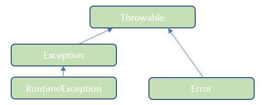

# Hata Yönetimi

## İstisna Durum Nedir? (Exception)

**İstisna** durum, İngilizce **exception** diye ifade edilir. Programın normal akışını beklenmeyen şekilde hatalı şekilde kesen durumlara karşılık gelir. Örneğin bir dosya okuması yaparken dosyanın harddiskte olmaması hatası, veritabanına bağlanırken bağlantı hatası, bir web servisi çağırırken bağlantı hatası veya null bir nesneye erişim hatası gibi bir çok hatalı durum meydana gelebilir. Java normal akışı kesen bu hatalı durumları yönetebilmek için yazılım geliştiricilere çeşitli imkanlar sunmuştur. Bu özelliği sayesinde Java programları tutarlı ve güvenli bir şekilde çalışabiliyor.

Java dilinde hatalara **istisna** (exception) denir. İstisna, adından da anlaşılacağı üzere, programın çalışması sırasında meydana gelen **istisnai** (**anormal**) durumları belirtir. Diğer bir deyişle, **çalışma zamanında** meydana gelen hatalara istisna denir.

Program yazarken belli kurallar yazmış oluruz. Java çalışma ortamı, programımızı bu kurallara göre çalıştırır. Hata ise istisnai (yani kural dışı) bir durumdur. Böyle bir durumda Java çalışma ortamı ne yapacağını bilemez, çareyi programı sonlandırmakta bulur. Kısacası, bir hata oluştuğu zaman programın çalışması sona erer. Bunun önüne geçebilmek için, kodun yazılış aşamasında hata yönetiminin iyi yapılması gerekir.

Hata yönetiminden kastımız, hatanın meydana gelmesini engellemek değildir. Hata yönetimi, en basit ifadesiyle, çalışma sırasında bir hata meydana gelse bile programın çalışmasına devam etmesini sağlamaktır. Java’da bu mümkündür. Java’nın hata yönetim mekanizması sayesinde, program normal akışında çalışır; eğer bir hata olursa, yazdığımız koda uygun olarak bir aksiyon alınır (kullanıcıya hata bilgilendirmesi yapılır, hata kayıt altına alınır vs.) ve sonra program çalışmasına devam eder.

Java’nın hata yönetim mekanizması şu şekilde işler: Programın çalışması sırasında istisnai bir durum oluşursa bu durumla ilgili bir nesne oluşturulur ve **throws** deyimiyle fırlatılır. Böyle bir durumda, programın olağan akışı durdurulur ve bu hatanın yakalanması beklenir. Hatanın yakalanabilmesi için, hataya sebep olan kodun **try-catch** bloğu içine yazılması gerekir. Bu durumda Java çalışma ortamı, meydana gelen hatayı yakalayabilecek bir catch bloğu arar, eğer bulursa bu **catch** bloğu çalıştırılır. Son olarak, eğer bir **finally** bloğu yazılmışsa bu blok çalıştırılır ve program normal akışına devam eder.

Java hataları yayılımcı hatalardır. Bunun anlamı şudur: hatanın meydana geldiği metot içinde yakalanması gerekir, aksi halde hata bir üst metoda (çağıran metoda) aktarılır. Hata yakalanmadığı sürece bir üst metoda aktarılmaya devam eder. Eğer yazdığımız kodun hiçbir yerinde hatayı yakalamadıysak, hata Java çalışma ortamına aktarılır. Java çalışma ortamı bize varsayılan bir hata yakalama mekanizması sunar. Bu mekanizma hata meydana geldiğinde programı sonlandırır.

Bir hata oluştuğunda iki farklı durumla ele alınabilir.

- Hatanın oluştuğu noktada önlem alıp hata kontrol altına alındıktan sonra programın kaldığı noktadan çalışmasına devam etmesini sağlamak bir seçenektir. Örneğin okumaya çalıştığınız klasörde olmayan bir dosyayı yaratıp programın kaldığı noktadan çalışması sağlanabilir.
- Hata oluştuğunda bu hata üste doğru fırlatılabilir. Bu fırlatılan hatayı dinleyen istemci (client) tarafı hatayı uygun bir mesajla kullanıcıya gösterebilir. Örneğin sorgulamaya çalıştığını TC numarası eksik veya hatalı gibi bir bildirimle kullanıcı önyüzde bilgilendirilebilir.

İki tip hata çeşidimiz vardır.

- **Unchecked Exceptions** : Programın derlenmesi sırasında bilinemeyen ancak program çalıştığı esnada ortaya çıkan hata tiplerdir. Çalışma zamanında ortaya çıktıklarından yeniden oluşturulmaları ve tespit edilmeleri daha zordur.
- **Checked Exceptions** : Derleme aşamasında tespit edilen hatalardır.Bu hataların alınabileceği önceden bilinir. Örneğin dosyayı açma işlemi Java&#39;da hata oluşturabilecek bir işlemdir. Bu fonksiyonun hata fırlatabileceği önceden belirtildiği için kodu yazarken Java geliştirme platformu ona göre önlem almamızı ister.

## Exception Hiyerarşisi

Java&#39;da Exception&#39;larda birer sınıftır. Bu sınıfların hepsi &quot;Throwable&quot; sınıfından türemişlerdir.



**Throwable** : Exception hiyerarşinin en üstündeki sınıftır. Tüm Exception sınıfları ondan kalıtım alır.

**Error** : Programdaki ciddi hatalı temsil eder. JVM tarafından iletilen uygulama dışında oluşan hatalardır. Bu tip hatalar da &quot;Unchecked Exceptions&quot; tipindedir. Örneğin veritabanı sunucusuna bağlanmaya çalışınca bağlantı hatası verirse bunu ancak çalışma zamanında anlayabiliriz.

**Exception** : Kullanıcı tanımlı Exception sınıfları dahil olmak üzere tüm Exception alt sınıflarının ATA sınıfıdır. &quot;RuntimeException&quot; dışındaki tüm Exception hataları &quot;Checked Exceptions&quot; tipindedir. Bu hata tipleri daha derleme aşamasında belirtilir. Bu hatalara göz önününde bulundurarak bir kod yazmamızı bizden bekler.

**RuntimeException** : Geçersiz ya da hatalı bir işlem sonucunda uygulamada oluşan hatalardır. Bunlar da JVM tarafından fırlatılır. &quot;Unchecked Exceptions&quot; kategorisine girer. Çünkü, ancak çalışma zamanında ortaya çıkarlar. Derleme aşamasında bu hataları yakalama şansımız yoktur. Örneğin null bir nesne üzerinden bir fonksiyon çağırmak veya sayı formatına uygun olmayan bir veriyi sayıya çevirmeye çalışmak gibi hataları örnek verebiliriz.

## İstisnai Durumların Yönetilmesi

Hata durumlarını yönetmek için 2 yöntem vardır.

- Try-catch blokları ile hatayı kontrol altına almak
- Hatayı throws anahtar kelimesi ile çağrıldığı bir üst noktaya fırlatmak

### &quot;try-catch-finally&quot; Mekanizması

Bu yöntem hata oluştuğunda &quot;catch&quot; bloğu adını verdiğimiz kod bloğuna düşer ve biz hataya dair işlemlerimizi burada yaparız. &quot;try-catch&quot; mekanizmasının kullanımı maliyetlidir. Yani, programınızın her noktasını gerekli gereksiz &quot;try-catch&quot; ile doldurursanız programınız performans sorunu yaşayabilirsiniz.

````java
public class DataConverter {

	
	public int convertToInt(String numberAsText) {
		
		// bu örnekte hatayı tespit ediyoruz ve oluştuğu noktada önlemler alıyoruz.
		try {
			int number = Integer.parseInt(numberAsText);
			return number;
		}
		catch (NumberFormatException e) {
			e.printStackTrace();
			// bu kısımda mutlaka loglama yapmanız önerilir.
			// kurumsal projelerde hata takibi ve logların izlenmesi hataların çözümü için çok önemlidir.
		}
		catch (NullPointerException e) {
			// farklı hata tiplerine göre birden fazla catch bloğu açabilirsiniz.
			e.printStackTrace();
		}
		
		return -1;
	}
	
	
	public Date convertToDate(String dateAsText) throws ParseException {
		
		SimpleDateFormat dateFormatter = new SimpleDateFormat("yyyy-MM-dd");
	
		// bu örnekte ise String haldeki date bilgisini Date verisine çevirmeye çalıştık.
		// parse fonksiyonu "ParseException" tipinde bir hata fırlattığı için biz de bu hatayı çağrıldığımız bir üste ilettik.
		return dateFormatter.parse(dateAsText);
	}
	
}
````

&quot;catch&quot; bloklarının sıralaması önemlidir. Çünkü, sıralanmış haline göre işletilir.

````java
   catch (NumberFormatException e) {
			e.printStackTrace();
			// bu kısımda mutlaka loglama yapmanız önerilir.
			// kurumsal projelerde hata takibi ve logların izlenmesi hataların çözümü için çok önemlidir.
   }
   catch (NullPointerException e) {
			// farklı hata tiplerine göre birden fazla catch bloğu açabilirsiniz.
			e.printStackTrace();
   }
````

Yukarıdaki örnekte ilk önce gelen hatanın &quot;NumberFormatException&quot; tipinde olup olmadığına bakılır. Eğer gelen hata bu tipte değilse, sonra sırayla alttaki catch blokları kontrol edilir. Uygun hata hangi bloğa denk geliyorsa o &quot;catch&quot; bloğu işletilir.

Eğer, belirli hata tiplerine göre işlemler yaptırmanız gerekmiyorsa tek bir &quot;catch&quot; bloğu yazıp tüm hataların aynı &quot;catch&quot; bloğuna düşmesini sağlayabilirsiniz. Bunun içinde ATA sınıf olan &quot;Exception&quot; tipinde bir hata tipi belirtmeniz gerekir.

````java
catch (Exception e) {
	e.printStackTrace();
}
````

### &quot;finally&quot; Bloğu

&quot;try-catch&quot; sonrasında opsiyonel olarak &quot;finally&quot; kod bloğunu ekleyebilirsiniz. &quot;try&quot; bloğu içindeki kod bloğu hata alsın ya da almasın &quot;finally&quot; bloğu her koşulda çalıştırılır. Bunu bir örnekle açıklayalım.

````java
public int readIntFromKeyboard() {
	
	Scanner scanner = new Scanner(System.in);
	
	// bu örnekte hatayı tespit ediyoruz ve oluştuğu noktada önlemler alıyoruz.
	try 
	{	
		String inputFromKeyboard = scanner.nextLine();
		
		int number = Integer.parseInt(inputFromKeyboard);
		
		return number;
		
	}
	catch (Exception e) 
	{
		e.printStackTrace();
	}
	// hata olsun veya olmasın mutlaka çalıştırılır.
	finally 
	{
		scanner.close();
	}
	
	return -1;
}
````

Yukarıdaki örnekte &quot;Scanner&quot; sınıfından bir nesne üretiyoruz. Bu nesne klavyeden girilen değeri alıyor. Aldığımız değeri int tipinde bir sayıya dönüştürüyoruz. Bu dönüşüm esnasında bir hata olsun ya da olmasın &quot;finally&quot; bloğunda &quot;Scanner&quot; sınıfının dinlediği Stream&#39;i close ediyoruz.

### Kendi Hata Tipimizi Oluşturmak

&quot;Exception&quot; ATA sınıftan türeterek kendimize ait hata tipleri oluşturabiliriz.

````java
public class BatuxException extends Exception {

	private static final long serialVersionUID = -1512968406062966965L;
	
	private String message;
	
	public BatuxException(String message) {
		this.setMessage(message);
	}

	public String getMessage() {
		return message;
	}

	public void setMessage(String message) {
		this.message = message;
	}
}
````


### &quot;throw&quot; Anahtar Kelimesi ile Hata Fırlatmak

&quot;try-catch&quot; yöntemiyle hatayı kontrol edip uygulamanın kırılmasını engelleyebiliyorduk. Bir başka yöntem de hata fırlatarak hatanın çağrıldığı noktada kontrolünün sağlanmasıdır.

````java
public int indexOf(String value, String searchedText) throws BatuxException {
	
	if(value == null) {
		throw new BatuxException("Gelen değer null olamaz!");
	}
	
	return value.indexOf(searchedText);
}
````

Yukarıdaki örnekte bir String değer içinde aranan ifadenin hangi indekste olduğunu bulmaya çalışıyoruz. Fakat, gönderilen değer &quot;null&quot; ise &quot;throw&quot; anahtar kelimesi ile yukarıda oluşturduğumuz kendi hata tipimizden bir hata fırlatıyoruz.

### Hatayı Metot Tanımında Belirtmek

Bir metot yazarken hata fırlatabilecek bir metot çağırıyorsak, ya metodun içerisinde **try-catch** bloğuyla bu hatayı yakalamalı ya da hata yakalamayı bir üst metoda bırakmalıyız. Fakat bu durumda, çağıran metodun bu hatadan haberdar olabilmesi için metodun hata fırlatabileceğini metodun tanımında belirtmeliyiz. Bunu **throws** deyimiyle yaparız. Örneğe bakalım:

```java
public class Person
{
	private int age;

    public void setAge(int age) throws IllegalArgumentException
	{
	
        if (age < 0)
		{
			throw new IllegalArgumentException("Yaş sıfırdan küçük olamaz!");
		}

        this.age = age;
	}
}
```

Gördüğünüz gibi, setAge() metodunun hata fırlatabilecek bir metot olduğunu throws deyimiyle metot tanımında belirttik. Artık bu metodu çağıran metotlar da bu hatayı yakalamak veya bir üst metoda bırakmak zorundadır.

### Java’daki Bazı Hata Sınıfları

Java’da bazı ortak hatalar için önceden tanımlanmış hata sınıfları vardır. Bunlardan en çok karşılaşılanları kısaca inceleyelim:

- **ArithmeticException**: Sıfıra bölme başta olmak üzere matematiksel hataları belirtir.
- **ArrayIndexOutOfBoundsException**: Bir dizinin aralığı dışında elemanına erişmeye çalışıldığında fırlatılır.
- **ClassCastException:** Geçersiz tür dönüşümü işlemlerinde fırlatılır.
- **IllegalArgumentException:** Metoda verilen parametrelerden biri hatalı olduğunda fırlatılır.
- **IndexOutOfBoundsException**: Hatalı indeks erişimlerinde fırlatılır.
- **NullPointerException**: Henüz değer ataması yapılmamış değişkenler üzerinde işlem yapmaya çalışıldığında fırlatılır. Java’da en çok karşılaşılan hatalardan biridir. Bu hataya karşı önlem almak için yaptığımız kontrollere **null kontrolü** (**null-check**) denir.
- **NumberFormatException**: Bir String değerini sayısal bir türe dönüştürmeye çalıştığımızda, eğer String değer düzgün bir sayı ifade etmiyorsa fırlatılır.
- **UnsupportedOperationException**: Desteklenmeyen bir iş yapmaya çalışıldığında fırlatılır.