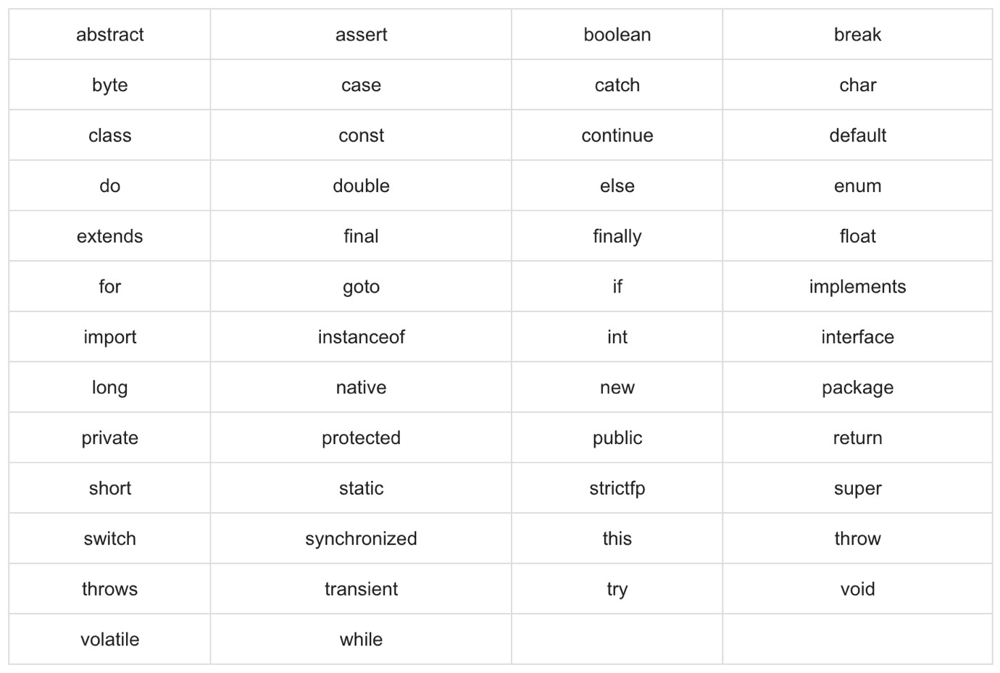

# Java Programlama Dili&#39;nin Genel Özellikleri

Java, dünyada web, mobil ve daha birçok alanda yaygın şekilde kullanılan bir programlama dilidir. Özellikle, kurumsal düzeyde büyük yazılım projeleri gerçekleştirmek için çok uygundur. Java ile **Özgür Yazılım Lisansı**&#39;na versiyonları kullanabilirsiniz. **OpenJDK** buna en güzel örnektir. Ayrıca, Java diliyle yazılım dünyasında ticari ve özgür yazılım lisansına sahip çok fazla geliştirme aracı mevcuttur. Java&#39;yı güçlü kılan da arkasında bu büyük topluluklardır.

Java dilinde Sınıf (Class) kavramı en önemli özelliktir. Java&#39;da her şeyi Sınıf şeklinde tanımlamanız gerekmektedir. Sınıflar bir nesneyi tanımlayan şablonlardır. Örneğin: Kahve Makinesi gerçek hayatta bir nesneyi ifade eder. Yazılım dünyasında bu gerçek hayat nesnesini tasarlarken, &quot;KahveMakinesi&quot; isminde bir şablon tasarlarız. Bu şablon gerçek hayatta var olan nesneye ait tüm özellikleri bünyesinde barındırır. Bu nesneyi ele aldığımızda renk, uzunluk, genişlik, ağırlık gibi nitelikleri vardır. Bu özellikler tasarladığımız &quot;KahveMakinesi&quot; isimli sınıfta birer değişkeni ifade eder. Suyu ısıtma, kahveyi karıştırma, kahveyi pişirme gibi eylemler ise fonksiyonları ifade eder. Gerçek hayat nesnesine ait bu eylemler &quot;KahveMakinesi&quot; isimli sınıfta birer fonksiyon olarak tanımlanır. Böylece, yazılım dünyasında kahve makinesini modellemiş oluruz. Bu modelden veya şablondan üretilenlere de nesne denilmektedir. &quot;KahveMakinesi&quot; isimli sınıftan bir fabrikada üretiliyormuş gibi onlarca nesne oluşturulabilir. Her üretilen yazılımsal açıdan farklı bir nesneyi ifade eder.

**Sınıf:** Gerçek hayatta yer alan bir nesnenin yazılım dünyasındaki model halidir.

**Nesne:** Tasarlanan bu modelden üretilenlere de nesne denilmektedir.

**Metot (Fonksiyon):** Fonksiyonlar eylemleri işaret eder. Örneğin: Printer isimli bir sınıfa ait &quot;print&quot; isimli eylem yazılım dünyasında bir metodu ifade eder. Metotlar belli parametreler alarak veya almadan belli bir üreten veya üretmeyen kod parçalarıdır.

**Değişken:** Değişkenler nesnenin niteliklerini işaret ederler. Örneğin: Printer isimli sınıfa ait &quot;color&quot; isimli nitelik bir değişkeni ifade eder. Eğer rengi beyazsa beyaz bir değer alır.

Java dilinde de sınıflar tasarlanır, bu sınıflardan nesneler üretilir. Bu nesneler birbirine bağımlılıklar kurarlar ve böylece birbiriyle iletişim kurarak bir yazılımı meydana getirirler. Lego parçalarıyla büyük bir uçak yapmak gibi  

## 1.Dilin Temel Kuralları

- Java dilinde sınıf, metot, değişken gibi isimlendirme yapabildiğiniz her şey büyük küçük harf duyarlılığına sahiptir. Yani, Java&#39;da &quot;invoicePrice&quot; ile &quot;InvoicePrice&quot; birbirinden farklı değişkenlerdir.
- Sınıf isimlendirmesi yapılırken hep ilk harf büyük olacak şekilde bir tanımlama yapılır. Dilde böyle bir kısıtlama olmasa da okunabilirlik için bu genel kabul görmüş bir yaklaşımdır. Örneğin: &quot;class **Printer**&quot; gibi.
- Metot (Fonksiyon) isimlerinin ilk harfi küçük ile başlayacak şekilde, Camel (Deve) Case stilinde bir tanımlama yapılır. Örneğin: &quot;void **printInvoice** ()&quot; gibi.
- Java&#39;da sınıfa ait kaynak kodlar &quot;.java&quot; uzantılı dosyaların içine yazılır. Bu dosya ismi sınıf ismi ile aynı olmalıdır. Örneğin: &quot;Printer.java&quot; ise sınıf tanımı &quot;class Printer&quot; şeklinde olmalıdır.
- Java&#39;da bir programın çalışması için bir başlangıç metoduna ihtiyaç duyar. &quot;public static void main(String args[])&quot; metod başlangıç metodur.

## 2.Java&#39;da Tanımlayıcı İsimlendirme Kuralları (Identifier)

Yazılım geliştiricinin sınıf, metot ve değişken gibi yapılar için yaptığı isimlendirmelere tanımlayıcı denilmektedir. Örneğin: oluşturulan sınıfa &quot;CustomerService&quot; isminin verilmesi gibi. Java dilinde isimlendirme yapılırken dikkat edilmesi gereken belli başlı hususlar vardır. Bunları aşağıda listelenmiştir.

- Java&#39;da isimlendirme yaparken ilk karakter harf, $ işareti ve \_ (alt çizgi) ile başlayabilir. Rakam ve sayı isimlendirmenin başında yer alamaz. İlk karakteri belirtilen şekilde kurallara uygun verirseniz geri kalanında dilediğiniz gibi isimlendirmeye devam edebilirsiniz. Örnegin: MinNumber, total, ak74, hello_world, $amount, \_name gibi Legal identifiers  yapabilirken 74ak, -amount gibi değişken isimleri Illegal identifiers olarak tanımlanır.
- Java diline özel ayrılmış anahtar kelimeler vardır. Bunları da değişken ismi olarak kullanamazsınız. Örneğin: class, int, for, while gibi anahtar sözcükler tek başlarına bir tanımlayıcı olarak kullanılamazlar.
- Java&#39;da yaptığınız isimlendirme büyük küçük harf duyarlılığına sahiptir. &quot;maxAge&quot; ile &quot;MAXAGE&quot; iki ayrı tanımlayıcıyı ifade etmektedir.

## 3.Java&#39;da Düzenleyiciler (Modifiers)

Java&#39;da tanımladığınız sınıflara, metotlara, değişkenlere başka kod bloklarından erişimi düzenleyen anahtar kelimelere düzenleyiciler (modifier) denilmektedir. Bu belirteçler ikiye ayrılmaktadır.

- Erişim Belirteçleri: **default, public, private, protected** gibi anahtar kelimeler ile ifade edilir. Bu belirteçler yazılan sınıfın, metotun kendi kapsamı dışında bir noktadan erişimini yönetir. Örneğin: &quot;public&quot; anahtar sözcüğü ile erişime açılır. &quot;private&quot; ile dışarıdan erişime kapatılır.
- Erişim Dışındaki Belirteçler: **final, abstract, strictfp** gibi anahtar kelimeleri ifade edilir. Bu sözcükler erişim ile ilgili değildir. Örneğin: &quot;final&quot; sözcüğü sınıfın, metotudun veya değişkenin davranışını etkiler.

## 4.Java&#39;da Değişkenler (Variables)

Java&#39;da bir veri parçasını, ki bu sayı, yazı alanı veya kompleks veri olabilir, hafızada tutmaya yarayan yapılardır. Java dilinde değişken tanımlarken **değişkenin_türü değişkenin_adı = değişken_değeri** şeklinde tanımlama yapılır. Örneğin: &quot; **int year = 2019;**&quot; gibi tanımlama yaptığımızda hafıza bir alan bu değer için ayrılır. 2019 verisi hafıza bu adrese yazılır. Değişken, hafıza adresini işaret eder. Aslında, hafıza adresinin kendisini belirtir.

Değişkenler üç tiptedir:

- Yerel Değişkenler
- Sınıf Değişkenleri (Statik olanlar)
- Nesne Değişkenleri (Statik olmayanlar)

## 5.Java&#39;da Diziler (Arrays)

Dizi kavramı aynı tipte liste halinde veriler tutmaya yarayan veri yapısıdır. Örneğin: 12 aya ait şirket bilançosu dizi şeklinde tutulabilecek bir veridir. Java&#39;da diziler oluşturulduğunda Heap Hafıza&#39;da tutulurlar.Diziler tanımlanırken **veritipi [] diziAdi = new veritipi[dizinin boyutu]** şeklinde tanımlanır. Dizi konusu ileride detaylıca işlenecektir

## 6.Java&#39;da Enum Yapılar (Enum)

Java&#39;da belirli seçenekleri önceden tanımlanabilen yapılar şeklinde kodlayabilirsiniz. Örneğin: mağazanın müşteri iki tipte ise bunları ENTERPRISE, INDIVIDUAL şeklinde iki tanımlı değerle ifade edebilirsiniz. Böylece, koddaki okunabilirliği arttırabilirsiniz. Müşteri tiplerini 1 ve 2 gibi sayılarla ifade etseydik, kodun başkası tarafından okunabilirliği azalırdı.

## 7.Java&#39;da Anahtar Sözcükler (Keywords)

Aşağıdaki anahtar sözcükler Java dilinde ayrılmış kelimelerdir. Bu kelimeleri tek başlarına isimlendirmede kullanamazsınız. Örneğin: &quot; **int class = 5;**&quot; şeklinde bir tanımlama yapamayız. Çünkü, class ayrılmış bir anahtar sözcüktür.



## 8.Java&#39;da Yorum Alanları (Comments)

Java dilinde kodların arasına açıklayıcı metinler eklenebilir. Kod parçasının ne iş yaptığını anlatan veya bilgi veren yorumlar eklenebilir. Bu yorumlar derleyici tarafından dikkate alınmaz. Tek satırlık veya çok satırlı yorumlar ekleyebilirsiniz.

```java
public class MyFirstJavaProgram {

/* This is my first java program.
* This will print 'Hello World'; as the output
* This is an example of multi-line comments.
*/

    public static void main(String []args){
        // This is an example of single line comment
        /* This is also an example of single line comment. */
        System.out.println("Hello World");
    }
}
```


Java&#39;da kod yazarken kodlar arasında dilediğiniz kadar boşluk bırakabilirsiniz.

## 9.Java&#39;da Kalıtım (Inheritance)

Java, nesneye dayalı programlamayı destekleyen bir dil olduğu için kalıtım mekanizmasına sahiptir. Kalıtım ile bir sınıf üst sınıfından ortak özellikleri miras yoluyla kendine alabilir. Üreten sınıf Super class(üst sınıf), oluşan yeni sınıflar ise Sub class(alt sınıf) şeklinde isimlendirilir. Kalıtım yapmak için kullanacağımız kelime **extends**’ dir. Bu konu ileride detaylıca açıklanacaktır.

## 10.Java&#39;da Ara yüzler (Interfaces)

Nesneye dayalı programlamanın en önemli kavramlarından biri de ara yüz tanımıdır. Arayüz tanımlarıyla çok biçimliliği ( **Polymorphism** ) desteklenir. Ara yüz (Interface) kontrat gibi değerlendirilebilir. Örneğin: aracın frenleme sistemi, elektrik sistemi tüm araçlarda bulunması gereken özelliklerdir. Fakat, bunların çalışma biçimi araçtan araca farklılıklar gösterebilir. İşte bu özellik kümesi bir aracın ara yüzü olarak tanımlanabilir. Böylece, yeni bir araç tanımlamak isteyen herkes bu kontrata uygun bir yapı kurmalıdır.
