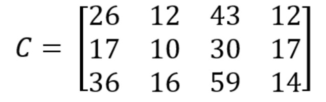

# Java&#39;da Matris İşlemleri (Matrice)

Java&#39;da matrisler varsayılan bir veri tipi olarak bulunmazlar. Dizilerin 2 boyutlu halleri şeklinde tanımlanırlar. Matris satır ve sütun şeklinde tablo verisi formatındaki verileri tutmak için kullanılır. Diziler liste halinde veriler için uygunken, matrisler tablo şeklindeki veriler için uygundur.

Örnek:

3x2 &#39;lik bir matris olduğunu düşünelim.


2x4 &#39;lük başka bir ise aşağıdaki gibi olacaktır.


Bu iki matrisin çarpımıyla ise C isminde 3x4 &#39;lük bir matris oluşacaktır. Buradaki çarpma yöntemi A&#39;nın satırını komple al, B&#39;nin sütunu komple al ve birbiriyle çarp sonucu C matrise yaz. Kabaca yöntem bu şekilde, bu yöntemin matematiksel izahı ise aşağıdaki gibidir.



C matrisi sonuç matrisidir.

Formül:


Yukarıdaki A ve B matrisinin Java&#39;da tanımlanması aşağıdaki gibidir.

````java
double[][] A = {
  new double[]{1d, 5d},
  new double[]{2d, 3d},
  new double[]{1d, 7d}
};
 
double[][] B = {
  new double[]{1d, 2d, 3d, 7d},
  new double[]{5d, 2d, 8d, 1d}
};

````

Dizilerden tek farkı [] parantez yanına bir tane [] açıyoruz. Zaten her [] ifadesi yeni bir boyut anlamına geliyor. &quot;**double[][][] ucBoyutlu;**&quot; şeklinde bir ifadeyle 3 boyutlu veri saklayan bir veri yapısı oluşturmuş oluyoruz.

````java
public double[][] multiplyMatrices(double[][] firstMatrix, double[][] secondMatrix) {

	// firstMatrix.length ile ilk matrisin satır sayısını buluyoruz. örneğimizde 3 olarak gelecektir.
	// secondMatrix[0].length ile ikinci matrisin sütun sayısını buluyoruz. örneğimizde 4 olarak gelecektir.

	// C matrisi olacak olan matrisi tanımlıyoruz.
    double[][] result = new double[firstMatrix.length][secondMatrix[0].length];
 
 	// matrislerde çarpma, toplama gibi işlemleri yapabilmek için iç içe 3 tane döngüye ihtiyaç duyarız.
    for (int row = 0; row < result.length; row++) {
        for (int col = 0; col < result[row].length; col++) {
            result[row][col] = multiplyMatricesCell(firstMatrix, secondMatrix, row, col);
        }
    }
 
    return result;
}


double multiplyMatricesCell(double[][] firstMatrix, double[][] secondMatrix, int row, int col) {
	// A matrisinin satırı ile B matrisinin sütunu çarpma işlemi.
	/*
	*   row = 3, col = 4  olarak gelecektir.
	*   i = 0 ise
	*   firstMatrix[3][0] * secondMatrix[0][4] 
	*   i = 1 ise
	*   firstMatrix[3][1] * secondMatrix[1][4] 
	*   i = 2 ise
	*   firstMatrix[3][2] * secondMatrix[2][4] 
	* şeklinde i değişerek satır ve sütun çarpılır.
	*/
    double cell = 0;
    for (int i = 0; i < secondMatrix.length; i++) {
        cell += firstMatrix[row][i] * secondMatrix[i][col];
    }
    return cell;
}

````

Yukarıdaki “multiplyMatrices” fonksiyonu iki tane matrisi girdi olarak alır. Fonksiyon matrislerin çarpım sonucunu matris olarak döndürür.

“multiplyMatrices” fonksiyonu içinde bir başka fonksiyon daha çağrılmıştır. “multiplyMatricesCell” bu fonksiyon ise iki matrisin satır ve sütununu çarpıp sonucu double tipte bir değer döndürür.

Yukarıdaki &quot;multiplyMatrices&quot; fonksiyonu iki tane matrisi girdi olarak alır. Fonksiyon matrislerin çarpım sonucunu matris olarak döndürür.

&quot;multiplyMatrices&quot; fonksiyonu içinde bir başka fonksiyon daha çağrılmıştır. &quot;multiplyMatricesCell&quot; bu fonksiyon ise iki matrisin satır ve sütununu çarpıp sonucu double tipte bir değer döndürür.

Çok boyutlu dizilere biraz daha ayrıntılı bakalım.

Bir değişkenin dizi olduğunu köşeli parantezler ile belirtmiştik. Bir tane köşeli parantez tek boyutlu dizi belirtir. Eğer çok boyutlu dizi oluşturmak istiyorsak, boyut sayısı kadar köşeli parantez belirtmeliyiz. Örneğin aşağıdaki satır 2 boyutlu bir dizi (yani matris) belirtir:

```java
int matrix[][];
```

İlk köşeli parantez birinci boyutu (satırları), diğeri ise ikinci boyutu (sütunları) belirtir. Aşağıdaki kodu çalıştırırsak, 3 satırlı ve 4 sütunlu bir matris oluşturur:

```java
int matrix[][] = new int[3][4];
```

Bu matrisin bütün elemanlarına ulaşmak için kullanmamız gereken indeks numaralarını aşağıdaki tabloda görebilirsiniz:

| \[0] \[0] | \[0] \[1] | \[0] \[2] | \[0] \[3] |
| --------- | --------- | --------- | --------- |
| \[1] \[0] | \[1] \[1] | \[1] \[2] | \[1] \[3] |
| \[2] \[0] | \[2] \[1] | \[2] \[2] | \[2] \[3] |

```java
matrix[1][2]; // Matrisin 2. satır ve 3. sütunundaki elemana erişiliyor
matrix[0][3]; // Matrisin 1. satır ve 4. sütunundaki elemana erişiliyor
matrix[2][0]; // Matrisin 3. satır ve 1. sütunundaki elemana erişiliyor
```

Şimdi güzel bir örnek yapalım. 3 satırdan ve 4 sütundan oluşan bir matris yaratalım ve bu matrisin elemanlarını sırayla 1’den başlayacak şekilde dolduralım. Aşağıdaki kodu inceleyelim:

```java
int[][] matrix = new int[3][4];
int number = 1;

for (int x = 0; x < matrix.length; x++)
{
	int[] row = matrix[x];

    for (int y = 0; y < row.length; y++)
	{	
		row[y] = number;
		number++;
	}
}
```

Şimdi yukarıdaki kodu inceleyelim. İki boyutlu diziyi oluşturduktan sonra önce for döngüsüyle dizinin satırlarını geziyoruz. Daha sonra içerideki for döngüsüyle dizinin sütunlarını dolaşıyoruz. Bu örneği vermemizdeki amaç, matrisin elemanlarına ulaşmak için iç içe 2 for döngüsü kullanmak gerektiğini göstermektir. Ayrıca dizinin _length_ metodunun faydasını da burada görmüş oluyoruz.

Yukarıdaki kod çalıştığında matrisin elemanları şu şekilde olur:

| 1    | 2    | 3    | 4    |
| ---- | ---- | ---- | ---- |
| 5    | 6    | 7    | 8    |
| 9    | 10   | 11   | 12   |

## Sütun Kapasiteleri Farklı Matris Oluşturmak

2 boyutlu dizilere matris denir. Başka bir açıdan bakıldığında ise, 2 boyutlu dizileri, dizinin dizisi olarak düşünmek doğru olur. Diziler aynı türden elemanlardan oluşur. int türünde bir dizi olabileceği gibi, dizinin dizisi de olabilir. Matrisleri **dizilerin dizisi** (**array of arrays**) olarak düşünebiliriz.

Yukarıdaki örneklerde matrisin sütun sayısını 4 olarak belirledik. Bu şekilde oluşturulursa matrisin bütün satırları 4 elemanlı olur. Fakat bu zorunlu değildir. Matris oluştururken sütun sayısı belirlemezsek, her bir satırdaki dizilerin kapasitesi farklı olabilir. Örneğin aşağıdaki kodu inceleyelim:

```java
int[][] matrix = new int[3][];
matrix[0] = new int[1];
matrix[1] = new int[2];
matrix[2] = new int[3];
```

Burada önce 3 satırdan oluşan bir matris belirttik, fakat sabit bir sütun sayısı vermedik. Sonra her bir satır için ayrı ayrı sütun sayısı belirledik. Bu kodu çalıştırdığımız zaman aşağıdaki gibi bir matris oluşur:


Çok boyutlu dizi oluştururken, yalnızca ilk boyutun (en soldaki) kapasitesini belirlemeniz yeterlidir. Diğer boyutların kapasitesini dinamik olarak belirleyebilirsiniz.