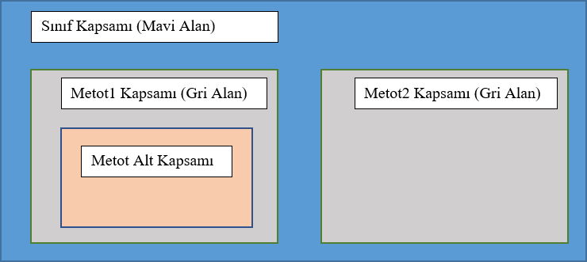

# Java Sınıf ve Nesne Kavramları

Java’nın temelinde sınıf kavramı vardır. Java’nın üzerine inşa edildiği temel mantıksal yapı sınıflardır; çünkü sınıflar, nesnelerin biçimini ve doğasını tanımlar. Nesne yönelimli programlamanın temelini sınıflar oluşturur. Java’da kurulacak yapıların tamamı sınıfların içinde inşa edilmelidir.

Bunun dışında Java, önceden de belirttiğimiz gibi Nesneye Dayalı Programlama yöntemini tamamıyla destekleyen bir programlama dilidir. Java bu nedenle aşağıdaki konseptleri destekler ve uygulanmasına olanak tanır. Bu özellikler ileriki konularda tek tek ele alınacaktır.

- Çok Biçimlilik (Polymorphism)
- Kalıtım (Inheritance)
- Kapsülleme (Encapsulation)
- Soyutlama (Abstraction)
- Sınıflar (Classes)
- Nesneler (Objects)
- Metot (Method)
- Mesaj Yoluyla Değer Geçmek (Message Passing)

## Java&#39;da Nesneler (Objects)

Gerçek hayata döndüğümüzde etrafımızda yüzlerce nesne görürüz. Aslında, her nesnenin var olan bir durumu ve davranışı vardır.

Örneğin: bir köpeği ele aldığımızda rengi, ismi, cinsi köpeğe ait durumu ifade eder. Havlaması, koşmak, acıkması ise onun davranışlarını ifade eder.

Aynı şekilde köpeği modelleyen bir nesneyi yazılım dünyasında oluşturduğumuzda renk, isim, cins gibi durumu ifade eden bilgiler değişkenler ile tanımlanır. Ve bu veriler değişkenlerde saklanır. Koşmak, havlamak, acıkmak gibi davranışlar ise yazılım dünyasında metotlar (fonksiyonlar) ile tanımlanır. Metotlar nesneler arası iletişim ve etkileşim için yol sunarlar.

**Örneğin:** Bir nesne başka bir nesnenin davranışını o nesnenin metodunu çağırarak etkileşime geçer.

## Java&#39;da Sınıflar (Classes)

Yukarıdaki örneğimizde bir köpeğin yazılım dünyasında nesneler vasıtasıyla bir modelinin olabileceğinden bahsetmiştik. Nesne modelin var olan fiziksel halidir. İşte bu noktada sınıflar bir nesnenin modellenmesi için oluşturulan taslağın kendisidir. Sınıflar bir nesneye ait taslaktır diyebiliriz. Nesne ise o taslaktan üretilmiş bir fiziksel kopyadır. Sınıflardan üretilen yazılımsal nesnelerde bilgisayar hafızasında fiziksel var olan yapılardır.

`````java
public class Dog {

   String breed;
   int age;
   String color;

   void barking() {
   }

   void hungry() {
   }

   void sleeping() {
   }
}
`````

Yukarıda örnek bir sınıf tanımı vardır. Java&#39;da sınıflar aşağıdaki yapıda tanımlanır.

````java
public class <SINIF_İSMİ>
{

   // Kod bloğu 
   // Bu alan sınıfın kapsamını belirler. Bu iki süslü parantez dışında kalan kod bloğu sınıfın dışıdır.

}

````

Süslü parantezler o sınıfa ait kod bloğunu temsil eder. Java&#39;da her süslü parantez açıp kapatmak bir kod bloğu oluşturur. İç içe açılan her kod bloğu alt kümeler gibi birbirini kapsar. Kapsayan blok içindeki tüm alt kod bloklarına erişim hakkına sahipken, alt kapsamdaki bir kod bloğu direkt olarak bir üst kapsam bloğuna erişemez. Bunu iç içe kümeler gibi düşünebiliriz.




### Değişken Tipleri:

- **Yerel Değişken:** Bu değişkenler metot veya bir kod kapsamı içinde tanımlanmış olan değişkenlerdir. Tanımlandıkları metodun veya kod bloğunun işi bitince otomatik olarak hafızadan silinirler. Yaşam ömürleri kod kapsamının ömrü kadardır.
- **Nesne Değişkenleri:** Sınıf tanımı yaparken köpek örneğinde olduğu gibi renk, boy, isim gibi nitelikleri değişkenler vasıtasıyla tanımlarız. Sınıf içinde bunları değişken olarak tanımlarız. Ardından sınıftan üretilen her nesne bu değişkenlere sahiptir. İşte bunlara nesne değişkenleri denilmektedir.
- **Sınıf Değişkenleri:** Sınıf tanımı yapılırken bir değişken **static** anahtar sözcüğüyle tanımlanıyorsa bu sınıf tipi bir değişkendir. Değişkene değer atamak için bir nesne oluşturmanıza gerek yoktur. Sınıf ismi ve nokta operatörü kullanarak erişilir. Global kapsama sahip değişkenlerdir. Yazının ilerleyen kısımlarında **statik** anahtar sözcüğü ve kullanım yerleri ( statik değişken, statik metotlar vs.) ayrıntılı olarak ele alınacaktır.

Şimdi ilerleyen konularda  sınıf ve nesne kavramını daha ayrıntılı ve bol örnekle ele alalım.