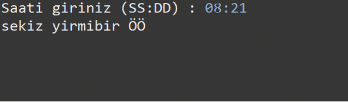

# Ödev 2

Girilen saat yazıyla yazdırılacak. Saat 24 saat formatında ve SS:DD  (saat ve dakika) şeklinde girilecektir. Yazı ile yazdırıldıktan sonra; öğleden önce ÖÖ ve öğleden sonra ÖS şeklinde yazdırılacaktır.

- Açıklama:
  Kullanıcı saati aşağıdaki formatta girecek;
  
  **Örnek çıktı**
  
  
