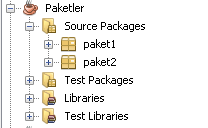
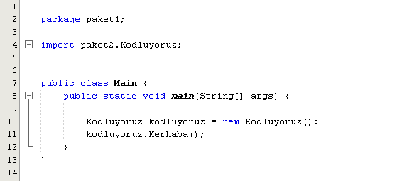

#  Java' da Paketler (Packages)

Java&#39;da sınıfları (classes) ve arayüzleri (interfaces) bir araya toplamak için paket kavramı vardır.  Birbiriyle mantıksal ilişkiye sahip sınıflar ve arayüzler bir paket altına hiyerarşik bir şekilde toplanır. Paket kullanımı düzenli, temiz bir kod yazımı ve sonrasında kodu yenileme, iyileştirme çalışmaları için oldukça önemlidir. Java' da paketler iki kategoriye ayrılır :

- Built-in Packages
- User-defined Packages


## Built-in Packages

Java tarafından bize hazır olarak sunulan paketlerdir. Her bir paket birçok sınıftan oluşur. Projelerimizde ister tüm paketi, istersek paket içerisindeki tek bir sınıfı kullanabiliriz. Bu işlemi gerçekleştirmek için **import** anahtar kelimesini kullanılır.

```java
import package.name.Class; // Tek bir sınıf import edilir.
import package.name.*;     // Tüm paket import edilir.
```

### Örnek

```java
import java.util.Scanner;  // java.util paketindeki Scanner sınıfı import edilir.
import java.util.*;        // java.util paketindeki tüm sınıflar import edilir.
```


## User-defined Packages

Bir java projesi oluşturduğumuzda, java bize default bir paket oluşturur ve bu paket altında sınıflar ve arayüzler oluşturulabilir. Bu kullanım şekli küçük projeler için büyük bir sorun olmasa da orta ve büyük çaplı projelerde, sınıf ve arayüz sayısının artmasıyla birlikte, karışıklığa sebep olmaktadır. Bu karışıklığı gidermek, temiz, düzenli  ve daha sonra iyileştirilebilecek bir kod yazımı için ilgili sınıf ve arayüzleri, ilgili paketler altında yazmak çok önemlidir. Oluşturulan farklı paketler, birbirileri içerisinde import edilerek kullanılabilir. Paket oluşturmak için ilgili projeye tıklayıp, sırasıyla **New  > Java Package**  seçeneğine tıklamak yeterli olacaktır. 







paket2 içerisindeki "Kodluyoruz" sınıfını kullanmak için paket2, paket1 içerisine import edildi.


**NOT:** Sınıf isimleri ile çakışmaması için paket isimleri **küçük** harfle yazılmalıdır.


#### Kaynaklar : 

[w3schools.com](https://www.w3schools.com)

[javapoint.com](https://www.javatpoint.com)