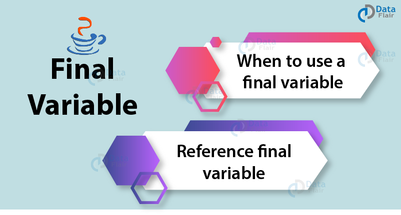

# Sabitler (Constants)

Değeri değiştirilemeyen değişkenlere **sabit (constant)** denir. Bazen, yazdığımız programlarda bazı değişkenlerin bir kere tanımlanmasını ve daha sonra değerlerinin değiştirilmemesini isteriz. Bu gibi durumlarda sabit tanımlarız. Sabitlerin değişkenlerden iki temel farkı vardır:

- Bir değişkeni sabit yapmak istiyorsanız **final** belirteci ile tanımlamalısınız.
- Normal değişkenlere yeniden bir değer ataması yapabiliyorken sabitlerin değerleri bir kere atandıktan sonra değişkenin değerini değiştiremeyiz. Bu nedenle, **final değişkenler ** yalnızca programın yürütülmesi boyunca sabit kalmasını istediğimiz değerler için kullanılmalıdır. 

Peki final değişkenlerin kullanılması bize ne gibi avantajlar sağlar? Programlamada sabitlerin kullanılması, programı kolay ve anlaşılır kılar ve başkaları tarafından kolayca anlaşılabilir. Ayrıca, sabit bir değişken hem JVM hem de uygulama tarafından önbelleğe alındığı için performansı etkiler.

Final değişkenler birçok farklı amaçla kullanılabilir. Bunları inceleyecek olursak;


* **FINAL INSTANCE VARIABLE**
  Class’ın bir field’i (alanı) olarak tanımlanan değişkenlere instance variable denir. Bu alanların değerlerini tanımlarken, constructor’da veya daha sonra herhangi bir metodun içerisinde verilebilir. Hatta herhangi bir değer atanmazsa ilgili veri tipinin varsayılan değeri atanacaktır. Örneğin: int için 0 gibi. Fakat final olan bir instance variable tanımlanmışsa bu değer ya tanımlanırken yada constructor’da atanmalıdır. Eğer bir final instance variable tanımlanırken değeri atanmamışsa buna **blank-final variable** denir ve tüm constructor’larda ilgili değişken parametre geçilerek değeri atanmalıdır.

```java
public class FinalInstanceVariable {
    private final int a = 15; // final keyword kullanıldığında, değişkenin değeri ya direkt tanımlanmalı yada constructor'da atanmalıdır.
    private final int b; // Eğer değer atanmamış final bir değişken varsa constructorların tümünde o değişken parametre olarak geçilip değer atanmalıdır.
    public FinalInstanceVariable(int b){
        this.b = b;
    }

    public static void main(String[] args) {

        FinalInstanceVariable finalInstanceVariable = new FinalInstanceVariable(20);

        System.out.println("a: " + finalInstanceVariable.a);  // a'nın değeri tanımlanma esnasında verilmiştir.
        System.out.println("b: " + finalInstanceVariable.b);  // b'nin değeri tanımlanma esnasında verilmemiştir. Constructor'da parametre olarak geçilmiştir.
// Eğer Constructor'da da değer atanmasaydı hata alırdık.
    }
}
```
Bu kodun çıktısı aşağıdaki gibidir:
a: 15
b: 20


* **STATIC FINAL INSTANCE VARIABLE**
Bu kullanımın bir önceki kullanımdan farkı static final olarak tanımlanmış bir instance variable ya değişken tanımlanırken değer ataması yapılır yada static blok ile atama işlemi gerçekleştirilir. Bu kullanımda constructor’a parametre geçerek değer atama işlemi gerçekleştirilemez.
```java
public class FinalStaticVariable {

    private static final int a = 20;
    private static final int b;

    static {  // static final constructor'dan atama yapılamadığı için static blok ile atama yapabiliriz.
        b = 40;
    }
    public static void main(String[] args) {

        FinalStaticVariable finalStaticVariable = new FinalStaticVariable(20);
       System.out.println("a: " + a); // static final kullanımında değer tanımlanırken atanabilir.
        System.out.println("b: " + b); // bu şekilde b'nin değeri static blok ile atanarak kullanılabilir.

    }
}
```
Bu kodun çıktısı aşağıdaki gibidir:
a: 20
b: 40


* **FINAL LOCAL VARIABLE**
Herhangi bir metot içinde tanımlanan değişkenlere local variable denir. 

```java
public class FinalLocalVariable {
    public static void main(String[] args) {
        final int b = 20;
        System.out.println("b: " + b);
        
        final int c;
        c = 30;
        System.out.println("c: " + c);
        
        final int d = 40;
        d = 50; // bu satırda hata alırız. Çünkü d'nin değeri 40 olarak atanmış tekrar atama yapılamaz.
    }
}
```
Final local değişkenleri yukarıdaki örnekteki gibi tanımlama biçimleri ile kullanabiliriz. Atama yapılan final değişkene tekrar atama yapıp değiştiremeyiz. Atama yapmadan tanımlayarak ardından kullanacağımız zaman atama işlemi yapabiliriz.




* **REFERENCE FINAL VARIABLE**
Final değişken bir nesneye referans olduğunda, bu final değişkene referans final değişken denir.  Buraya kadar öğrendiklerimize göre final bir değişkenin değerinin değiştirilemeyeceğini yeniden bir atama yapılamayacağını öğrendik. Ancak bir referans final değişkeni olması durumunda, o referans değişkeni tarafından gösterilen nesnenin dahili durumu değiştirilebilir. Bunun yeniden bir atama olmadığını unutmayalım. Bu final özelliğine non-transitivity denir. Nesnenin iç durumunun ne anlama geldiğini anlamak için aşağıdaki örneğe bakalım:

```java
public class FinalReferenceVariable { 
    public static void main(String[] args)  
    { 
        final StringBuilder sb = new StringBuilder("Merhaba");           
        System.out.println(sb); 
        sb.append("Dünya");           
        System.out.println(sb); 
    }     
} 
Bu kodun çıktısı aşağıdaki gibi olacaktır:
Merhaba
MerhabaDünya
```

## Alıştırma Soruları

```java
public class FinalVariable
{
    static final int CAPACITY = 4;

    public static void main(String args[])
    {
        CAPACITY = 5;
        System.out.println(CAPACITY);
    }
} 
```
1. Yukarıdaki kodun çıktısı nedir?
    A) 5
    B) 4
    C) Runtime error
    D) Compile-time error

**Cevap:** D şıkkıdır çünkü static final değişken olarak tanımlandığı için CAPACİTY değerinin değiştirilmesine java tarafından izin verilmez. Kod bloğu çalıştırılmaz.


2. Aşağıdaki ifadelerden hangisi yanlıştır?
    A) Local final değişkenleri kullanacağımız zaman atama yaparak kullanabiliriz.
    B) Instance variablelarda final keyword'ü kullanıldığında direk değer atanmalıdır.
    C) Static final değişkenlerde constructor’a parametre geçerek değer atama işlemi gerçekleştirilemez.
    D) Eğer bir final instance variable tanımlanırken değeri atanmamışsa buna blank-final variable denir ve tüm constructor’larda ilgili değişken parametre geçilerek değeri atanmalıdır.

**Cevap:** Bu sorunun cevabı B seçeneğidir. Çünkü final instance değişkenlerde değer ataması yapılmadığında constructorlar içerisinde bu atama gerçekleştirilebilir.


```java
public class FinalVariable
{
    static final int CAPACITY = 4;

    public static void main(String args[])
    {
        CAPACITY = 5;
        System.out.println(CAPACITY);
    }
} 
```
3. Yukarıdaki kodun çıktısı nedir?

  **Cevap:** Kodun çıktısı 5'tir. Çünkü static final değişkenler değer ataması yapılmadan tanımlanıp static blok içerisinde değer ataması yapılabilir.

  

4. Final anahtar kelimesini kullanmanın ne gibi faydaları vardır?

**Cevap:** Programı kolay ve anlaşılır kılar ve hem JVM hem de uygulama tarafından önbelleğe alındığı için performansı etkiler.


5. Yukarıdaki kod parçasının vereceği çıktı nedir?
    A)Compile-time error
    B)Runtime error
    C)Name :Mark  Surname :Down
    Name :Tom  Surname :Johnson

  D)Name :Mark  Surname :Down

**Cevap:** Burada cevap C seçeneğidir. Çünkü buradaki final kelimesi reference final değişkenlerine bir örnektir. Yani onu başka bir referansa veya nesneye yeniden atayamayız. Örneğin; object=object1; desek compiler-time da hata alırdık. Ancak setter metotlarını kullanarak üyelerin değerini değiştirebiliriz.


### **KAYNAKÇA**
* https://www.javatpoint.com/instance-initializer-block
* https://www.javatpoint.com/final-keyword
* https://www.geeksforgeeks.org/final-keyword-java/
* https://medium.com/@metinalniacik/javada-final-keyword-5d711c44375

