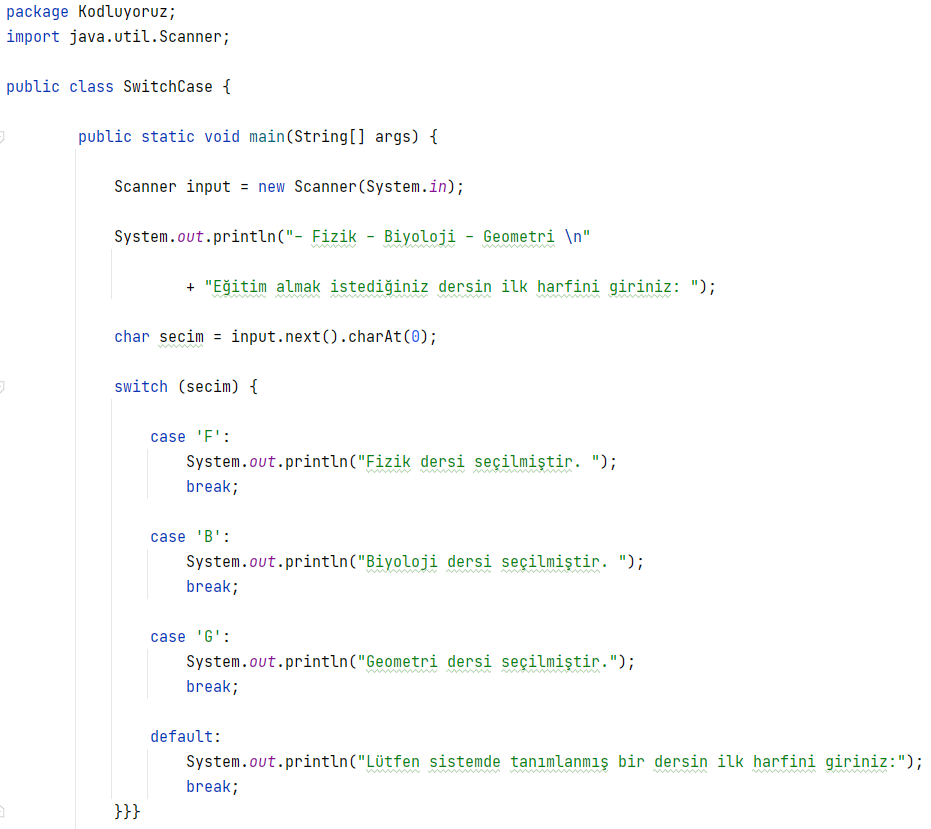

# Java&#39;da "switch-case" Yapıları
Merhaba Arkadaşlar,

Bu yazımızda sizlerle Java programlama dilinde yaygın olarak kullandığımız koşul ifadelerinden biri olan Switch Case yapısından bahsedeceğiz.

Switch Case; tanımlanmış olan yalnızca bir değişkenin, alacağı değerlere bağlı olarak, farklı sonuçlar döndürmesini sağlayan bir yapıdır. Switch kısmında kullanılacak olan değişkenler byte, short, int, char veya String veri tipine sahip olmalıdır. 

Switch case akış diyagramı şu şekildedir:


En basit haliyle switch-case yapısının söz dizimi aşağıdaki gibidir:

```java
    public class SwitchCase {

    public static void main (String args []) {

       int value;

       switch (value) {

       case 1: 

            // Value 1
            break;         
         
       case 2: 

             // Value 1 
             break;
         
       case 3: 

             // Value 1
             break;
         
       default:
     
             // Value is invalid         
             break;
         
     }}}
  ```

Yukarıdaki switch-case yapısında hangi kod bloğunun çalıştırılacağını value değişkeni belirler. Value değeri 1 ise case 1, 2 ise case 2, 3 ise case 3 kod bloğu çalıştırılır. Eğer value değişkeninin değeri hiçbir case değeriyle eşleşmiyorsa default alanı çalıştırılır. Her bir case durumunda, switch yapısından çıkmak ve switch'i izleyen bir sonraki ifadeye geçmek için 'break' komutu kullanılır. Break komutunun kullanılmadığı case'lerde ise ilgili case bloğu işletildikten sonra break komutunun bulunduğu satıra kadar olan tüm kod satırları çalıştırılır. Switch-case yapısının çalışma mantığı genel olarak bu şekildedir. Örnekler ile bu yapıyı daha fazla detaylandıracağız.

Switch Case ifadeleri, çalışma mantığı açısından baktığımızda If - Else-if ifadeleri ile benzerlik göstermektedir. Ancak çok fazla koşul gerektiren durumlarda If - Else-if ifadelerinin yerine Switch ifadelerini tercih edebiliriz. Bu sayede uzun kod satırlarının aksine daha sade ve düzenli bir görünüm elde edebilir ve kodumuzun okunabilirliğini artırmış oluruz.

Not: "switch-case" yapısında eğer her case&#39;in sonuna "break" ifadesi koymazsak aramış olduğu koşulu bulana kadar tüm case&#39;lere girip o kod bloklarını çalıştıracaktır.


   Aşağıdaki örnekte switch-case yapısının Integer anahtar değeri ile kullanımı gösterilmiştir;


   Aşağıdaki örnekte switch-case yapısının Char anahtar değeri ile kullanımı gösterilmiştir;





   Aşağıdaki örnekte switch-case yapısının String anahtar değeri ile kullanımı gösterilmiştir;


Programlama yaparken birden fazla koşula sahip durumlarla karşılaşabiliriz. Örneğin: eğer 1&#39;e basarsanız "vize işlemleri", eğer 2&#39;ye basarsanız "kredi kartı işlemleri", 3&#39;e basarsanız "ev kredisi işlemleri", eğer 4&#39;e basarsanız "müşteri temsilcisine bağlanmak", sıfıra basarsanız "diğer işlemler menüsüne gitmek" gibi çoklu koşullara göre programlama yapmak gerekebilir. Bunu çözmek için "if-else if" yapılarını ya da "switch-case" yapısını kullanırız.

````java
Scanner scanner = new Scanner(System.in);
int operationChoice = scanner.nextInt();

System.out.println("0-Diğer işlemler");
System.out.println("1-Vize işlemler");
System.out.println("2-Kredi kartı işlemler");
System.out.println("3-Ev kredisi işlemler");
System.out.println("4-Müşteri temsilcisi işlemler");
System.out.println("Your choice is : " + operationChoice);

switch (operationChoice) {
	case 0:
		System.out.println("Diğer işlemler menüsü");
		break;
	case 1:
		System.out.println("Vize işlemleri");
		break;
	case 2:
		System.out.println("Kredi kartı işlemleri");
		break;
	case 3:
		System.out.println("Ev kredisi işlemleri");
		break;
	case 4:
		System.out.println("Müşteri temsilcisi işlemleri");
		break;
	default:
		System.out.println("Lütfen geçerli bir işlem tipi seçiniz");
}

````

karar mekanizmalarıyla ilgili birkaç örneğe daha bakalım.

```java
import java.util.Random;

class FirstJavaApp
{
	public static void main(String[] args)
	{
		Random random = new Random();
		int number = random.nextInt(11);
		
        System.out.println("Rastgele bir sayı tuttum: " + number);

        if (number < 5)
		{
			System.out.println("Sayı 5'ten küçük.");
		}
	}
}
```

Burada kısaca anlatmak gerekirse, bilgisayardan 0 ile 10 arasında rastgele bir sayı seçmesini istiyoruz, daha sonra bu sayıyı konsola yazdırıyoruz. Buna ek olarak, eğer sayı 5’ten küçükse konsolda bunu belirtiyoruz. Programı arka arkaya birkaç kez çalıştırırsanız şuna benzer sonuçlar alırsınız:

```java
Rastgele bir sayı tuttum: 6
```

```java
Rastgele bir sayı tuttum: 3
Sayı 5'ten küçük.
```

Görüldüğü gibi ilk çalıştırmamızda çıkan sonuçla ikincisindeki farklıdır. Buna **if bloğu** sebep olmaktadır. Java’da belli bir koşula bağlı olarak bir şey yapmak istediğimizde if bloğunu kullanırız. Yukarıdaki örnekte, "Sayı **5**' ten küçük." yazısını yalnızca sayı gerçekten 5’ten küçükse yazdırıyoruz. Eğer sayı **5** veya **5**’ten büyükse kodumuz if bloğuna girmez.

Belli bir koşula bağlı olarak iş yapmamızı sağlayan bu tarz ifadelere, **seçim ifadeleri** (**selection statements**) denir. Seçim ifadelerini daha sonra ayrıntılı olarak inceleyeceğiz.

Şimdi başka bir karar mekanizmasına göz atalım. Kodumuzu aşağıdaki gibi değiştirelim:

```java
class FirstJavaApp
{
	public static void main(String[] args)
	{

        System.out.println("1'den 10'a kadar sayıyorum...");

        for (int i = 1; i <= 10; i++)
		{
			System.out.println(i);
		}

        System.out.println("Saydım.");
	}
}
```

Bu programı çalıştırdığınızda aşağıdaki çıktıyı alırsınız:

```java
1'den 10'a kadar sayıyorum...
1
2
3
4
5
6
7
8
9
10
Saydım.
```

Bu örneğimizde bilgisayardan bir işlemi defalarca yapmasını istedik. 1’den 10’a kadar olan sayıları konsola yazdırdık. Bu şekilde, belli bir kod bloğunu birden fazla kez çalıştırmamızı sağlayan ifadelere **döngü ifadeleri** (**iteration statements**) denir. Biz buradaki örneklerde konuya giriş yaptık. Döngü ifadelerini ileride ayrıntıyla inceleyeceğiz.


SORU 1: Aşağıdaki switch ifadesinin tamamlanması için eksik parçalar nelerdir?


```java
     public class SwitchCase {

	public static void main(String[] args) {
		
		int classNo=2;

		switch (A) {
		
		B 1:
			System.out.println("Class-1");
			
			C ;
			
		B 2:
			System.out.println("Class-2");
			
			C ;
		}}}		
```
    
    
Cevap: A= classNo, B= case, C= break


SORU 2: Aşağıda bulunan kod bloğunda value değeri 2 ise kod çıktısı nasıl olur?


```java
     import java.util.Scanner;

     public class SwitchCase {

     public static void main(String[] args) {
		
		Scanner input=new Scanner(System.in);		
		
		int value=input.nextInt();
		
		switch(value) {
		
		case 1: case 2:	case 3: 
			
			System.out.println("Value-3");
			
			break;
			
		default:				
			System.out.println("Value is invalid.");
		    break;
		
		}}}		
 ```
 

Cevap: Value değeri 2 olması durumunda case 2 çalıştırılır. Case 2 bloğunda break komutu olmadığından bir sonraki Case 3 bloğu çalıştırılır ve Value-3 çıktısı elde edilir.


## Kaynakça:

- *The Switch Statement*, https://docs.oracle.com/javase/tutorial/java/nutsandbolts/switch.html
 
- *Switch Statement in Java*, https://www.geeksforgeeks.org/switch-statement-in-java/
 
- *Java Switch Statements*, https://www.w3schools.com/java/java_switch.asp
 
- *Java Switch Case*, https://www.journaldev.com/588/java-switch-case-string
