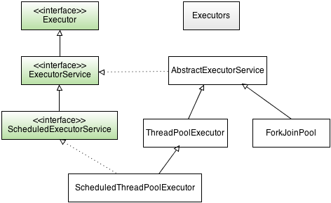

# İş Parçacığı Havuzları (ThreadPooling)

##### Executor




Thread yaratmak cidden maliyetli bir olaydır. Her Thread için sistemde belli bir kaynak ayrılır. Bu kaynaklar CPU, Hafıza gibi önemli olanlardır. Uygulamamız çalışırken belli miktarda bir Thread ile sınırlandırmak isteyebiliriz. 

Bu nedenle Thread havuzu oluşturup bu havuzu önceden oluşturulmuş ve kullanıma hazır Thread nesneleri ile doldururuz. Böylece, performans kazanımı ve sistem kaynaklarının verimli kullanımını sağlayabiliriz. Resim gördüğümüz hiyerarşik düzenin en tepesindeki Executor interface'i sadece execute adlı bir metot içerir. Bu metot;

```java
void execute(Runnable command);
```

ExecutorService interface ise Executor Interfaceini extend eder ve içerisinde threadleri işletip değer döndürebilecek metotlar bulunur.

ScheduledExecutorService interface hem ExecutorService Interfaceini extends eder, hem de schedule etmeye (planlamaya) yarar.

```java
//callable-> Runnabledan farklı olarak V tipinde bir değer döndürebileceğimiz bir task oluşturmamızı sağlar.
//delay -> taskın gecikmesini belirleriz.
//unit -> dakika,saniye vb. gibi isteğimizi göndeririz.(Milisaniye için TimeUnit.MILLISECONDS )
public <V> ScheduledFuture<V> schedule(Callable<V> callable,long delay, TimeUnit unit);
```

ThreadPoolExecutor sınıfı dolaylı yoldan ExecutorService interfaceini implemente eder ve threadlerden oluşan bir havuzu
yönetmeye yarar. Executors  Sınıfı ise içerisinde şu static metotları barındırır ve bizim pool oluşturmamızı sağlar;

```java
//Boşta bulunan threadleri çalıştırmaya yarar.
//Boşta thread bulunmuyorsa havuza yeni bir tane thread ekler.
static ExecutorService newCachedThreadPool( )

//Belli sayıda threadden oluşan ve yeni thread ekleme yapmadan
//gerektiğinde boş durumdaki threadleri çalıştırır
static ExecutorService newFixedThreadPool(int numThreads)

//schedule işlemi yapmamızı sağlar.
static ScheduledExecutorService newScheduledThreadPool(int numThreads)
```

Bu metotlar ile ilgili birer örnek vermeden önce bu konun anlaşılması için Callable ve Future Interfaceleri ile ilgili bilgi vermek gerekir.

##### Callable ve Future

Konu içerisinde de bahsettiğim gibi Callable Interfacei, Runnable Interfacei gibi bize tasklar oluşturmamızı sağlar. Callable Interfacei tasklardan sonuç değeri almamızı sağlar.

```java
public interface Callable<V> {
    V call() throws Exception;
}
```

Callable Interfacei jenerik yapıda olduğu için oluştururken gönderdiğimiz değer tipinde bize dönüş yapan bir call metodu içerir.  ExecutorService içerisinde de Callable tasklarımızı kullanıp bize değer döndürecek bir metot bulunur.

```java
<T> Future<T> submit(Callable<T> task)
```

Bu submit metodu bize Future tipinde bir obje döndürür. Bizim bu dönen objeden sonucu alabilmemiz için Future içerisindeki get metodunu implemente etmemiz gerekir.

```java
V get( ) throws InterruptedException, ExecutionException;
V get(long wait, TimeUnit tu) throws InterruptedException, ExecutionException, TimeoutException;
```

Bu iki metot arasındaki fark, birinci metot dönecek sonucu sonsuza kadar bekler ancak ikinci metot ise aldığı iki parametre ile belli bir süre bekler. Eğer bu süre aşılırsa TimeoutException fırlatır.  Ayrıca get metodu çağıran sınıf ya da thread sonuç gelinceye kadar bloklanır. Şimdi Callable ve Future ile bir örnek yapalım.

```java
import java.util.concurrent.*;

public class Main {

    public static void main(String[] args) throws InterruptedException, TimeoutException, ExecutionException {
        System.out.println("Ana threadimiz başladı.");

        int value=10;
        Callable<Integer> increment=()->{
            int tempValue=value;
            for (int i=0;i<5;i++){
                tempValue++;
                System.out.println("Increment: "+tempValue);
            }
            return tempValue;
        };

        Callable<Integer> decrement=()->{
            int tempValue=value;
            for (int i=0;i<5;i++){
                tempValue--;
                System.out.println("Decrement: "+tempValue);
            }
            return tempValue;
        };

        ExecutorService executorService= Executors.newFixedThreadPool(2);
        Future<Integer> submitIncrement=executorService.submit(increment);
        Future<Integer> submitDecrement=executorService.submit(decrement);

        System.out.println(value+" değerini 5 kere arttırma işlemi sonucu: "
                +submitIncrement.get(500, TimeUnit.MILLISECONDS));
        System.out.println(value+" değerini 5 kere azaltma işlemi sonucu: "
                +submitDecrement.get(500, TimeUnit.MILLISECONDS));
       	
        //Havuzu durdurmamızı sağlayan metottur.
        executorService.shutdown();
        System.out.println("Ana threadimiz bitti.");
    }

}
```

###### Çıktı

```
Ana threadimiz başladı.
Decrement: 9
Decrement: 8
Decrement: 7
Increment: 11
Increment: 12
Increment: 13
Increment: 14
Decrement: 6
Decrement: 5
Increment: 15
10 değerini 5 kere arttırma işlemi sonucu: 15
10 değerini 5 kere azaltma işlemi sonucu: 5
Ana threadimiz bitti.
```

Çıktıda görüldüğü üzere bu poolumuzdaki taskların çalışması tamamen işletim sistemi tarafından kontrol edilmektedir. Hem de newFixedThreadPool metodu için bir örnekte olmuş oldu.

```java
ExecutorService executor = Executors.newFixedThreadPool(15);
```

Yukarıdaki Java’da hazır bulunan “Executors” sınıfındaki “newFixedThreadPool” metodunu çağırarak bir Thread havuzu oluşturabilirsiniz. Ardından bize 15 Thread’in kullanıma hazır halde bulunduğu bir havuz oluşturup verecektir. Bu fonksiyon ayrıca bize bu havuz üzerinde Thread kullanımını yönetecek “ExecutorService” tipinde bir nesne verecektir. Bu nesne üzerindeki “execute” fonksiyonuyla havuzdaki bir Thread’i kullanıp işimiz bitince tekrar sisteme iade edeceğiz.

```java
ExecutorService executor = Executors.newFixedThreadPool(15);

QMatic qmatic = new QMatic();

for(int i=0; i < 100; i++) {
 executor.execute(qmatic);
}
```

Yukarıdaki örnekte “QMatic” isminde önceden de kullandığımız Runnable tipinde sıra numarası veren sınıftan bir nesne yaratıyoruz. Bu kod parçasını “execute” fonksiyonuyla havuzdaki bir Thread’i kullanarak çalıştırıyoruz. Görüldüğü gibi havuz 15 kapasiteli olmasına rağmen döngüde 100 kez Thread kullanma talebi gelmiş. Eğer havuzda uygun boş bir Thread yoksa beklemede kalacaktır. Havuzdan ilk boşa çıkan Thread nesnesini alıp çalışacaktır. Bir de newScheduledThreadPool kullanarak bir örnek yapalım.

```java
import java.util.concurrent.*;

public class Main {

    public static void main(String[] args) throws InterruptedException{
        System.out.println("Ana threadimiz başladı.");

        CountDownLatch countDownLatch=new CountDownLatch(3);
        ScheduledExecutorService executor=Executors.newScheduledThreadPool(5);
        ScheduledFuture<?> future=executor.scheduleAtFixedRate(()->{
            System.out.println("Havuz Çalışıyor");
            countDownLatch.countDown();
        },100,300,TimeUnit.MILLISECONDS);

        countDownLatch.await();
        executor.shutdown();
        System.out.println("Ana threadimiz bitti.");
    }

}
```

###### Çıktı:

```
Ana threadimiz başladı.
Havuz Çalışıyor
Havuz Çalışıyor
Havuz Çalışıyor
Ana threadimiz bitti.
```

Sıra newChachedThreadPool örneğine geldi bu örneğimizi ThreadPoolExecutor ile yazacağız.

```java
import java.util.concurrent.*;

public class Main {

    public static void main(String[] args) throws InterruptedException{
        System.out.println("Ana threadimiz başladı.");

        ThreadPoolExecutor executor= (ThreadPoolExecutor) Executors.newCachedThreadPool();
        executor.execute(()->{
            try {
                Thread.sleep(100);
            } catch (InterruptedException e) {
                e.printStackTrace();
            }
        });
        executor.execute(()->{
            try {
                Thread.sleep(100);
            } catch (InterruptedException e) {
                e.printStackTrace();
            }
        });
        executor.execute(()->{
            try {
                Thread.sleep(100);
            } catch (InterruptedException e) {
                e.printStackTrace();
            }
        });

        System.out.println("Thread havuzumuzun boyutu: "+executor.getPoolSize());
        executor.shutdown();
        System.out.println("Ana threadimiz bitti.");
    }

}
```

###### Çıktı:

```
Ana threadimiz başladı.
Thread havuzumuzun boyutu: 3
Ana threadimiz bitti.
```


> Soru:  Neden birden fazla thread kullanmak isteriz? Neden bir threadleri sınırlamaya ihtiyaç duyarız? Araştırınız.

##### Kaynakça

###### **1.**[Resim 1](https://www.keil.com/pack/doc/CMSIS/RTOS2/html/group__CMSIS__RTOS__SemaphoreMgmt.html)

###### 2.[Kaynak 1](https://www.baeldung.com/thread-pool-java-and-guava)

###### 3.[Kaynak 2](https://medium.com/sıfırdan-i̇leri-düzeye-java-eğitim-serisi/multithreaded-programlama-2-kısım-6cd8411f8b2e)

